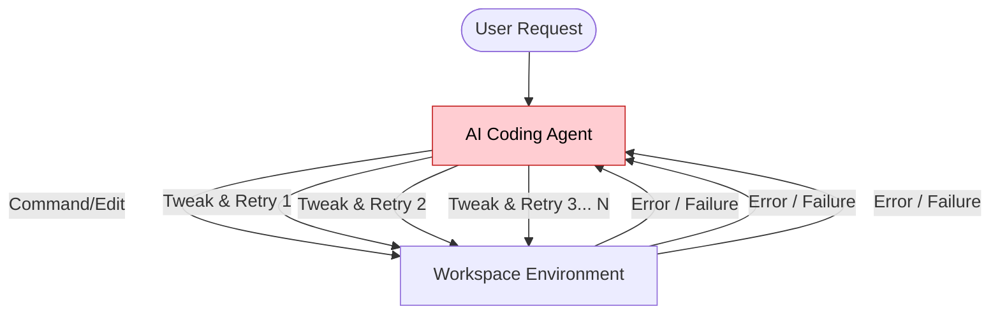
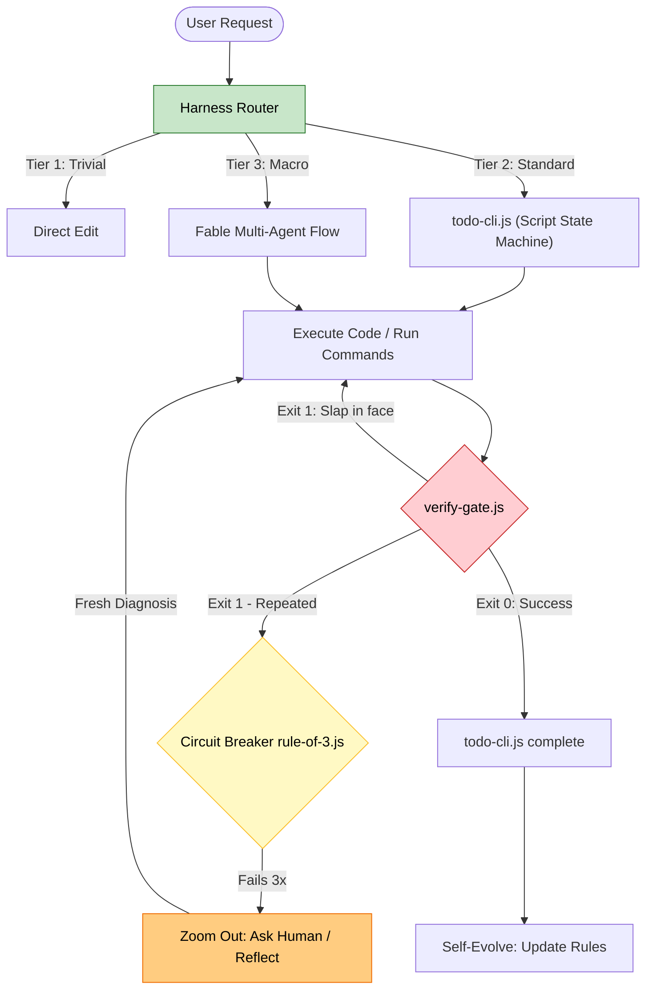

# Harness (Behavior Layer for AI Coding Agents)

[](LICENSE)

Harness is a lightweight, local behavior and orchestration runtime that wraps around your AI development sessions (Claude Code, Cursor, Copilot Chat, Codex, Continue.dev, Hermes Agent). It provides reactive hooks, routing boundaries, and circuit breakers designed to prevent infinite trial-and-error loops, costly over-engineering, and "lost-in-the-middle" context drift.

---

## The Problem

AI coding agents are highly capable, but they struggle with self-regulation, environment awareness, and attention limits:
1. **The Infinite Retry Loop:** When an agent encounters a subtle compilation or test failure, its default behavior is to make micro-adjustments repeatedly (tweak and run, tweak and run) until it exhausts your token budget.
2. **Environment Blindness:** Agents often assume standard Unix environments, hallucinating shell commands and paths when running on Windows, PowerShell, or sandboxed environments.
3. **Lost-in-the-Middle Bloat:** As sessions grow, agents aggressively read too many large files or generate massive console logs, causing severe context degradation and reasoning hallucinations.

---

## Why Harness?

Harness acts as an automated system supervisor. It remains completely silent and out of the way, intervening only when execution boundaries are violated or failures are detected.

### Comparison: Prompt vs. Skill vs. Harness

| Dimension | Prompt-Only (Custom Instructions) | Skill-Only (Task Guides) | Harness (Behavior Layer) |
|---|---|---|---|
| **Activation** | Always loaded (wastes prompt space) | Loaded on demand (requires manual trigger) | Reacts dynamically via native lifecycle hooks |
| **Fail-Safe** | No protection (model keeps retrying) | No protection (loops until token limit) | **Circuit Breaker:** Halts execution after 3 failures and alerts human |
| **Context Aware** | High risk of lost-in-the-middle bloat | Manages scope manually | **Bloat Shield:** Proactively audits diff sizes and logs warning alerts |
| **System Audit** | Blindly assumes shell syntax | Requires manual shell check | **Preflight:** Proactively detects Windows/Unix paths, shell type, and package manager |
| **Memory** | Resets on every new chat session | Static text rules | **Continuous Persistence:** Writes Write-Ahead Logs (WAL) for session recovery and immunizes workspace rules |

The "Harness" column above is Claude Code's behavior. On Cursor, Copilot, Codex, Continue.dev, and Hermes Agent — platforms with no hook/exit-code execution mechanism — Harness can only inject advisory text, which lands in the **Prompt-Only** column instead. See [Supported AI IDEs & Tools](#supported-ai-ides--tools) below.

### When should I use Harness?
* You regularly use agentic coding tools (like Claude Code, Cursor, or Copilot) on medium-to-large codebases.
* You develop on Windows or in mixed shells (Git Bash, WSL, PowerShell) where agents frequently get shell syntax wrong.
* You want automated test-driven development (TDD) enforcement and safety guards to save token budgets.

### When should I NOT use Harness?
* You only use chat interfaces for general questions without letting the AI run local commands or modify files.
* Your project has no test suite, or you prefer unconstrained, free-form agent generation.

---

## ⚡ Quick Start (Get Protected in 10s)

Harness integrates directly into your workspace. There is no heavy daemon, no paid external APIs, and zero configuration required.

```bash
# Install Harness hooks and skills into your current workspace
npx github:dyphn1/Harness-everything install
```

### Expected Behavior After Installation:
1. **Hook Registration:** Harness registers native hooks (e.g., inside `.claude/settings.json` for Claude Code) to intercept session starts and tool use.
2. **Preflight Audit:** At session startup, a lightweight preflight script runs, printing a diagnostic environment block that tells the agent your exact OS, active shell, and package manager.
3. **Guard Active:** The circuit breaker and context compactors are active in the background, consuming zero overhead unless triggered.

---

## Visualizing the Flow

### Without Harness (Endless Trial-and-Error Loop)


### With Harness (Guarded and Routed Execution)


---

## Core Modules & Concepts

Harness operates through five core cognitive concepts:

1. **Router (`tier-router.js`):** Prevents over-engineering. Triages incoming tasks into Tiers: Tier 1 (Direct Edit, no plans), Tier 2 (Standard TDD enforcement), or Tier 3 (Macro Multi-Agent planning and delegation).
2. **Guard (`rule-of-3.js`):** The fail-safe circuit breaker. Tracks failure signatures across terminal runs. If a test or command fails 3 times with the same signature, it locks mutating tools and forces a `zoom-out` reflection: re-verify every assumption with read-only tools, write a fact-checked report, then resume on a fresh diagnosis. The human partner is pulled in only for genuine decisions — or when the same signature trips the breaker a second time. A companion `Stop` gate (`stop-gate.js`) bounces the end of a turn once per edit batch when edits were never followed by a successful verification command.
3. **Memory (`state-persist.js`):** Session transaction logging. Stores a local Write-Ahead Log (WAL) of milestones, preventing agents from forgetting their current task state if a session limits out or restarts.
4. **Reflection (`self-evolve`):** Long-term workspace immunization. Upon task completion, the agent reflects on the root cause of resolved issues and saves them to local workspace rules (`RULES.md`), validated by a hermetic self-regression suite.
5. **Subagent Scope Guard (`subagent-scope-guard.js`):** Diffs the whole repo's `git status` before and after every subagent (`Task`) burst, not just the files it was briefed to touch. Catches a subagent that was told to only read/verify but edited files anyway — a real failure mode, not a hypothetical one.

---

## Supported AI IDEs & Tools

**Only Claude Code gets the hard-boundary hooks.** Every other platform below has no hook/exit-code execution mechanism, so `harness-everything` can only inject advisory text — same protection level as the "Prompt-Only" column in the comparison table above. There is no circuit breaker, no preflight audit, and no WAL on those platforms unless Claude Code (or another hook-capable tool) is also driving the same repo.

| AI Agent Tool | Integration Method | Local Target Location | Enforcement |
|---|---|---|---|
| **Claude Code** | Native Lifecycle Hooks (`PreToolUse`, `PostToolUse`, `SessionStart`) | `.claude/settings.json` (project) / `~/.claude/settings.json` (user) | **Hard** — hooks can block a tool call (`exit(2)`) |
| **Cursor** | Native Project Rules | `.cursorrules` | Advisory only |
| **Copilot Chat** | Custom Instructions | `.github/copilot-instructions.md` | Advisory only |
| **Codex** | Custom Instructions (`AGENTS.md`, not `.codex/config.toml` — that file controls CLI/sandbox behavior, not prompt content) | `AGENTS.md` | Advisory only |
| **Continue.dev** | Native project rules (a dedicated Markdown file with YAML frontmatter, `alwaysApply: true`) | `.continue/rules/harness.md` (project) / `~/.continue/rules/harness.md` (user, via `--global`) | Advisory only |
| **Hermes Agent** ([Nous Research](https://hermes-agent.nousresearch.com/)) | Auto-loaded project context file (Hermes also reads `AGENTS.md`/`CLAUDE.md`/`.cursorrules` from the same directory if present, truncated at ~20k chars) | `.hermes.md` (project only — Hermes has no documented global project-instructions equivalent, so `--global --hermes` is a documented no-op) | Advisory only |

---

## Deeper Documentation

For a deep dive into individual modules and the underlying philosophy, explore our sub-documents:

*   [Harness Philosophy](docs/philosophy.md): The core behavior-first, intervention-only design.
*   [Harness Architecture](docs/architecture.md): Lifecycle hooks, security model, and data locality.
*   [Harness Routing & Triage](docs/routing.md): Detailed trigger criteria for Tiers 1, 2, and 3.
*   [Harness Reflection & Memory](docs/reflection.md): WAL session handoffs and workspace rules immunization.

---

## Benchmarks & Testing

**If you are an agent asked to verify a Harness install, start at [VERIFICATION.md](VERIFICATION.md), not here.** It gives exact commands with exact expected output — install artifact checks for every platform, mechanism-level checks (Claude Code only: pipe a simulated hook payload into `hooks/scripts/*.js` on stdin, confirm the exit code), the behavioral test prompts below, and an acceptance scorecard to fill in. Do not report "it works" from reading the code — every check there names a command to actually run.

`npm test` (`self-evolve/scripts/self-regression.js`) runs four phases: static syntax check on every script, 5 bilingual tier-routing assertions, a 6-step behavioral state-machine simulation of `todo-cli.js`, and — as of 2026-07-23 — an automated re-run of every VERIFICATION.md §2 mechanism check (`eval-framework/mechanism-test.js`, `npm run test:mechanism` to run it alone): the Rule of 3 breaker's full trip → zoom-out release → repeat-trip hard-lock cycle, boundary guard, WAL state persistence, the fact-audit reminder, subagent scope guard, and the stop gate — 10 assertions against real exit codes and stderr, not just "the code looks right." Before this, those mechanism checks existed only as copy-paste recipes in VERIFICATION.md, and three independent 2026-07-23 audits (see [docs/reports/](docs/reports/)) mis-tested them via a Windows-Git-Bash-unsafe `echo '...' | node script.js` pipe and reported working hooks as broken — see the System Evaluation section below for how that got resolved. There is currently no CI workflow enforcing `npm test` on push/PR — it's a local gate contributors are expected to run, not yet an automated one.

For a fuller vanilla-vs-Harness behavioral comparison, see [Harness Skills Benchmark SOP](BENCHMARK_SOP.md) — standardized, reproducible scenarios:
*   **Test A:** Over-engineering defense (Tier 1 typo correction)
*   **Test B:** Micro-error loop defense (Tier 2 bug resolution)
*   **Test C:** Attention loss and hallucination (Tier 3 module refactoring)
*   **Test D:** Knowledge boundary constraints (Offline hallucination prevention)
*   **Test E:** Terminal environment and shell awareness (Windows/Unix shell detection)
*   **Test F** (in VERIFICATION.md, not BENCHMARK_SOP.md): fact-audit discipline — does the agent verify an external-behavior claim before asserting it?

---

## 📊 System Evaluation

**Last self-audited: 2026-07-23**, by running the actual test suite and the VERIFICATION.md recipes on Windows 11 — not by reading the code and assuming it works. Seven independent AI-model audits (Gemini 3.1 Pro, Gemini 3.5 Flash, GPT/Copilot on Mistral Medium/Small, and others) ran the same week and disagreed sharply on whether core hooks even functioned; the raw reports are kept in [docs/reports/](docs/reports/). Three of them tested `rule-of-3.js`, `boundary-guard.js`, and `state-persist.js` by piping JSON through `echo '...' | node script.js` in Windows Git Bash, which mangles stdin/TTY state and produced false "broken" verdicts. Re-running the identical payloads through Node's own `child_process` stdin API (the technique VERIFICATION.md's recipes now use) showed every one of those mechanisms working exactly as documented — the scores below reflect that corrected, verified state, not the average of the seven reports.

### Five Core Verification Criteria (per VERIFICATION.md §5a)

| Criterion | Score | Verified basis |
|---|---|---|
| **Skill Description Completeness** | 8.5/10 | 23 of 27 skills/hooks have a full Skill Contract `SKILL.md` (trigger, output, state mutations, enforcement gate). Four PreToolUse hooks — `depth-guard.js`, `context-compact.js`, `atomic-commit-check.js`, `contract-test.js` — are only described in passing in `docs/architecture.md`, not as standalone contracts. Known, not yet closed. |
| **Routing Accuracy** | 7/10 | `tier-router.js` is a deterministic, bilingual (EN/中文) keyword heuristic — zero runtime dependencies (`package.json` has none), fully offline, fully auditable. That's a deliberate trade against false positives/negatives on ambiguous or metaphorical prompts, not an oversight: swapping it for semantic/LLM-based routing would trade determinism and zero external calls for accuracy, which cuts against the project's own "mechanism over prose" design. |
| **Test Coverage of All Skills** | 8.5/10 | `npm test` now runs 55 real assertions: 34 syntax checks, 5 routing-tier assertions, 6 behavioral state-machine steps, and — new as of this audit — 10 mechanism assertions covering every hook in VERIFICATION.md §2 (`eval-framework/mechanism-test.js`). Previously this scored 3–6/10 across every 2026-07-23 report because the mechanism layer was manual-only. Remaining gap: no CI wiring yet (`npm test` isn't enforced on push/PR), and the four undocumented hooks above also lack dedicated tests. |
| **Configuration Balance** | 8.5/10 | Confirmed asymmetric-by-design: hard `exit(2)` blocking hooks on Claude Code, advisory-only text on the other five platforms, with `self-heal.js` auto-repairing missing integration files on every platform. No platform is either silently ignored or over-blocked. |
| **Workflow Conformance** | 7/10 | `docs/workflows/` diagrams (TDD, git-commit, agent-launcher, architecture refactor) are accurate and the tier-router recommends the full skill chain for each, confirmed live. What's still missing is a *runtime* check that an agent's actual tool-call sequence matched the diagram — today that's compliance-by-convention, not compliance-by-mechanism. Not attempted this round; it's a larger feature, not a fix. |

### Overall Scorecard

| Category | Score | Notes |
|---|---|---|
| **Architecture** | 9/10 | Per-session state isolation, per-platform state directories, fail-open-by-default hooks — all re-verified directly against `hooks/scripts/lib/harness-state.js`. |
| **Test Coverage** | 8.5/10 | See above — the single biggest measured improvement this cycle (manual-only → 55 automated assertions, cross-platform). |
| **README Completeness** | 9/10 | This section included. |
| **Maintainability** | 8.5/10 | `todo-cli.js`'s shared, cross-session state file (`todo-state.json`) now writes atomically (temp file + rename) instead of a direct `writeFileSync`, closing a real corruption window for concurrent subagent Task bursts. |
| **Skills Design** | 8.5/10 | Consistent Skill Contract format; four hooks still pending one (see above). |
| **Agent Compatibility** | 9/10 | Full hard-mechanism support on Claude Code; verified advisory-text fallback on the other five platforms via `docs/architecture.md` and `scripts/installer.js`. |
| **Beginner Friendliness** | 7.5/10 | Quick Start is genuinely 10 seconds, but Tier Routing / Rule of 3 / session-scoped state are load-bearing concepts a newcomer has to absorb before the system's behavior makes sense. Not addressed this round. |

**What changed this cycle:** VERIFICATION.md §2's mechanism checks are now automated (`npm run test:mechanism`), VERIFICATION.md's own test recipes were rewritten to be Windows-safe (`node -e` stdin instead of a shell `echo` pipe), and `todo-cli.js` writes its shared state file atomically. Full detail in the commit history and [docs/reports/](docs/reports/).

---

## 🤝 For Contributors

To contribute to Harness or modify any Skill behavior, ensure you run the local self-regression suite first:

```bash
# Run full hermetic static syntax & routing simulations
npm run self-regression
```

All script modifications must pass 100% cleanly before pushing to keep the runtime immunized against behavioral regression.

