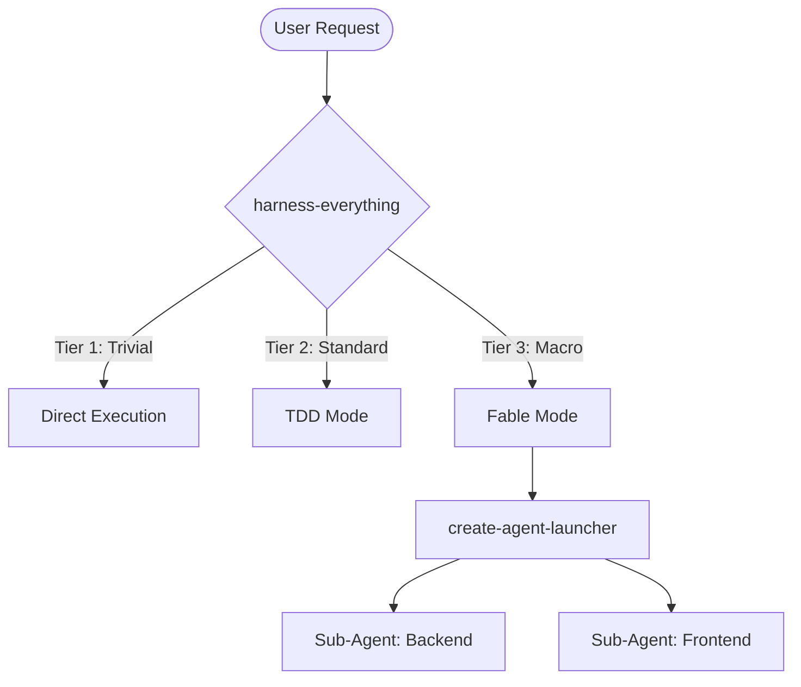
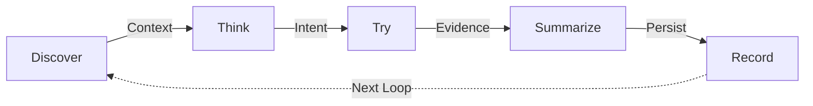
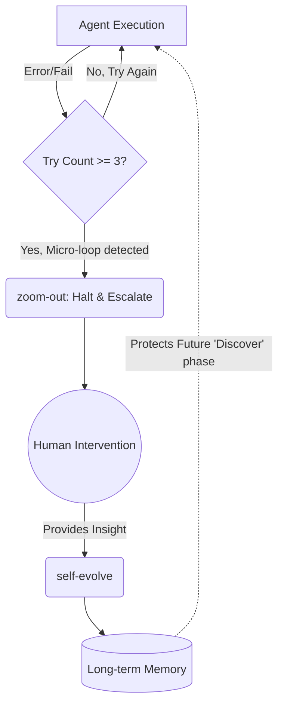

# Harness Skills (The Agentic Operating System)

> "Don't use a cannon to kill a mosquito; break through the reasoning ceiling."

Harness Skills is a dynamic routing and self-defense system built specifically for AI Agents. Inspired by the powerful designs of ECC and Superpowers, this system aims to solve the two most common pain points for AI in daily development:
1. **Over-engineering**: Writing long-winded plans or generating unnecessary sub-agents for simple typo fixes.
2. **Reasoning Ceiling & Infinite Loops**: Falling into invalid infinite retry loops when encountering complex algorithms beyond the model's capabilities.

## Core Design Philosophy: Single Entry & Circuit Breaker Architecture

This Skills system does not require humans to manually choose which Skill to activate. You only need a single entry point: **`harness-everything`**.

### 1. Task Triage
When a task enters `harness-everything`, the Agent automatically categorizes the task:
*   **Tier 1 (Trivial Task)**: Direct execution. Prohibited from writing plans or calling sub-agents.
*   **Tier 2 (Standard Task)**: Automatically switches to `tdd` (Test-Driven Development) mode.
*   **Tier 3 (Macro Task)**: Automatically loads `fable-mode` and `create-agent-launcher`, assembling specialized Sub-agents to handle complex architectures.

### 2. The Global OS
Regardless of the Tier, all Agents must obey the cognitive loop defined by `install-cognitive-os`: **Discover > Think > Try > Summarize > Record**.

### 3. Circuit Breaker & Self-Evolve
*   **Rule of 3**: If fixing the same error fails 3 times, forcefully trigger the `zoom-out` circuit breaker. The Agent must stop writing code and seek human help.
*   **Feedback Loop**: When human intervention resolves the blind spot, forcefully trigger `self-evolve`, abstract the solution, and write it to long-term memory to ensure the same mistake doesn't happen again.

## Directory Structure
- `harness-everything/`: System main entry and routing center
- `install-cognitive-os/`: Underlying cognitive loop OS
- `skill-style/`: Skills writing and design guidelines
- `tdd/`: Standard task development mode
- `fable-mode/` & `fable-discipline/`: Macro task and multi-agent orchestration architecture
- `create-agent-launcher/`: Sub-agent generator
- `zoom-out/`: Circuit breaker and global perspective
- `self-evolve/`: Memory compression and self-evolution
- And other integrated tools (e.g., `git-commit`, `grill-me`, etc.)

---
*Generated for seamless integration into any AI IDE (VS Code Copilot, Claude Code, Cursor, etc.).*
