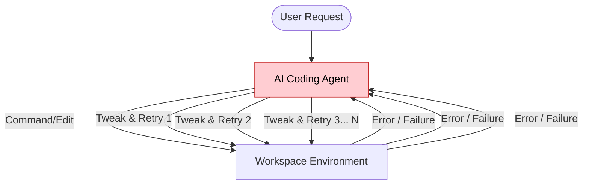
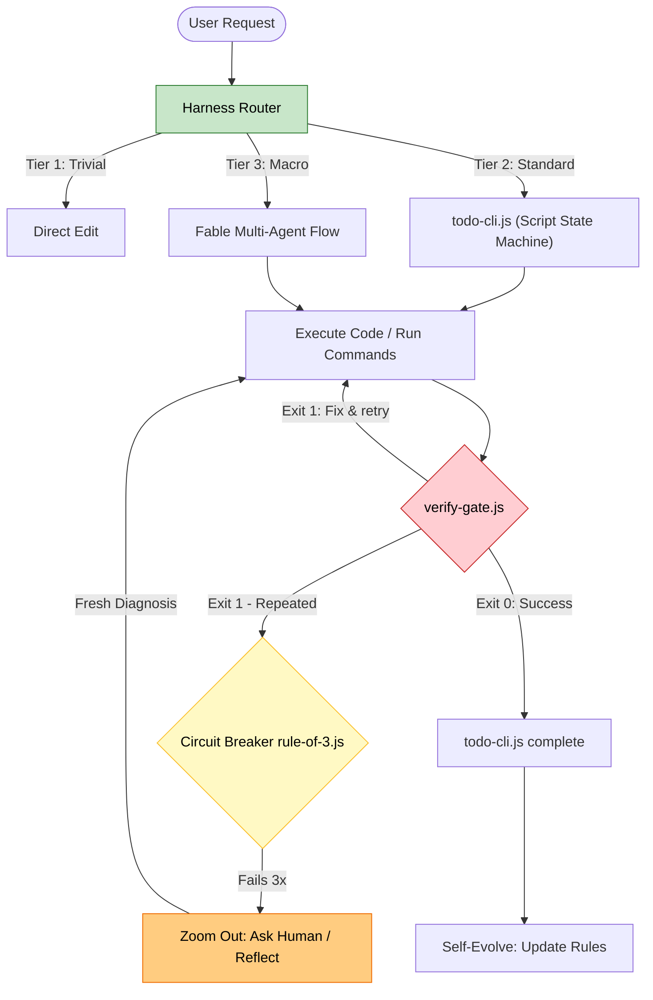

# Harness (Behavior Layer for AI Coding Agents)

[](LICENSE)

Harness is a lightweight, local behavior and orchestration runtime that wraps around your AI development sessions (Claude Code, Cursor, Copilot Chat, Codex, Continue.dev, Hermes Agent). It provides reactive hooks, routing boundaries, and circuit breakers designed to prevent infinite trial-and-error loops, costly over-engineering, and "lost-in-the-middle" context drift.

---

## The Problem

AI coding agents are highly capable, but they struggle with self-regulation, environment awareness, and attention limits:
1. **The Infinite Retry Loop:** When an agent encounters a subtle compilation or test failure, its default behavior is to make micro-adjustments repeatedly (tweak and run, tweak and run) until it exhausts your token budget.
2. **Environment Blindness:** Agents often assume standard Unix environments, hallucinating shell commands and paths when running on Windows, PowerShell, or sandboxed environments.
3. **Lost-in-the-Middle Bloat:** As sessions grow, agents aggressively read too many large files or generate massive console logs, causing severe context degradation and reasoning hallucinations.

---

## Why Harness?

Harness acts as an automated system supervisor. It remains completely silent and out of the way, intervening only when execution boundaries are violated or failures are detected.

### Comparison: Prompt vs. Skill vs. Harness

| Dimension | Prompt-Only (Custom Instructions) | Skill-Only (Task Guides) | Harness (Behavior Layer) |
|---|---|---|---|
| **Activation** | Always loaded (wastes prompt space) | Loaded on demand (requires manual trigger) | Reacts dynamically via native lifecycle hooks |
| **Fail-Safe** | No protection (model keeps retrying) | No protection (loops until token limit) | **Circuit Breaker:** Halts execution after 3 failures and alerts human |
| **Context Aware** | High risk of lost-in-the-middle bloat | Manages scope manually | **Bloat Shield:** Proactively audits diff sizes and logs warning alerts |
| **System Audit** | Blindly assumes shell syntax | Requires manual shell check | **Preflight:** Proactively detects Windows/Unix paths, shell type, and package manager |
| **Memory** | Resets on every new chat session | Static text rules | **Continuous Persistence:** Writes Write-Ahead Logs (WAL) for session recovery and immunizes workspace rules |

The "Harness" column above is Claude Code's behavior. On Cursor, Copilot, Codex, Continue.dev, and Hermes Agent — platforms with no hook/exit-code execution mechanism — Harness can only inject advisory text, which lands in the **Prompt-Only** column instead. See [Supported AI IDEs & Tools](#supported-ai-ides--tools) below.

### When should I use Harness?
* You regularly use agentic coding tools (like Claude Code, Cursor, or Copilot) on medium-to-large codebases.
* You develop on Windows or in mixed shells (Git Bash, WSL, PowerShell) where agents frequently get shell syntax wrong.
* You want automated test-driven development (TDD) enforcement and safety guards to save token budgets.

### When should I NOT use Harness?
* You only use chat interfaces for general questions without letting the AI run local commands or modify files.
* Your project has no test suite, or you prefer unconstrained, free-form agent generation.

---

## ⚡ Quick Start (Get Protected in 10s)

Harness integrates directly into your workspace. There is no heavy daemon, no paid external APIs, and zero configuration required.

```bash
# Option A: Claude Code plugin (marketplace manifest included)
#   /plugin marketplace add dyphn1/Harness-everything
#   /plugin install harness-everything

# Option B: install Harness hooks and skills into your current workspace
npx github:dyphn1/Harness-everything install
```

### Expected Behavior After Installation:
1. **Hook Registration:** Harness registers native hooks (e.g., inside `.claude/settings.json` for Claude Code) to intercept session starts and tool use.
2. **Preflight Audit:** At session startup, a lightweight preflight script runs, printing a diagnostic environment block that tells the agent your exact OS, active shell, and package manager.
3. **Guard Active:** The circuit breaker and context compactors are active in the background, consuming zero overhead unless triggered.

### What Gets Installed (and How to Remove It)

The installer only ever writes to your workspace (or, with `--global`, your home directory) — no daemons, no registry entries, no network services. Depending on which platforms you select, it creates:

| File / Directory | Purpose |
|---|---|
| `.claude/settings.json` (merged) + `.claude/skills/` | Claude Code lifecycle hooks and project skills |
| `.cursorrules` | Cursor advisory rules |
| `.github/copilot-instructions.md` | Copilot Chat advisory instructions |
| `AGENTS.md` | Codex advisory instructions |
| `.continue/rules/harness.md` | Continue.dev advisory rules |
| `.hermes.md` | Hermes Agent advisory context |
| `.claude/harness-everything/` (or the per-platform equivalent) | Harness state: `manifest.json`, WAL, circuit-breaker counters |

The installer records the state directories in `.git/info/exclude` — a local-only git ignore file — so Harness state never lands in a commit and your working tree (including `.gitignore`) is never modified. Everything is removed with the built-in uninstaller:

```bash
npx github:dyphn1/Harness-everything uninstall            # interactive
npx github:dyphn1/Harness-everything uninstall --local --skills -y   # non-interactive, workspace only
npx github:dyphn1/Harness-everything uninstall --global   # also remove ~/.agents etc.
```

---

## Visualizing the Flow

### Without Harness (Endless Trial-and-Error Loop)

```mermaid
flowchart TD
    U([User Request]) --> A[AI Coding Agent]
    A -->|Command/Edit| Env[Workspace Environment]
    Env -->|Error / Failure| A
    A -->|Tweak & Retry 1| Env
    Env -->|Error / Failure| A
    A -->|Tweak & Retry 2| Env
    Env -->|Error / Failure| A
    A -->|Tweak & Retry 3... N| Env
    style A fill:#ffcdd2,stroke:#c62828,stroke-width:1px,color:#000000
```

### With Harness (Guarded and Routed Execution)

```mermaid
flowchart TD
    U([User Request]) --> H_Router[Harness Router]
    H_Router -->|Tier 1: Trivial| T1[Direct Edit]
    H_Router -->|Tier 2: Standard| T2["todo-cli.js (Script State Machine)"]
    H_Router -->|Tier 3: Macro| T3[Fable Multi-Agent Flow]
    
    T2 & T3 --> Exec[Execute Code / Run Commands]
    Exec --> Gate{verify-gate.js}
    
    Gate -->|Exit 1: Fix & retry| Exec
    Gate -->|Exit 1 - Repeated| CB{Circuit Breaker rule-of-3.js}
    CB -->|Fails 3x| ZO[Zoom Out: Ask Human / Reflect]
    ZO -->|Fresh Diagnosis| Exec
    Gate -->|Exit 0: Success| Done[todo-cli.js complete]
    
    Done --> SE[Self-Evolve: Update Rules]
    style H_Router fill:#c8e6c9,stroke:#2e7d32,stroke-width:1px,color:#000000
    style CB fill:#fff9c4,stroke:#fbc02d,stroke-width:1px,color:#000000
    style ZO fill:#ffcc80,stroke:#ef6c00,stroke-width:1px,color:#000000
    style Gate fill:#ffcdd2,stroke:#c62828,stroke-width:1px,color:#000000
```

---

## Core Modules & Concepts

Harness operates through six core cognitive concepts:

1. **Router (`tier-router.js`):** Prevents over-engineering. Triages incoming tasks into Tiers: Tier 1 (Direct Edit, no plans), Tier 2 (Standard TDD enforcement), or Tier 3 (Macro Multi-Agent planning and delegation). It also scans every installed platform's `manifest.json` for skills `self-evolve` has generated dynamically, and auto-surfaces the ones whose keyword triggers match the current prompt — so a lesson learned in one session gets suggested again without the human having to remember it exists. If nothing matches at all — including nothing already kept from the open skills ecosystem — `find-skills` checks `npx skills list` live and, if still nothing, searches `skills.sh`/`npx skills`. With explicit approval it defaults to applying the result ephemerally (a content-addressed OS-temp cache, zero footprint after the OS reclaims it) and only permanently installs via `npx skills add` when the user says they'll reuse it — neither path is cached into `manifest.json` the way `generated[]` is, since third-party content isn't lifecycle-owned by Harness.
2. **Guard (`rule-of-3.js`):** The fail-safe circuit breaker. Tracks failure signatures across terminal runs. If a test or command fails 3 times with the same signature, it locks mutating tools and forces a `zoom-out` reflection: re-verify every assumption with read-only tools, write a fact-checked report, then resume on a fresh diagnosis. The human partner is pulled in only for genuine decisions — or when the same signature trips the breaker a second time. A companion `Stop` gate (`stop-gate.js`) bounces the end of a turn once per edit batch when edits were never followed by a successful verification command.
3. **Memory (`state-persist.js`):** Session transaction logging. Stores a local Write-Ahead Log (WAL) of milestones, preventing agents from forgetting their current task state if a session limits out or restarts.
4. **Reflection (`self-evolve`):** Long-term workspace immunization. Upon task completion, the agent reflects on the root cause of resolved issues, then judges whether the lesson is a simple rule or a reusable, complex pattern: simple rules are appended to local workspace rules (`RULES.md`); genuinely reusable patterns are instead packaged as a dynamic skill (via `skill-creator`'s Dynamic Skill Generation Contract) and registered in `manifest.json` so the Router picks it up in future sessions. Either path is validated by a hermetic self-regression suite before it's persisted.
5. **Subagent Scope Guard (`subagent-scope-guard.js`):** Diffs the whole repo's `git status` before and after every subagent (`Task`) burst, not just the files it was briefed to touch. Catches a subagent that was told to only read/verify but edited files anyway — a real failure mode, not a hypothetical one.
6. **Cognitive Laws (Agent Cognitive OS):** Six governing laws — Intent Precedence, State Handoff Awakening, Elimination & Prediction, Evidence Assertion, Adversarial Falsification, and Code-Documentation Alignment — are woven directly into the specific skill phase each one governs (e.g. Evidence Assertion inside `tdd`'s RED/GREEN/REFACTOR gates, State Handoff Awakening inside `zoom-out`'s reflection phase) rather than duplicated in one shared file. See the relevant skill's own `SKILL.md` for where a given law actually applies.

---

## Supported AI IDEs & Tools

**Only Claude Code gets the hard-boundary hooks.** Every other platform below has no hook/exit-code execution mechanism, so `harness-everything` can only inject advisory text — same protection level as the "Prompt-Only" column in the comparison table above. There is no circuit breaker, no preflight audit, and no WAL on those platforms unless Claude Code (or another hook-capable tool) is also driving the same repo.

| AI Agent Tool | Integration Method | Local Target Location | Enforcement |
|---|---|---|---|
| **Claude Code** | Native Lifecycle Hooks (`PreToolUse`, `PostToolUse`, `SessionStart`) | `.claude/settings.json` (project) / `~/.claude/settings.json` (user)<br>*.claude/skills/* (Project Skills) / *~/.claude/skills/* (Global Skills) | **Hard** — hooks can block a tool call (`exit(2)`) |
| **Cursor** | Native Project Rules | `.cursorrules` | Advisory only |
| **Copilot Chat** | Custom Instructions | `.github/copilot-instructions.md` | Advisory only |
| **Codex** | Custom Instructions (`AGENTS.md`, not `.codex/config.toml` — that file controls CLI/sandbox behavior, not prompt content) | `AGENTS.md` | Advisory only |
| **Continue.dev** | Native project rules (a dedicated Markdown file with YAML frontmatter, `alwaysApply: true`) | `.continue/rules/harness.md` (project) / `~/.continue/rules/harness.md` (user, via `--global`) | Advisory only |
| **Hermes Agent** ([Nous Research](https://hermes-agent.nousresearch.com/)) | Auto-loaded project context file (Hermes also reads `AGENTS.md`/`CLAUDE.md`/`.cursorrules` from the same directory if present, truncated at ~20k chars) | `.hermes.md` (project only — Hermes has no documented global project-instructions equivalent, so `--global --hermes` is a documented no-op) | Advisory only |

---

## 📁 Repository Map

This repository contains 27 skills plus supporting infrastructure. The table below helps you locate what you're looking for.

### 🎯 Skills (27)
| Directory | Purpose | Tier |
|---|---|---|
| `harness-everything` | Meta-skill: routes to other skills | Core |
| `verification-loop` | Enforces test/lint before task completion | Core |
| `verify-before-claim` | Fact-audit discipline before assertions | Core |
| `environment-detection` | Detects OS, shell, package manager | Core |
| `self-evolve` | Long-term workspace immunization | Core |
| `find-skills` | Discovers external skills via CLI | Core |
| `zoom-out` | Circuit breaker reflection protocol | Core |
| `tdd` | RED/GREEN/REFACTOR enforcement | Task |
| `todo-driven-workflow` | State-machine task execution | Task |
| `fable-mode` | Multi-agent orchestration (fable-orchestrator) | Macro |
| `fable-discipline` | Fable worker discipline & guardrails | Macro |
| `build-multi-agent-system` | Generates multi-agent architectures | Macro |
| `create-agent-launcher` | Creates agent launchers for platforms | Macro |
| `to-spec` | Reverse-engineers specs from code | Spec |
| `to-tickets` | Converts specs to actionable tickets | Spec |
| `grill-me` | Adversarial code review (Socratic) | Quality |
| `grill-with-docs` | Document-grounded adversarial review | Quality |
| `git-commit` | Conventional commit generation | Git |
| `rewrite-commits` | History rewriting & squashing | Git |
| `using-git-worktrees` | Parallel worktree workflows | Git |
| `improve-codebase-architecture` | Architectural improvement patterns | Architecture |
| `security-review` | OWASP/STRIDE vulnerability scanning | Security |
| `skill-style` | Skill authoring style guide | Meta |
| `skill-creator` | Dynamic skill generation contract | Meta |
| `eval-harness` | Skill evaluation framework | Eval |
| `install-cognitive-os` | Cognitive OS installation | Meta |
| `repo-docs` | Repository documentation templates | Docs |

### ⚙️ Infrastructure
| Directory | Purpose |
|---|---|
| `hooks/` | Claude Code lifecycle hooks (hard enforcement: circuit breaker, boundary guard, stop gate) |
| `ci/` | Quality gates: consistency-check, description-collision, mechanism tests |
| `scripts/` | Runtime: tier-router, todo-cli, verify-gate, bootstrap, installer |
| `bin/` | CLI entry point (`harness`) |
| `eval-framework/` | Legacy eval harness (deprecated → `eval-harness/`) |
| `behavioral-evals/` | LLM behavioral test cases (on-demand, token-costing) |
| `benchmarks/` | Benchmark fixtures & recorded results (BENCHMARK_SOP) |
| `evals/` | Routing evals per skill (waza format) |
| `.claude-plugin/` | Plugin distribution manifests |

### 📚 Documentation
| Directory | Purpose |
|---|---|
| `docs/` | Architecture, philosophy, routing, reflection, audit |
| `references/` | Shared checklists: definition-of-done, performance, security |
| `docs/workflows/` | Detailed workflow guides (TDD, git-commit, skill-creator, etc.) |

### 🔬 Fixtures & Tests
| Directory | Purpose |
|---|---|
| `eval-framework/fixtures/` | Negative control fixtures for quality gates |

---

## Deeper Documentation

For a deep dive into individual modules and the underlying philosophy, explore our sub-documents:

*   [Harness Philosophy](docs/philosophy.md): The core behavior-first, intervention-only design.
*   [Harness Architecture](docs/architecture.md): Lifecycle hooks, security model, and data locality.
*   [Harness Routing & Triage](docs/routing.md): Detailed trigger criteria for Tiers 1, 2, and 3.
*   [Harness Reflection & Memory](docs/reflection.md): WAL session handoffs and workspace rules immunization.
*   [Harness Audit Log](docs/audit.md): Dated self-audit scorecards, methodology, and per-cycle change log.

---

## Benchmarks & Testing

**If you are an agent asked to verify a Harness install, start at [VERIFICATION.md](VERIFICATION.md), not here.** It gives exact commands with exact expected output — install artifact checks for every platform, mechanism-level checks (Claude Code only), the behavioral test prompts below, and an acceptance scorecard to fill in. Do not report "it works" from reading the code — every check there names a command to actually run.

`npm test` (`self-evolve/scripts/self-regression.js`) runs four phases: static syntax check on every script, 5 bilingual tier-routing assertions, a 6-step behavioral state-machine simulation of `todo-cli.js`, and an automated re-run of every VERIFICATION.md §2 mechanism check (`ci/mechanism-test.js`, `npm run test:mechanism` to run it alone) — 10 assertions against real exit codes and stderr, not just "the code looks right." The suite runs in CI on every push and pull request (`.github/workflows/ci.yml`); the history of how these checks became automated is in [docs/audit.md](docs/audit.md).

For a fuller vanilla-vs-Harness behavioral comparison, see [Harness Skills Benchmark SOP](BENCHMARK_SOP.md) — standardized, reproducible scenarios:
*   **Test A:** Over-engineering defense (Tier 1 typo correction)
*   **Test B:** Micro-error loop defense (Tier 2 bug resolution)
*   **Test C:** Attention loss and hallucination (Tier 3 module refactoring)
*   **Test D:** Knowledge boundary constraints (Offline hallucination prevention)
*   **Test E:** Terminal environment and shell awareness (Windows/Unix shell detection)
*   **Test F** (in VERIFICATION.md, not BENCHMARK_SOP.md): fact-audit discipline — does the agent verify an external-behavior claim before asserting it?

Benchmark **results** are tracked in [benchmarks/](benchmarks/README.md) (`run.js scaffold` builds the fixture, `record` commits a schema-validated result bound to a session log). Until those cells are filled, effectiveness claims are unbacked by recorded evidence.

### Behavioral evals (LLM-level, on demand)

Mechanism tests prove the hooks enforce gates; only live sessions prove agents follow the disciplines. [behavioral-evals/](behavioral-evals/README.md) runs discipline cases (including pressure variants like "we ship in 5 minutes, skip checks") against headless agent sessions (`claude -p`, opencode) in throwaway workspaces: `npm run eval:behavioral`. Token-costing by design — never wired into CI.

### Catalog hygiene

`npm run test:consistency` keeps the distribution manifests, docs links, skill frontmatter, and routing-eval coverage in lockstep with what is actually on disk; `npm run test:collision` fails CI when two skills' descriptions overlap enough to confuse the router. Both run on every push (`.github/workflows/ci.yml`).

---

## 📊 System Evaluation

Harness audits itself on a dated cycle by running its own test suite and VERIFICATION.md recipes — never by reading the code and assuming it works. The full scorecards, methodology, and per-cycle change log live in [docs/audit.md](docs/audit.md).

**Latest baseline — 2026-08-23**, measured with [waza](https://github.com/microsoft/waza) 0.38.7 against an LF-normalized export of `main`: `waza check` 29/29 skills, `waza spec verify` 27/27 eval suites, `npm test` / `test:consistency` / `test:collision` all green.

Measure on an LF export, not a Windows working tree — CRLF inflates waza's counts enough to push 20 of 29 `SKILL.md` files past the 500-token ceiling.

---

## 🤝 For Contributors

To contribute to Harness or modify any Skill behavior, ensure you run the local self-regression suite first:

```bash
# Run full hermetic static syntax & routing simulations
npm run self-regression
```

All script modifications must pass 100% cleanly before pushing to keep the runtime immunized against behavioral regression.

