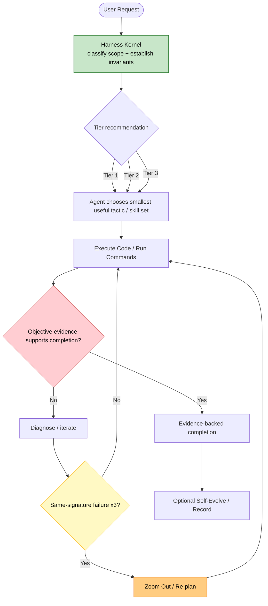

# Harness (Behavior Layer for AI Coding Agents)

[](LICENSE)

Harness is a lightweight, local behavior and orchestration runtime that wraps around your AI development sessions (Claude Code, Cursor, Copilot Chat, Codex, Continue.dev, Hermes Agent). It provides reactive hooks, routing boundaries, and circuit breakers designed to prevent infinite trial-and-error loops, costly over-engineering, and "lost-in-the-middle" context drift.

---

## The Problem

AI coding agents are highly capable, but they struggle with self-regulation, environment awareness, and attention limits:
1. **The Infinite Retry Loop:** When an agent encounters a subtle compilation or test failure, its default behavior is to make micro-adjustments repeatedly (tweak and run, tweak and run) until it exhausts your token budget.
2. **Environment Blindness:** Agents often assume standard Unix environments, hallucinating shell commands and paths when running on Windows, PowerShell, or sandboxed environments.
3. **Lost-in-the-Middle Bloat:** As sessions grow, agents aggressively read too many large files or generate massive console logs, causing severe context degradation and reasoning hallucinations.

---

## Why Harness?

Harness acts as an automated system supervisor. It remains completely silent and out of the way, intervening only when execution boundaries are violated or failures are detected.

Harness deliberately follows a **minimal rails, maximum freedom** design: the runtime enforces only a few cross-cutting invariants — route before execution, verify before claim, and re-plan after repeated identical failure — while capable agents remain free to choose, combine, reorder, or skip domain skills according to the task.

### Comparison: Prompt vs. Skill vs. Harness

| Dimension | Prompt-Only (Custom Instructions) | Skill-Only (Task Guides) | Harness (Behavior Layer) |
|---|---|---|---|
| **Activation** | Always loaded (wastes prompt space) | Loaded on demand (requires manual trigger) | Reacts dynamically when the selected host surface exposes compatible hooks/plugins |
| **Fail-Safe** | No protection (model keeps retrying) | No protection by itself | Can add mechanical retry/verification boundaries on surfaces that package those mechanisms |
| **Context Aware** | High risk of lost-in-the-middle bloat | Manages scope manually | Can add preflight/boundary mechanisms where the host exposes the required lifecycle/tool hooks |
| **System Audit** | Blindly assumes shell syntax | Requires manual shell check | Uses environment detection and explicit verification paths instead of assuming one shell/runtime |
| **Memory** | Resets on every new chat session | Static text rules | Stateful hook/plugin integrations can persist bounded runtime state; instruction-only integrations cannot |

The exact "Harness" behavior depends on the installation surface. Claude Code has the broadest currently verified lifecycle-hook coverage. OpenCode has a real plugin implementation with deterministic mechanism tests, but **live loading remains unverified**. Codex has both an advisory `--codex` installer path and a **local OpenAI plugin** path with `SessionStart` / `UserPromptSubmit` invariant hooks. The public OpenAI **Skills-only** submission is narrower and does not include those local lifecycle hooks. See [Supported AI IDEs & Tools](#supported-ai-ides--tools) and [docs/platform-capabilities.md](docs/platform-capabilities.md).

### When should I use Harness?
* You regularly use agentic coding tools (like Claude Code, Cursor, or Copilot) on medium-to-large codebases.
* You develop on Windows or in mixed shells (Git Bash, WSL, PowerShell) where agents frequently get shell syntax wrong.
* You want lightweight routing, objective verification, and failure-loop safety without forcing every task through a rigid workflow.

### When should I NOT use Harness?
* You only use chat interfaces for general questions without letting the AI run local commands or modify files.
* You deliberately want completely unconstrained execution with no routing, verification, or retry boundaries.

---

## ⚡ Quick Start (Get Protected in 10s)

Harness integrates directly into your workspace. There is no heavy daemon, no paid external APIs, and zero configuration required.

```bash
# Option A: Claude Code plugin (marketplace manifest included)
#   /plugin marketplace add dyphn1/Harness-everything
#   /plugin install harness-everything

# Option B: install Harness hooks/skills/advisory integrations into your workspace
npx github:dyphn1/Harness-everything install

# OpenAI/Codex local plugin packaging is repository-owned under:
#   .agents/plugins/marketplace.json
#   plugins/harness-everything/.codex-plugin/plugin.json
# See docs/openai-plugin.md for local import/install and public Skills-only submission.
```

### Expected Behavior After Installation:
1. **Use the selected surface's real mechanism:** Claude Code hooks, the local OpenAI plugin prompt/session hooks, OpenCode's plugin API, or advisory instructions depending on what you installed.
2. **Preflight / session context where packaged:** Hook-capable surfaces can inject environment/session context automatically; advisory-only surfaces must not be described as if they do.
3. **Verification boundary:** Completion claims require objective evidence; whether that boundary is mechanically invoked or explicitly called depends on the host surface.
4. **Agent Freedom Preserved:** Tier classification suggests useful skills, but does not impose a universal TODO/TDD/Fable sequence.

### What Gets Installed (and How to Remove It)

The general installer only writes to your workspace (or, with `--global`, your home directory) — no daemons, no registry entries, no network services. Depending on which platforms you select, it creates:

| File / Directory | Purpose |
|---|---|
| `.claude/settings.json` (merged) + `.claude/skills/` + `.claude/agents/` | Claude Code lifecycle hooks, project skills, and named Fable agents |
| `.cursorrules` + `.cursor/skills/` | Cursor advisory rules and project skills |
| `.github/copilot-instructions.md` + `.github/skills/` | Copilot Chat advisory instructions and project skills |
| `AGENTS.md` + `.agents/skills/` | Codex advisory instructions plus repo-scoped Agent Skills; Hermes can also consume trusted project skills from `.agents/skills/` |
| `.continue/rules/harness.md` + `.continue/skills/` | Continue.dev advisory rule and project skills |
| `.hermes.md` | Hermes Agent project advisory context |
| `.claude/harness-everything/` (or the per-platform equivalent) | Harness installer/runtime bookkeeping owned by that integration |

For `--global`, the installer uses each host's supported user-level skill location rather than assuming one shared directory works everywhere: shared Agent Skills remain under `~/.agents/skills/` where natively consumed, Continue uses `~/.continue/skills/`, Hermes uses `~/.hermes/skills/`, and Claude uses `~/.claude/skills/`.

The repository also ships a separate local OpenAI/Codex plugin package under `plugins/harness-everything/` with marketplace metadata in `.agents/plugins/marketplace.json`. That package is not the same thing as the `--codex` advisory installer path. The public OpenAI Skills-only upload is narrower again; see [docs/openai-plugin.md](docs/openai-plugin.md).

The installer records its state directories in `.git/info/exclude` — a local-only git ignore file — so Harness state never lands in a commit and your working tree (including `.gitignore`) is never modified. Everything owned by the general installer is removed with the built-in uninstaller:

```bash
npx github:dyphn1/Harness-everything uninstall            # interactive
npx github:dyphn1/Harness-everything uninstall --local --skills -y   # non-interactive, workspace only
npx github:dyphn1/Harness-everything uninstall --global   # also remove Harness-owned global state
```

---

## Visualizing the Flow

### Without Harness (Endless Trial-and-Error Loop)

```mermaid
flowchart TD
    U([User Request]) --> A[AI Coding Agent]
    A -->|Command/Edit| Env[Workspace Environment]
    Env -->|Error / Failure| A
    A -->|Tweak & Retry 1| Env
    Env -->|Error / Failure| A
    A -->|Tweak & Retry 2| Env
    Env -->|Error / Failure| A
    A -->|Tweak & Retry 3... N| Env
    style A fill:#ffcdd2,stroke:#c62828,stroke-width:1px,color:#000000
```

### With Harness (Invariant-First, Agent-Orchestrated Execution)

```mermaid
flowchart TD
    U([User Request]) --> K[Harness Kernel<br/>classify scope + establish invariants]
    K --> T{Tier recommendation}
    T -->|Tier 1| A[Agent chooses smallest useful tactic / skill set]
    T -->|Tier 2| A
    T -->|Tier 3| A
    A --> Exec[Execute Code / Run Commands]
    Exec --> Gate{Objective evidence supports completion?}
    Gate -->|No| Retry[Diagnose / iterate]
    Retry --> CB{Same-signature failure x3?}
    CB -->|No| Exec
    CB -->|Yes| ZO[Zoom Out / Re-plan]
    ZO --> Exec
    Gate -->|Yes| Done[Evidence-backed completion]
    Done --> SE[Optional Self-Evolve / Record]
    style K fill:#c8e6c9,stroke:#2e7d32,stroke-width:1px,color:#000000
    style CB fill:#fff9c4,stroke:#fbc02d,stroke-width:1px,color:#000000
    style ZO fill:#ffcc80,stroke:#ef6c00,stroke-width:1px,color:#000000
    style Gate fill:#ffcdd2,stroke:#c62828,stroke-width:1px,color:#000000
```

The Tier changes the **recommendations**, not the required order. Tier 2 may suggest `tdd`, `todo-driven-workflow`, or `verification-loop`; Tier 3 may suggest Fable or multi-agent capabilities. The model decides what actually helps.

---

## Core Modules & Concepts

Harness operates through six core cognitive concepts:

1. **Kernel Router (`kernel-router.js` + `tier-router.js`):** `tier-router.js` remains the classifier, dynamic-skill detector, and knowledge-guide matcher. `kernel-router.js` is the public runtime boundary: it preserves the classifier result, removes legacy fixed-pipeline instructions, injects the three mandatory invariants, and presents domain skills as advisory suggestions. This prevents host peer-skill selection from bypassing Harness while preserving agent autonomy. If nothing matches at all — including nothing already kept from the open skills ecosystem — `find-skills` checks `npx skills list` live and, if still nothing, searches `skills.sh`/`npx skills` with explicit approval before installation.
2. **Guard (`rule-of-3.js`):** The fail-safe circuit breaker. Tracks failure signatures across terminal runs on integration surfaces that package the required lifecycle hooks. If a test or command fails 3 times with the same signature, it locks mutating tools and forces a `zoom-out` reflection: re-verify every assumption with read-only tools, write a fact-checked report, then resume on a fresh diagnosis. A companion `Stop` gate (`stop-gate.js`) can bounce the end of a turn once per edit batch when edits were never followed by successful verification on hosts where that hook is installed.
3. **Memory (`state-persist.js`):** Session transaction logging for stateful hook/plugin integrations. Static skills/instructions alone do not create WAL state.
4. **Reflection (`self-evolve`):** Long-term workspace immunization. Upon task completion, the agent reflects on the root cause of resolved issues, then judges whether the lesson is a simple rule or a reusable, complex pattern: simple rules are appended to local workspace rules (`RULES.md`); genuinely reusable patterns are instead packaged as a dynamic skill (via `skill-creator`'s Dynamic Skill Generation Contract) and registered in `manifest.json` so the Router picks it up in future sessions. Either path is validated by a hermetic self-regression suite before it's persisted.
5. **Subagent Scope Guard (`subagent-scope-guard.js`):** Diffs the whole repo's `git status` before and after every supported subagent (`Task`) burst, not just the files it was briefed to touch. Catches a subagent that was told to only read/verify but edited files anyway — where that host/integration actually invokes the guard.
6. **Cognitive Laws (Agent Cognitive OS):** The Cognitive OS is a policy layer, not a peer skill that must win host routing before domain work can begin. Its Discover → Think → Try → Summarize → Record loop remains available as an explicit/manual entry point, while runtime integrations establish the smaller cross-cutting invariants independently.

---

## Supported AI IDEs & Tools

The authoritative current matrix is [docs/platform-capabilities.md](docs/platform-capabilities.md). The important distinction is that **one host can have multiple Harness installation surfaces**.

[`opencode-plugin/`](opencode-plugin/) (`index.mjs`) implements a verification gate and a Rule of 3 breaker against OpenCode's real, source-verified plugin API (`tool.execute.before`/`.after`, the `session.idle` event). `ci/mechanism-2n-opencode-plugin.test.js` drives the exported hooks directly against a mock context matching that API. What's *not* yet done: a live OpenCode session actually loading and firing the plugin, so the current claim remains **hard-capable / mechanism-tested, unverified live**.

| AI Agent Tool / Surface | Integration Method | Local Target Location | Enforcement claim |
|---|---|---|---|
| **Claude Code** | Native lifecycle hooks (`PreToolUse`, `PostToolUse`, `SessionStart`, `UserPromptSubmit`, `Stop`) | `.claude/settings.json`, `.claude/skills/`, `.claude/agents/` | **Hard** for the supported verified hook gates |
| **OpenCode** | Native plugin module ([`opencode-plugin/index.mjs`](opencode-plugin/index.mjs)) | `.opencode/plugins/` | **Hard-capable, unverified live** — mechanism/source coverage exists; live host loading is not yet evidence-backed |
| **Codex — general installer path** | Skills + `AGENTS.md` guidance | `AGENTS.md` + repo-scoped `.agents/skills/` | **Advisory/instruction-oriented** where the host only consumes instructions |
| **Codex / local OpenAI plugin** | `.codex-plugin` package with `SessionStart` + `UserPromptSubmit` hooks and 26 canonical skills | `.agents/plugins/marketplace.json` → `plugins/harness-everything/` | **Mechanical invariant enforcement** for the packaged session/prompt hooks; not full Claude parity |
| **Public OpenAI Skills-only plugin** | Public Skills-only bundle | Generated submission ZIP from `plugins/harness-everything/skills/` | **Skill/workflow behavior only**; no local `.codex-plugin` lifecycle hooks in the public artifact |
| **Cursor** | Native Project Rules + project skills | `.cursorrules` + `.cursor/skills/` | Advisory only |
| **Copilot Chat** | Custom Instructions + project skills | `.github/copilot-instructions.md` + `.github/skills/` | Advisory only |
| **Continue.dev** | Native project rules + skills | `.continue/rules/harness.md` + `.continue/skills/`; global skills `~/.continue/skills/` | Advisory only |
| **Hermes Agent** | Auto-loaded project context + skills | `.hermes.md` + trusted project `.agents/skills/`; global skills `~/.hermes/skills/` | Advisory only |

For local OpenAI packaging, marketplace import, plugin tests, and the public Skills-only submission boundary, see [docs/openai-plugin.md](docs/openai-plugin.md).

---

## Repository Index

## Multi-Agent Workspace

Use the canonical `multi-agent-workspace` skill for permanent multi-agent
infrastructure:

```bash
node multi-agent-workspace/scripts/scaffold.js --workspace . \
  --agency-source <path-to-agency-agents> --division engineering --platform codex
```

The source is read-only input. Runtime metadata, selected roles, the launcher,
resolved router, memory index, and structured handoff are keyed under the
global Harness state home; no generated router, executable, or zone skeleton is
written to the target workspace. Decision, domain, and architecture records
are resolved per repository from `CONTEXT-MAP.md`, project configuration,
existing documentation folders, or a committable fallback. Omit the source for
an explicit unavailable-catalog fallback; do not treat it as a complete roster.

This repo uses a flat layout (waza/agentskills.io convention). The table below maps each top-level directory to its role.

| Directory | Category | Description |
|---|---|---|
| `harness-everything` | **Core Runtime** | Bootstrap, kernel-router, tier-router, verify-gate, self-heal |
| `hooks` | **Core Runtime** | Claude Code lifecycle hooks (prompt routing, circuit breaker, scope guard, stop gate, etc.) |
| `scripts` | **Core Runtime** | Installer, manifest, prompts, workspace utilities |
| `bin` | **Core Runtime** | `harness` CLI entry point |
| `ci` | **Quality Gates** | Consistency checks, description collision, mechanism tests, invariant-routing regression, documentation capability drift guard |
| `.github` | **CI/CD** | GitHub Actions workflows (ci.yml, release.yml, behavioral-evals.yml) |
| `.claude-plugin` | **Distribution** | Plugin manifests for Claude Code marketplace |
| `.agents/plugins` | **Distribution** | OpenAI/Codex repository marketplace metadata |
| `plugins/harness-everything` | **Distribution** | Local OpenAI/Codex plugin package plus canonical skill copies |
| `submission/openai` | **Distribution / Review** | Public OpenAI Skills-only listing/test inputs |
| `evals` | **Routing Evals** | 26 trigger/routing eval suites (waza format) |
| `behavioral-evals` | **Behavioral Evals** | LLM-level discipline cases (headless agent sessions) |
| `benchmarks` | **Benchmarks** | BENCHMARK_SOP fixtures and recorded A/B results |
| `docs` | **Documentation** | Philosophy, architecture, routing, reflection, platform capabilities, audit |
| `references` | **Documentation** | Shared checklists (security, performance, definition-of-done) |
| `multi-agent-workspace` | **Skill (Tier 3)** | Scaffold six zones, select agency specialists, and generate bounded launchers |
| `environment-detection` | **Foundation** | Preflight: detect OS, shell, package manager |
| `eval-harness` | **Skill (Tier 2)** | Evaluate agent outputs against rubrics |
| `fable-discipline` | **Skill (Tier 3)** | Fable execution guardrails when Fable is selected |
| `fable-mode` | **Skill (Tier 3)** | Optional macro/multi-agent orchestration with milestone gates |
| `find-skills` | **Meta** | Discover and install skills from open ecosystems |
| `git-commit` | **Skill (Tier 1)** | Conventional commit messages with verification |
| `grill-me` | **Skill (Tier 2)** | Adversarial plan interrogation before implementation |
| `grill-with-docs` | **Skill (Tier 3)** | Domain-model and decision alignment before design publication |
| `improve-codebase-architecture` | **Skill (Tier 2)** | Architectural refactoring with evidence |
| `install-cognitive-os` | **Foundation / Manual Entry** | Explain or explicitly apply the cognitive policy; runtime invariants do not depend on host selecting it |
| `repo-docs` | **Skill (Tier 3)** | Generate repository documentation |
| `rewrite-commits` | **Skill (Tier 1)** | Interactive rebase and commit history cleanup |
| `security-review` | **Skill (Tier 2)** | OWASP/STRIDE security review |
| `self-evolve` | **Skill (Tier 2)** | Workspace immunization via dynamic skills |
| `skill-creator` | **Meta** | Create new skills from patterns |
| `skill-style` | **Meta** | Skill authoring style guide |
| `tdd` | **Skill (Tier 2)** | Test-driven development when executable behavior benefits from it |
| `to-spec` | **Advisory (Tier 2/3)** | Publish specs from settled conversations |
| `to-tickets` | **Advisory (Tier 2/3)** | Decompose settled specs into tracked tickets |
| `todo-driven-workflow` | **Advisory Foundation** | Progress tracking when explicit multi-step state helps |
| `using-git-worktrees` | **Skill (Tier 2)** | Git worktree concurrency patterns |
| `verification-loop` | **Skill (Tier 2)** | Select systematic verification evidence; kernel still requires evidence before completion |
| `verify-before-claim` | **Always-on discipline** | Fact-audit before asserting claims |
| `zoom-out` | **Circuit breaker** | Circuit-breaker reflection protocol |
| `opencode-plugin` | **Platform Plugin** | Enforcement logic for OpenCode's real plugin API; live-session firing still unverified (#37) |

---

## Deeper Documentation

For a deep dive into individual modules and the underlying philosophy, explore our sub-documents:

* [Harness Philosophy](docs/philosophy.md): The core behavior-first, intervention-only design.
* [Harness Architecture](docs/architecture.md): Lifecycle hooks, security model, and data locality.
* [Platform Capability Matrix](docs/platform-capabilities.md): Canonical current enforcement/install/evidence boundary per surface.
* [OpenAI / ChatGPT Plugin Packaging](docs/openai-plugin.md): Local Codex/OpenAI plugin packaging plus public Skills-only submission boundary.
* [Harness Routing & Triage](docs/routing.md): Detailed trigger criteria for Tiers 1, 2, and 3.
* [Harness Reflection & Memory](docs/reflection.md): WAL session handoffs and workspace rules immunization.
* [Harness Audit Log](docs/audit.md): Dated historical self-audit scorecards, methodology, and per-cycle change log.

Fable model selection is documented in [fable-mode/references/model-matrix.md](fable-mode/references/model-matrix.md); the explicit entrypoints are `fable-haiku`, `fable-sonnet`, and `fable-opus`.

Maintainers should follow [RELEASING.md](RELEASING.md) for tag-driven npm releases and record observations in [docs/release-evidence.md](docs/release-evidence.md). The issue #20 coordination decisions and evidence boundaries are captured in [docs/issue-20-rollup.md](docs/issue-20-rollup.md).

---

## Benchmarks & Testing

**If you are an agent asked to verify a Harness install, start at [VERIFICATION.md](VERIFICATION.md), not here.** It separates package/integrity checks, mechanism evidence, live-host evidence, and behavioral evidence so one kind of pass is not mistaken for another.

`npm test` (`self-evolve/scripts/self-regression.js`) runs deterministic syntax, CLI, routing-matrix, positive skill-route coverage, **invariant-first routing regression**, reference, behavioral-case, Fable model-mode, and mechanism checks (`ci/mechanism-test.js`, `npm run test:mechanism` to run it alone). The suite checks real exit codes and stderr, not just "the code looks right." It runs in CI on Ubuntu, Windows, and macOS for every push and pull request (`.github/workflows/ci.yml`); live model evaluations remain explicitly on-demand.

For a fuller vanilla-vs-Harness behavioral comparison, see [Harness Skills Benchmark SOP](BENCHMARK_SOP.md) — standardized, reproducible scenarios:
* **Test A:** Over-engineering defense (Tier 1 typo correction)
* **Test B:** Micro-error loop defense (Tier 2 bug resolution)
* **Test C:** Attention loss and hallucination (Tier 3 module refactoring)
* **Test D:** Knowledge boundary constraints (Offline hallucination prevention)
* **Test E:** Terminal environment and shell awareness (Windows/Unix shell detection)
* **Test F** (in VERIFICATION.md, not BENCHMARK_SOP.md): fact-audit discipline — does the agent verify an external-behavior claim before asserting it?

Benchmark **results** are tracked in [benchmarks/](benchmarks/README.md) (`run.js scaffold` builds the fixture, `record` commits a schema-validated result bound to a session log). Until those cells are filled, effectiveness claims are unbacked by recorded evidence.

### Behavioral evals (LLM-level, on demand)

Mechanism tests prove individual packaged mechanisms; only real host/session evidence proves the host actually loaded and fired them. [behavioral-evals/](behavioral-evals/README.md) runs discipline cases (including pressure variants like "we ship in 5 minutes, skip checks") against headless agent sessions (`claude -p`, OpenCode) in throwaway workspaces: `npm run eval:behavioral`. Token-costing by design — never wired into CI.

### Catalog hygiene

`npm run test:consistency` keeps the distribution manifests, docs links, skill frontmatter, routing-eval coverage, and the cross-platform capability claims in lockstep with what is actually on disk; `npm run test:docs:capabilities` runs the platform-doc drift check directly. `npm run test:references` checks every executable/deep-dive path named by `SKILL.md`; `npm run test:release` compares release/catalog evidence; `npm run test:routing:skills` recursively classifies nested skills and executes the real router for every directly-routable skill's positive cases; `npm run test:routing:invariants` guards the invariant-first architecture; and `harness verify-install` detects stale installed versions or file trees. The installer E2E gate performs install → verify-install → uninstall against seeded user-owned files on Ubuntu, Windows, and macOS so path and ownership symmetry regressions fail CI. `npm run test:collision` fails CI when two skills' descriptions overlap enough to confuse the router.

---

## 📊 System Evaluation

Harness audits itself on a dated cycle by running its own test suite and VERIFICATION.md recipes — never by reading the code and assuming it works. The full scorecards, methodology, and per-cycle change log live in [docs/audit.md](docs/audit.md). Audit scorecards are historical snapshots; current platform capability claims live in [docs/platform-capabilities.md](docs/platform-capabilities.md).

**Latest local audit baseline — 2026-09-01**: 26/26 on-disk skills, 26/26 routing-eval directories, and the local npm gates were green for that audit snapshot. Waza remained a CI-only gate in that checkout because its installer was not available as an npm package; run it on an LF-normalized export as documented by CI.

Measure on an LF export, not a Windows working tree — CRLF can inflate waza's token counts and trigger false budget failures.

---

## 🤝 For Contributors

To contribute to Harness or modify any Skill behavior, ensure you run the local self-regression suite and consistency gates first:

```bash
npm run self-regression
npm run test:consistency
npm run test:plugin:openai
npm run test:plugin:submission
```

All script modifications must pass 100% cleanly before pushing to keep the runtime immunized against behavioral regression.
