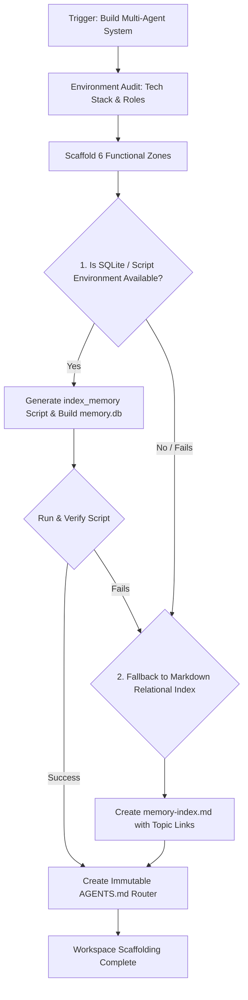

# Architecture Guide (Deep Dive)

## Resolution Flow

## Core Principles

- MUST operate using the cognitive loop: Think > Try > Summarize > Record.
- [Think] Map the project state before altering it. The architecture must adapt to the project's native ecosystem, not force a rigid template.
- [Try] Build the architecture incrementally. Ensure all constraints are physically enforced by the file system or explicit router rules.
- [Summarize] Verify that the cognitive pathways (the 6 functional zones) are clearly isolated and language-appropriate.
- [Record] Leave behind a robust memory indexer and an immutable `AGENTS.md` router as the permanent handoff.

## Cognitive Foundation (The Meta-Framework)

- `install-cognitive-os` defines *how an agent thinks*. `self-evolve` defines *how an agent learns*.
- THIS skill defines **WHERE the agent lives**. It is the physical landing gear.
- Without a strict folder structure and relational index, a multi-agent team will eventually drown in its own Markdown logs, leading to massive token burn and hallucination.
- This skill enforces "Physical Isolation of Context" and "Cognitive Metabolism", but adapts its implementation dynamically based on the project's domain (Software, Research, Writing, etc.).

## Phase Details

### State Checkpoint
- MUST verify the current working directory is the root of the target project.
- MUST verify we have read/write access to create directories and scripts.

### Discovery Phase: Environment Audit
1. Tech Stack & Domain Analysis: MUST analyze the project (e.g., read `package.json`, `pyproject.toml`, or general file extensions) to determine the primary language and domain.
2. Dynamic Role Deduction: MUST deduce the required sub-agent roles from a standard Archetype Pool (e.g., Frontend, Backend, Data, Writer).
   - *Mandatory Roles:* PM (Coordinator) and Challenger (Alignment Enforcer) MUST always be included.

### Execution Phase: Structural Scaffolding
Isomorphic Zone Mapping: MUST implement the "6 Functional Zones", adapting the folder names/paths to the project's ecosystem if necessary (e.g., `docs/`, `.agents/`, `.cursor/`), while preserving their strict semantic purpose:
- `[State]`: High-frequency, volatile working state (Max 100 lines).
- `[Logs]`: Raw dialogue and verification outputs (Strictly excluded from default PM context).
- `[Decisions]`: Distilled Project Memory (ADRs, Read-on-demand via Index).
- `[Domain]`: Immutable product vision / core rules.
- `[Architecture]`: Immutable technical contracts / style guides.
- `[Roles]`: Individual sub-agent system prompts.

### Execution Phase: Hybrid Memory Implementation
Polyglot Indexer Generation & Fallback:
- **Primary**: Generate an `index_memory` script in the project's primary language (e.g., Python, Node.js, Bash) to parse frontmatter and build a local SQLite database (`memory.db`).
- **Fallback (Pure Markdown Index)**: If SQLite or script execution is unavailable or fails, generate a clean `memory-index.md` at the project root or `.github/harness-everything/memory-index.md` listing document zone links and topic tags.

### Execution Phase: The Immutable Router
Hardcoded Laws: MUST create or rewrite `AGENTS.md` at the project root. This file is the system's brain and must be strictly protected:
- It MUST include a directive forbidding sub-agents from modifying it.
- It MUST be a lightweight router (< 50 lines).
- It MUST define the "Bootstrap Protocol" (Read Payload -> Read State -> Delegate without reading full history).
- It MUST enforce "Cognitive Metabolism" (Strict line limits triggering Distillation cycles).
- It MUST enforce "Adaptive Alignment" (Path-based escalation matrix invoking the Challenger).
- It MUST explicitly state the "Non-blocking Release" rule: agents log subjective reviews asynchronously and never halt execution waiting for human input.

### Verification Phase
- MUST run the generated `index_memory` script once to initialize the `memory.db` and verify it executes cleanly in the user's environment.
- MUST summarize the deployed architecture and the dynamically deduced roles to the user.

[Exit: Await User Instruction]
