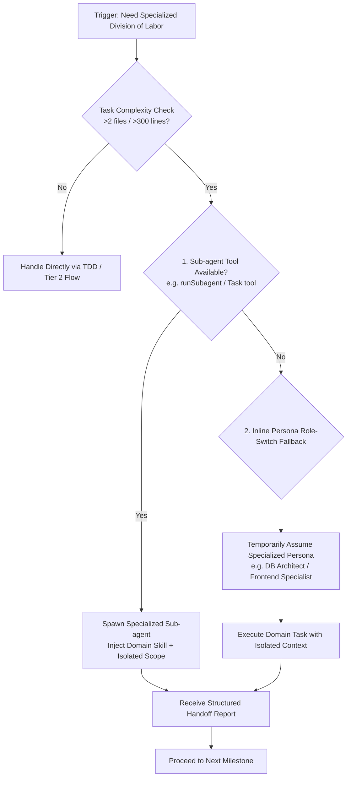

# Create Agent Launcher

## 📋 Skill Contract

| Component | Specification |
| :--- | :--- |
| **Trigger / Input** | Invoked by `fable-mode` for Tier 3 tasks needing domain-specific division of labor, or when scaffolding new multi-agent teams. |
| **Expected Output** | Sub-agent spawned via native subagent tool, or inline persona role-switch fallback with isolated task scope. |
| **State Mutations** | Updates the active session's delegation state (active sub-agents and assigned boundaries). |
| **Enforcement Gate** | Sub-agents return a structured handoff report. Avoid sub-agents for simple tasks (≤2 files / ≤300 lines) — handle directly under `tdd`. |

This skill provides orchestration and scaffolding for multi-agent workflows when tasks benefit from specialized division of labor.

## Process & Sub-agent Spawning Flow

Follow the decision matrix below when delegating domain tasks:

## 1. When to Use
Activate this skill when a task spans multiple distinct tech domains (e.g. database schema, backend API, and frontend UI) or exceeds the comfortable reasoning scope of a single context window.

## 2. Dynamic Sub-agent Orchestration

When launching ad-hoc sub-agents during execution:
- **Persona Alignment**: Give the sub-agent a focused role (e.g. "Senior Database Architect focusing solely on user table indexes").
- **Scope Isolation**: Provide only the relevant file paths and context necessary for the specific sub-task.
- **Model Efficiency**: Match sub-task complexity with appropriate model tiers (e.g. small/fast model for file lookup, main model for multi-file implementation).
- **Handoff Contract**: Require a brief summary upon completion covering modified files, new interfaces, and notes for downstream tasks.
- **Scope Monitoring**: Sub-agent tool executions are monitored by `hooks/scripts/subagent-scope-guard.js`, which alerts if files outside the briefed brief are edited.

## 3. Scaffolding Multi-Agent Project Infrastructure (Sequential Workflows)
For generating structured, permanent agent manifests in a repository, follow the progressive workflow steps in order:
1. **Phase 1 — Platform Discovery**: Read `create-agent-launcher/workflows/01-init.md`
2. **Phase 2 — Project Analysis**: Read `create-agent-launcher/workflows/02-analysis.md`
3. **Phase 3 — Scaffold Generation**: Read `create-agent-launcher/workflows/03-generation.md`
4. **Phase 4 — Execution & Handoff**: Read `create-agent-launcher/workflows/04-launcher.md`

- **Platform Guidelines**: Supported platforms in `create-agent-launcher/guidelines/`:
  - `platform-claude.md` — Claude Code (Hard enforcement via native hooks)
  - `platform-cursor.md` — Cursor (Advisory rules via `.cursorrules`)
  - `platform-copilot.md` — GitHub Copilot (Advisory custom instructions)
  - `platform-codex.md` — Codex CLI (Advisory `AGENTS.md`)
  - `platform-continue.md` — Continue.dev (Advisory `.continue/rules/harness.md`)
  - `platform-hermes.md` — Hermes Agent (Advisory `.hermes.md`)
