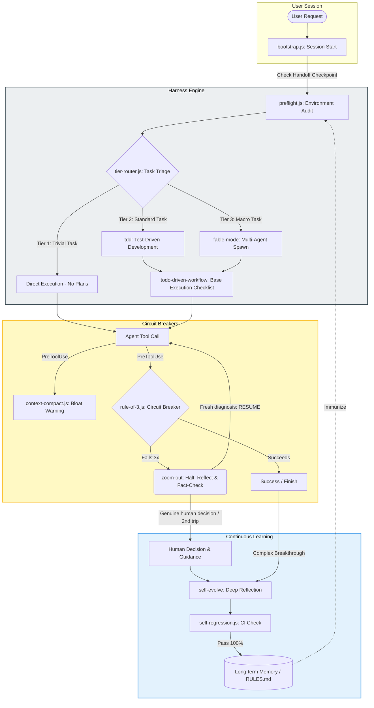

# Harness Architecture

This document details the internal architecture, lifecycle, and integration touchpoints of the Harness behavior layer.

---

## Architectural Overview

Harness acts as a **system supervisor** wrapping around your AI development sessions. Instead of controlling the model's generation directly, it leverages native hook systems (like Claude Code's lifecycle hooks) and instruction files (like `.cursorrules` or `.github/copilot-instructions.md`) to inject contextual guardrails.

The diagram below outlines the full lifecycle of a task under Harness:

---

## Integration touchpoints

Harness is designed to align with the unique capabilities of various AI IDEs and CLI tools — but those capabilities are not equivalent across platforms, and this repo does not pretend otherwise.

**Self-healing:** integration touchpoints can drift — installed from one editor, opened in another. `harness-everything/scripts/self-heal.js` audits all six touchpoints below and re-runs the idempotent installer to backfill whatever is missing. On Claude Code, `bootstrap.js` performs the audit at SessionStart and reports missing touchpoints (repair is left to the model so an intentionally removed file isn't silently re-created every session); on hook-less platforms, the audit runs when `harness-everything` or `environment-detection`'s Discover phase loads. Only Claude Code has a hook system with exit-code-based blocking; every other platform below gets **advisory text only**, with the same protection level as the "Prompt-Only" column in the README's own comparison table. There is no `preflight.js` audit, no `Rule of 3` circuit breaker, and no WAL on those platforms — nothing runs the `.claude/harness-everything/state/*` runtime-state scripts unless Claude Code (or another hook-capable tool) is also driving the same repo.

**Placement rule:** a platform's own native file/folder (`.claude/settings.json`, `.cursorrules`, `.cursor/skills/`, …) is never moved — it lives exactly where that platform expects it. Anything Harness itself needs that has no native home converges into one exclusively-owned subfolder per platform: `<platform-dir>/harness-everything/`. Nothing else ever creates a directory literally named `harness-everything`, which is what lets the installer add or remove it as a unit — including on uninstall — without touching anything else already in that platform's directory (another tool's files, or skills the user installed by hand).

**Runtime state vs. installed skill content:** `<platform-dir>/harness-everything/` holds two kinds of content, kept apart by subfolder. `skills/` — Claude only, since Claude has no native project-skill directory to piggyback on — is the installer's local skill-copy target (see `scripts/lib/skills.js`'s `getInstalledSkills`, which is manifest-tracked, not a blind directory scan) — real files, not cache. Every other platform's skills stay at that platform's own established location (`.cursor/skills`, `.github/skills`, `.codex/skills`, `.continue/skills`) and are never moved. `state/` is pure runtime state: hook JSON, circuit-breaker counters, handoff/verification timestamps. It's scoped per Claude Code `session_id` under `sessions/<id>/` so two sessions open on the same repo never share (and stomp) each other's edit/verify timestamps or breaker counts — invocations with no `session_id` (manual runs, tests) fall into a fixed `sessions/default/` bucket. Both are gitignored and safe to delete; `state/` regenerates itself from nothing but in-session state (losing it mid-session just clears breaker/verification history), while deleting `skills/` requires re-running the installer to restore the copied skill files. A `manifest.json` sibling at the `harness-everything/` root records exactly what the installer put where, per platform, so uninstall never has to guess.

### 1. Claude Code (hook-enforced)
Our installer configures native lifecycle hooks inside `.claude/settings.json`:
*   `SessionStart`: Runs `bootstrap.js` to restore previous handoffs, check environment variables, and initialize session state.
*   `PreToolUse`: Triggers `rule-of-3.js`, `boundary-guard.js`, `depth-guard.js`, `context-compact.js`, and `subagent-scope-guard.js` to intercept tool invocations before they run, and can actually block one (`exit(2)`) — e.g. the Rule of 3 circuit breaker.
*   `PostToolUse`: Records tool outcomes, updates the persistent transaction log (WAL) via `state-persist.js`, tracks repeat failures, and can only add advisory context back (the tool already ran; nothing here blocks it).
*   `Stop`: Runs `stop-gate.js` — when a turn ends with uncommitted edits that were never followed by a successful verification command (test/build/lint), it bounces the stop back once per edit batch. This is the mechanical form of `verification-loop`'s pre-delivery gate; on every other platform that gate remains advisory prose.

### 2. Cursor (advisory only)
The installer appends guidance to `.cursorrules`. Cursor has no hook/execution mechanism, so nothing in `.claude/harness-state/` gets read or written by Cursor itself, and no tool call can be blocked — the model is simply asked (in the same file, every session) to self-regulate: discover the environment before acting, stop after 3 repeated failures instead of continuing to retry, and prefer small commits.

### 3. Copilot Chat (advisory only)
Same mechanism and same limits as Cursor, via `.github/copilot-instructions.md`.

### 4. Codex (advisory only)
Same mechanism and same limits again, via `AGENTS.md` — Codex's actual custom-instruction file, read automatically at session start (`.codex/config.toml` controls CLI/sandbox behavior, not prompt content, and was never a valid target for this).

### 5. Continue.dev (advisory only)
Continue's rules system reads individual Markdown files (with YAML frontmatter — `name`, `globs`, `alwaysApply`) from a `.continue/rules/` folder rather than one shared file, so the installer writes a dedicated `.continue/rules/harness.md` with `alwaysApply: true` instead of appending into an arbitrary pre-existing file. No hook/execution mechanism, same limits as Cursor. Global scope writes to `~/.continue/rules/harness.md`.

### 6. Hermes Agent (advisory only)
[Hermes](https://hermes-agent.nousresearch.com/) (Nous Research) auto-injects project context into its system prompt from `.hermes.md`, `AGENTS.md`, `CLAUDE.md`, and `.cursorrules` if present in the directory it's launched from (truncated at ~20k chars) — meaning a Codex or Cursor install already reaches Hermes for free. The installer still writes a dedicated `.hermes.md` for explicit coverage. No hook/execution mechanism. Project scope only: Hermes has no documented global project-instructions equivalent (its own settings live under `~/.hermes/`, which governs model/terminal/skills config, not per-project behavior text), so `--global --hermes` is a deliberate no-op rather than a guess.

---

## Security Model & Data Locality

Harness runs with a **zero-trust, fully local security model**:

1. **No External APIs:** Harness does not send telemetry, code snippets, or configuration files to external servers. All processing is done locally via native Node.js scripts.
2. **Credential Protection:** Harness never asks for or stores API keys or secrets. If any terminal command prompts for a password, Harness's rules immediately direct the model to halt and request manual entry by the human partner.
3. **Execution Gating:** The hook scripts are written in standard CommonJS, ensuring they compile and run fast (<200ms) to prevent blocking terminal operations.
