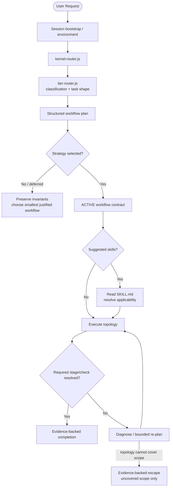
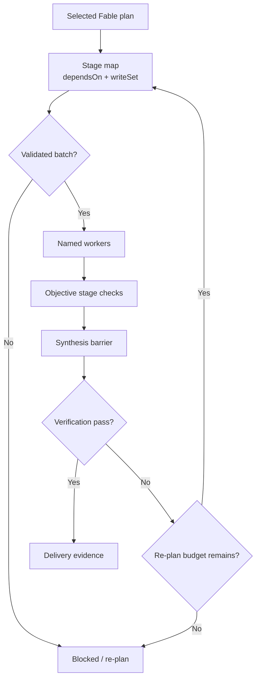
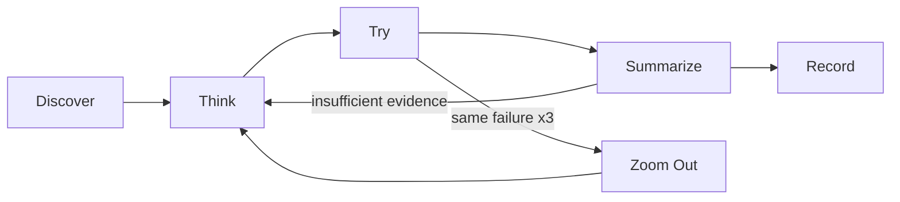

# Harness Architecture

This document describes Harness runtime architecture and integration boundaries. Current host capability/evidence claims are centralized in [platform-capabilities.md](platform-capabilities.md); package wiring is not live-host proof.

## Architectural Overview

Harness is a **behavior and workflow observer/router**, not a universal fixed workflow or scheduler. The router chooses a useful topology; the model remains free to adapt execution.

The minimal kernel establishes:

- scope/tier before mutation,
- a selected workflow topology as a semantic execution contract when task evidence supports one,
- applicability evaluation for every suggested skill before omission,
- objective evidence before completion,
- bounded re-plan/recovery after repeated failure,
- explicit warnings/degraded/escape evidence instead of silent workflow deletion;
- one mandatory user-visible Harness Status protocol for non-trivial work, independent of execution topology.

> **Contract-first lifecycle; flexible reasoning/implementation and execution.**
>
> Suggested skills MUST be evaluated from their real flows. Applicable skill core contracts and selected-topology obligations are semantic MUSTs; missing evidence produces reminders rather than persistent Harness locks.

This avoids both extremes: no universal Tier-2/Tier-3 pipeline and no maze of self-deadlocking cognitive gates.


```mermaid
flowchart TD
    U([User Request]) --> B[Session bootstrap / environment]
    B --> K[kernel-router.js]
    K --> T[tier-router.js<br/>classification + task shape]
    T --> P[Structured workflow plan]
    P --> A{Strategy selected?}
    A -- No / deferred --> D[Preserve invariants<br/>choose smallest justified workflow]
    A -- Yes --> C[ACTIVE workflow contract]
    C --> S{Suggested skills?}
    S -- Yes --> E[Read SKILL.md<br/>resolve applicability]
    S -- No --> X[Execute topology]
    E --> X
    X --> V{Required stage/check resolved?}
    V -- Yes --> Done[Evidence-backed completion]
    V -- No --> R[Diagnose / bounded re-plan]
    R --> X
    R -- topology cannot cover scope --> Esc[Evidence-backed escape<br/>uncovered scope only]
```

### Router responsibilities

`kernel-router.js` is the public runtime entry. It consumes the structured classifier contract and exposes:

- tier + rationale,
- selected/deferred execution strategy,
- required invariants,
- suggested skills that require applicability evaluation,
- the internal routing checkpoint,
- the semantic workflow contract.

The router does not tell the model *how* to solve each stage. It decides what lifecycle shape is required. `direct-single`, `iterative-single`, `fable-staged`, `fable-parallel`, and `fable-multi-agent-workspace` remain deliberately small, non-overlapping topology choices.

### User-visible status protocol

Non-trivial work MUST expose one stable, scannable Markdown progress shape to the user:

```md
### 🚦 Harness Status

- **Current:** <what is being done now>
- **Read / Evidence:**
  - <important file/source/evidence read or confirmed>
  - <another item when multiple evidence items improve scanability>
- **Next:** <next intended action>
- **Risk / Blocked:** <only when materially applicable; omit otherwise>
```

Use nested evidence bullets when multiple items would otherwise become one dense sentence. The agent emits the status before substantive execution, after major phases, on material direction changes, at meaningful long-running phase boundaries, and before final completion. The router checkpoint feeds this status as internal source state but is not a second user-facing template.

This is a semantic contract, not another cognitive lock. Hook-capable hosts may observe or remind about compliance; instruction-only hosts still receive the MUST contract without pretending they can mechanically enforce it.

### Skill applicability vs. topology execution

Router suggestions remain useful domain/workflow knowledge, not a universal sequence. Before omission, the agent reads the complete `SKILL.md` entry and evaluates `USE FOR`, `DO NOT USE FOR`, workflow/basic flow, and hard rules. Name/description/router-summary or “routine task” is insufficient evidence.

The selected topology is a semantic lifecycle contract, not a persistent execution lock. Required obligations MUST resolve; implementation tactics MAY adapt.

### Runtime workflow state

On host paths that can persist it, `kernel-router.js` records session-scoped `workflow-run.json` with the selected strategy and lifecycle state. Prompt text is not persisted; only a content hash is retained for correlation.

For selected Fable topologies on Claude:

- `workflow-gate.js` observes supported mutation/worktree/Fable state and emits reminders;
- Fable owns stage contracts, `dependsOn`/`writeSet`, validated execution batches, objective per-stage checks, synthesis, cold verification, and bounded re-plans;
- `workflow-stop-gate.js` reports unresolved stage/verification evidence without rejecting Stop;
- `workflow-disposition.js` records explicit lifecycle/audit decisions; numeric budgets are no longer authoritative control state.

Other topologies use their own applicable mechanisms: advisory loop-awareness reminders, regular verification stop-gates, action gates, and task-specific skills. Mechanism coverage is not assumed identical across hosts.

### Scoped runtime advisories and capabilities

Two kernel mechanisms annotate plans without creating hard workflow enforcement:

- **Ensemble policy (`harness-everything/scripts/ensemble-policy.js`):** optional selection is a **MAY** capability, not a separate topology. It is selected only when uncertainty is high (or stakes are high) **and** the task asks for comparable outputs or preserves explicit disagreement **and** the selected strategy is already `fable-*`. Creative generation, mechanical bulk work, an explicit user prohibition, unavailable subagents, or a blocked base plan force exclusion. Once selected, preserving disagreement, using an independent verifier, and honoring the plan's ensemble invariants are **MUST** obligations. Covered by deterministic mechanism tests; no live-host effectiveness claim follows from the annotation alone.
- **Single-use memory capability (`kernel-router.js#issueMemoryCapability`):** when the selected plan permits memory writes, the router issues one capability token bound to `sessionId`/`workflowId` with a stored SHA-256 hash (`memoryAuthorization`, coordinator-only writer role, `usedAt` tracking). Plans with `memory.write === 'none'` receive no capability. This binds a memory write to the workflow that authorized it; it is not a general credential and proves nothing about a live host honoring the binding.

### PreToolUse guard trio and denied-mutation probes

On the Claude hook path, three narrowly scoped `PreToolUse` guards sit alongside the workflow/action gates:

- `boundary-guard.js` (Grep/Glob/Read): warns about very large reads and noisy search roots; it fails open.
- `depth-guard.js` (Write): reminds when an existing file would be overwritten without prior inspection. The semantic obligation to establish current target state before destructive overwrite is a **MUST**; the hook itself stays fail-open. New files are unaffected.
- `context-compact.js`: estimates working-tree context pressure from `git status`/`git diff --numstat` so later stages can compact or halt before lost-in-the-middle degradation.

Shell mutation observation is best-effort evidence for reminders. The old mutation-probe reservation/lock subsystem was retired by #190.

## Integration Touchpoints

Harness aligns to each host's actual lifecycle/tool APIs. Shared skill text defines a contract; only supported host mechanisms can mechanically block or observe particular transitions.

### Runtime state vs. skill content

Runtime state includes hook metadata, workflow lifecycle, circuit-breaker counters, handoff/verification evidence, and WAL-style session state. Skill content is independently discoverable and remains useful on instruction-only surfaces.

### Claude Code — hook guidance plus explicit safety boundaries

The installer configures native lifecycle hooks and project skills.

- `SessionStart`: bootstrap/restoration.
- `UserPromptSubmit`: kernel routing + workflow guidance.
- `PreToolUse`: workflow/boundary/depth/scope reminders, plus separate action permission and Rule-of-3 boundaries.
- `PostToolUse`: outcomes, state, repeated-failure evidence, stage checks.
- `Stop`: action-gate audit plus non-blocking workflow/verification reminders.

These hooks make semantic obligations observable; they do not promote cognitive workflow contracts into hard enforcement.

### OpenCode — plugin enforcement, scoped live verification

The retained [OpenCode evidence](../benchmarks/results/live-host/opencode-2026-09-16/README.md) supports **project-scope `.js` loading and edit/verification state on OpenCode 1.18.31 (macOS)**. The final snapshot is **post-reset**. Hard-lock is an **interactive observation** with **no retained blocked-tool trace**; reflection was **operator-seeded** and then agent-rewritten. Global scope, npm-package installation, and other OpenCode versions remain unverified.

This evidence predates #190 and does not establish behavioral effectiveness of the current guidance-first lifecycle.

### Cursor — skills plus advisory rules

Cursor receives project skills and advisory rules. The semantic workflow contract can be stated, but unsupported lifecycle transitions are not mechanically enforced.

### GitHub Copilot agent surfaces — skills plus advisory instructions

Copilot receives Agent Skills/repository instructions. No Harness-specific live hook-enforcement claim is made from repository text alone.

### Codex / local OpenAI plugin

Codex has multiple distinct Harness surfaces:

- The general `--codex` installer writes repo-scoped `.agents/skills/` plus `AGENTS.md`; when consumed only as instructions, workflow enforcement is advisory/instruction-governed.
- The **Codex / local OpenAI plugin** under `plugins/harness-everything/` packages canonical skills plus session/prompt/supported-tool/subagent/stop hooks. The package includes workflow-gate adapters, but this is mechanism/package evidence until a live Codex session proves loading/firing.
- The public OpenAI **Skills-only** artifact excludes local `.codex-plugin` lifecycle hooks; it carries reusable workflow knowledge, not local hard gates.

Do not infer Claude parity from package similarity.

### Continue.dev — rules documented, standalone discovery uncertain

Continue uses native rule files; standalone skill discovery remains separately bounded by the capability matrix.

### Hermes Agent — trusted skills plus advisory context

Hermes uses trusted project/global skill surfaces plus advisory context. Trust/loading and lifecycle enforcement remain host-specific.

## Fable Execution Architecture

Fable is the execution owner for selected `fable-*` topologies.


```mermaid
flowchart TD
    P[Selected Fable plan] --> M[Stage map<br/>dependsOn + writeSet]
    M --> B{Validated batch?}
    B -- No --> Block[Blocked / re-plan]
    B -- Yes --> W[Named workers]
    W --> C[Objective stage checks]
    C --> S[Synthesis barrier]
    S --> V{Verification pass?}
    V -- Yes --> D[Delivery evidence]
    V -- No --> R{Re-plan budget remains?}
    R -- Yes --> M
    R -- No --> Block
```

The orchestrator coordinates lifecycle and evidence; scope drift is reported for review rather than turned into a cognitive deadlock.

## Cognitive OS and Skill Mesh

The Cognitive OS remains a reasoning policy:


```mermaid
flowchart LR
    D[Discover] --> T[Think]
    T --> Y[Try]
    Y --> S[Summarize]
    S --> R[Record]
    S -- insufficient evidence --> T
    Y -- same failure x3 --> Z[Zoom Out]
    Z --> T
```

A domain skill may define RED/GREEN/REFACTOR or another local lifecycle. The selected Harness topology supplies the outer execution contract; domain skills supply tactics/stages when applicable.

## Security and Data Locality

1. **No Harness telemetry service:** project code/state is not uploaded by Harness runtime scripts.
2. **Credential protection:** credentials remain human/host controlled.
3. **Small mechanism surface:** hooks should remain fast and auditable.
4. **Explicit enforcement labels:** instruction, mechanism, and live evidence are distinct.
5. **Deterministic regression:** workflow/routing/hook contracts are executable CI gates.
6. **No silent widening:** workflow escape cannot widen authorization, permissions, or external side effects.

## Validation Boundary

Validation is layered:

- syntax/reference/package checks prove package integrity;
- routing tests prove plan and workflow-contract semantics;
- mechanism tests prove supported hook/plugin behavior;
- live-host evidence proves a specific host actually loaded/fired the mechanism;
- paired behavioral evaluation (#71) is required before claiming the new lifecycle improves outcomes.

The architecture diagrams are part of the contract. A runtime orchestration change must update these docs and tests in the same change.
