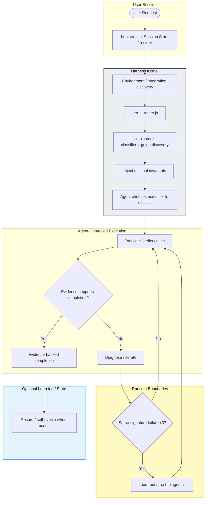
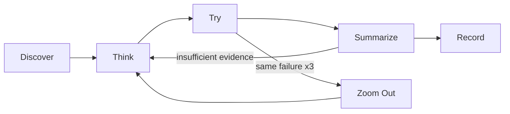

# Harness Architecture

This document describes the internal architecture, lifecycle, and integration boundaries of the Harness behavior layer.

---

## Architectural Overview

Harness is a **system supervisor**, not a universal workflow engine. Skills remain independently useful, while runtime mechanisms establish a small cross-cutting contract around software work.

The architecture follows a mechanism-first skill mesh with a **minimal kernel**:

- classify scope before mutation,
- require evidence before completion claims,
- stop repeated same-signature micro-retries and re-plan,
- leave domain skill selection, ordering, planning style, and delegation to the agent.

> **Do not enforce workflow order. Enforce workflow invariants.**

This is intentionally different from the older design where Tier 2 implied a fixed TDD/checklist pipeline and Tier 3 implied a mandatory Fable/multi-agent pipeline.

```mermaid
flowchart TD
    subgraph User_Session [User Session]
        U([User Request]) --> Boot[bootstrap.js: Session Start / restore]
    end

    subgraph Kernel [Harness Kernel]
        Boot --> Preflight[Environment / integration discovery]
        Preflight --> KR[kernel-router.js]
        KR --> TR[tier-router.js<br/>classifier + guide discovery]
        TR --> Inv[Inject minimal invariants]
        Inv --> Choice[Agent chooses useful skills / tactics]
    end

    subgraph Execution [Agent-Controlled Execution]
        Choice --> Tools[Tool calls / edits / tests]
        Tools --> Evidence{Evidence supports completion?}
        Evidence -- Yes --> Done[Evidence-backed completion]
        Evidence -- No --> Retry[Diagnose / iterate]
    end

    subgraph Defense [Runtime Boundaries]
        Retry --> CB{Same-signature failure x3?}
        CB -- No --> Tools
        CB -- Yes --> ZO[zoom-out / fresh diagnosis]
        ZO --> Tools
    end

    subgraph Learning [Optional Learning / State]
        Done --> Record[Record / self-evolve when useful]
    end

    style Kernel fill:#eceff1,stroke:#37474f,stroke-width:2px,color:#000000
    style Defense fill:#fff9c4,stroke:#fbc02d,stroke-width:2px,color:#000000
    style Learning fill:#e3f2fd,stroke:#1e88e5,stroke-width:2px,color:#000000
```

### Router responsibilities

`kernel-router.js` is the public runtime entry point. It delegates heuristic classification and dynamic guide/skill discovery to `tier-router.js`, then converts the result into the Harness contract:

- recommended Tier + rationale,
- required invariants,
- advisory skill suggestions.

The kernel deliberately suppresses the old fixed `BASE EXECUTION LOOP` wording so that a host selecting `tdd`, `security-review`, `repo-docs`, or another peer skill cannot accidentally replace or bypass the cross-cutting Harness contract.

`harness-everything` remains the public/manual skill entry point for routing, debugging, and re-routing. `install-cognitive-os` remains the explanatory/manual entry point for the Discover → Think → Try → Summarize → Record policy. Automatic correctness must not depend on either one winning host peer-skill selection first.

---

## Integration Touchpoints

Harness aligns to each host's real capabilities. Enforcement strength is platform-specific; shared skill text does not prove mechanism parity.

### Self-healing and placement

`harness-everything/scripts/self-heal.js` audits supported integration touchpoints and can re-run the idempotent installer to repair missing pieces. If a user intentionally removed an integration, respect that choice.

A platform's native files stay where that platform expects them. Harness-owned runtime state converges under the platform's `harness-everything/` state directory, while skills remain in each platform's native skill location. `manifest.json` records installed artifacts so uninstall can remove only Harness-owned files.

### Runtime state vs. skill content

Runtime state includes hook metadata, circuit-breaker counters, handoff/verification timestamps, and WAL-style session state. Skill content is separate and independently discoverable. This separation lets a domain skill remain useful even when a host does not support Harness runtime hooks.

---

## Host Adapters

### 1. Claude Code — hook-enforced

The installer configures native lifecycle hooks and project skills.

- `SessionStart`: `bootstrap.js` restores prior state and audits integrations.
- `UserPromptSubmit`: `kernel-router.js` establishes routing + invariants before peer/domain skill execution.
- `PreToolUse`: circuit breaker, boundary/depth/context guards, and subagent scope guards can block supported tool calls.
- `PostToolUse`: records outcomes/state and tracks repeated failures.
- `Stop`: `stop-gate.js` prevents an edit batch from being claimed complete without successful verification evidence.

The prompt hook is intentionally lightweight: it does **not** prescribe TODO/TDD/Fable order. It gives the model the rails and lets the model orchestrate itself.

### 2. opencode — plugin enforcement, live loading still unverified

`opencode-plugin/` maps supported enforcement behavior to opencode's plugin API. Source-level/mechanism tests exist, but live plugin loading remains tracked separately; do not overclaim it.

### 3. Cursor — advisory

The current installer uses `.cursorrules`. Without a Harness runtime hook adapter, routing/verification/retry boundaries are self-directed guidance.

### 4. Copilot Chat — advisory

The current installer uses `.github/copilot-instructions.md`; same advisory limitation as Cursor.

### 5. Codex — current installer advisory; Plugin adapter tracked in #72

The existing installer writes `AGENTS.md`, so that installed path remains advisory today. Current OpenAI tooling supports richer Plugin/hook mechanisms, but Harness should only claim hard behavior after the `.codex-plugin` adapter is packaged and verified. Issue #72 tracks that work.

The invariant-first architecture is specifically designed to map cleanly onto a prompt hook: establish the kernel contract before host skill routing, then allow the model to select peer/domain skills freely.

### 6. Continue.dev — advisory

The installer writes `.continue/rules/harness.md` with the platform's native rules format. No Harness hard-gate parity is claimed.

### 7. Hermes Agent — advisory

The installer writes `.hermes.md` for explicit project coverage. No hard-gate parity is claimed.

---

## Cognitive OS and Skill Mesh

The Cognitive OS is a policy layer, not a parent skill that every domain skill must call.

```mermaid
flowchart LR
    D[Discover] --> T[Think]
    T --> Y[Try]
    Y --> S[Summarize]
    S --> R[Record]
    S -- insufficient evidence --> T
    Y -- same failure x3 --> Z[Zoom Out]
    Z --> T
```

A domain skill may have its own lifecycle — for example RED/GREEN/REFACTOR inside `tdd` — without being forced into a global sequence. The only shared obligations are the kernel invariants.

This separation solves the peer-skill routing problem: a strong host may correctly decide that a task primarily needs `tdd` or `security-review`; that choice is allowed. What it cannot silently erase is the routing/evidence/retry contract established by the runtime.

---

## Security Model & Data Locality

Harness runs with a local-first, zero-trust model:

1. **No Harness telemetry:** runtime scripts do not upload project code or state as a Harness service.
2. **Credential protection:** scripts do not require storing user secrets; interactive credentials remain human-controlled.
3. **Small hook surface:** hook scripts are local Node.js programs and should stay fast and auditable.
4. **Explicit enforcement labels:** unsupported/advisory behavior must not be documented as hard enforcement.
5. **Deterministic regression:** mechanism and routing behavior is tested with executable CI gates rather than inferred from documentation.

---

## Validation Boundary

Static configuration is not enough to claim that a host behaves correctly. Validation is layered:

- syntax/reference/manifest checks prove package integrity,
- `ci/invariant-routing.test.js` proves the kernel contract and documentation invariants,
- mechanism tests prove supported hook behavior,
- live host sessions are required before claiming platform-level hard-enforcement parity.

The architecture and its Mermaid diagrams are part of that contract. Runtime changes that alter orchestration must update these documents in the same change.
