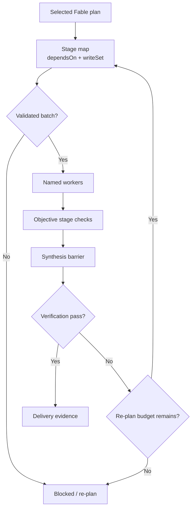
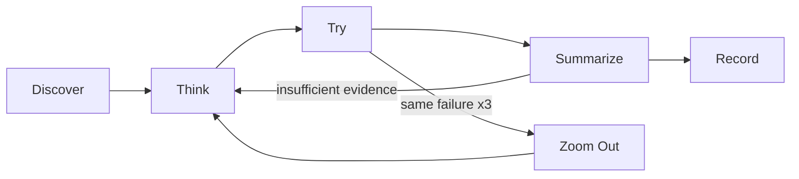

# Harness Architecture

This document describes Harness runtime architecture and integration boundaries. Current host capability/evidence claims are centralized in [platform-capabilities.md](platform-capabilities.md); package wiring is not live-host proof.

## Architectural Overview

Harness is a **behavior and workflow supervisor**, not one universal fixed workflow. The router chooses the smallest sufficient execution topology; once selected, that topology becomes a lifecycle contract. The model retains freedom over reasoning, tools, and implementation technique inside the contract.

The minimal kernel establishes:

- scope/tier before mutation,
- a selected workflow topology when task evidence supports one,
- applicability evaluation for every suggested skill before omission,
- objective evidence before completion,
- bounded re-plan/recovery after repeated failure,
- explicit blocked/degraded/escape state instead of silent workflow deletion.

> **Mandatory applicable workflow; flexible reasoning/implementation inside it.**
>
> A suggested skill can be `not-applicable` after evaluating its real flow. A selected topology cannot be replaced with a direct path merely because the model is confident. Escape is only for genuinely uncovered workflow scope and requires evidence.

This avoids both extremes: the old universal Tier-2/Tier-3 pipeline and a purely advisory system where the model can rationalize away verification, staging, documentation, or other applicable obligations.

```mermaid
flowchart TD
    U([User Request]) --> B[Session bootstrap / environment]
    B --> K[kernel-router.js]
    K --> T[tier-router.js<br/>classification + task shape]
    T --> P[Structured workflow plan]
    P --> A{Strategy selected?}
    A -- No / deferred --> D[Preserve invariants<br/>choose smallest justified workflow]
    A -- Yes --> C[ACTIVE workflow contract]
    C --> S{Suggested skills?}
    S -- Yes --> E[Read SKILL.md<br/>resolve applicability]
    S -- No --> X[Execute topology]
    E --> X
    X --> V{Required stage/check resolved?}
    V -- Yes --> Done[Evidence-backed completion]
    V -- No --> R[Diagnose / bounded re-plan]
    R --> X
    R -- topology cannot cover scope --> Esc[Evidence-backed escape<br/>uncovered scope only]
```

### Router responsibilities

`kernel-router.js` is the public runtime entry. It consumes the structured classifier contract and exposes:

- tier + rationale,
- selected/deferred execution strategy,
- required invariants,
- suggested skills that require applicability evaluation,
- the visible routing checkpoint,
- a workflow execution contract.

The router does not tell the model *how* to solve each stage. It decides what lifecycle shape is required. `direct-single`, `iterative-single`, `fable-staged`, `fable-parallel`, and `fable-multi-agent-workspace` remain deliberately small, non-overlapping topology choices.

### Skill applicability vs. topology execution

Router suggestions remain useful domain/workflow knowledge, not a universal sequence. Before omission, the agent reads the complete `SKILL.md` entry and evaluates `USE FOR`, `DO NOT USE FOR`, workflow/basic flow, and hard rules. Name/description/router-summary or “routine task” is insufficient evidence.

The selected topology is stronger. Once selected, it must be entered and resolved unless the runtime records a permitted workflow escape with uncovered scope + evidence. Covered obligations survive the escape.

### Runtime workflow state

On host paths that can persist it, `kernel-router.js` records session-scoped `workflow-run.json` with the selected strategy and lifecycle state. Prompt text is not persisted; only a content hash is retained for correlation.

For selected Fable topologies on Claude:

- `workflow-gate.js` runs before parent artifact mutation and prevents direct `Edit`/`Write` bypass until a correlated Fable run exists;
- Fable owns stage contracts, `dependsOn`/`writeSet`, validated execution batches, objective per-stage checks, synthesis, cold verification, and bounded re-plans;
- `workflow-stop-gate.js` rejects completion while correlated stage contracts remain unresolved;
- `workflow-disposition.js` permits only narrow evidence-backed escape (`workflow-uncovered-scope` or `host-capability-unavailable`).

Other topologies use their own applicable mechanisms: loop budgets, regular verification stop-gates, action gates, and task-specific skills. Mechanism coverage is not assumed identical across hosts.

## Integration Touchpoints

Harness aligns to each host's actual lifecycle/tool APIs. Shared skill text defines a contract; only supported host mechanisms can mechanically block or observe particular transitions.

### Runtime state vs. skill content

Runtime state includes hook metadata, workflow lifecycle, circuit-breaker counters, handoff/verification evidence, and WAL-style session state. Skill content is independently discoverable and remains useful on instruction-only surfaces.

### Claude Code — hook-enforced mechanisms

The installer configures native lifecycle hooks and project skills.

- `SessionStart`: bootstrap/restoration.
- `UserPromptSubmit`: kernel routing + active workflow contract.
- `PreToolUse`: workflow bypass gate, action gate, rule-of-3, boundary/depth/context guards, subagent scope guard.
- `PostToolUse`: outcomes, state, repeated-failure evidence, stage checks.
- `Stop`: action-gate audit, selected-Fable completion gate, and ordinary verify-before-claim stop gate.

These hooks make some lifecycle obligations mechanically enforceable. They still do not prove a real session loaded/fired them; live evidence remains separate.

### OpenCode — plugin enforcement, scoped live verification

The retained [OpenCode evidence](../benchmarks/results/live-host/opencode-2026-09-16/README.md) supports **project-scope `.js` loading and edit/verification state on OpenCode 1.18.31 (macOS)**. The final snapshot is **post-reset**. Hard-lock is an **interactive observation** with **no retained blocked-tool trace**; reflection was **operator-seeded** and then agent-rewritten. Global scope, npm-package installation, and other OpenCode versions remain unverified.

This evidence does not establish the new mandatory-workflow lifecycle on OpenCode. That requires its own adapter/evidence before parity is claimed.

### Cursor — skills plus advisory rules

Cursor receives project skills and advisory rules. The semantic workflow contract can be stated, but unsupported lifecycle transitions are not mechanically enforced.

### GitHub Copilot agent surfaces — skills plus advisory instructions

Copilot receives Agent Skills/repository instructions. No Harness-specific live hook-enforcement claim is made from repository text alone.

### Codex / local OpenAI plugin

Codex has multiple distinct Harness surfaces:

- The general `--codex` installer writes repo-scoped `.agents/skills/` plus `AGENTS.md`; when consumed only as instructions, workflow enforcement is advisory/instruction-governed.
- The **Codex / local OpenAI plugin** under `plugins/harness-everything/` packages canonical skills plus session/prompt/supported-tool/subagent/stop hooks. The package includes workflow-gate adapters, but this is mechanism/package evidence until a live Codex session proves loading/firing.
- The public OpenAI **Skills-only** artifact excludes local `.codex-plugin` lifecycle hooks; it carries reusable workflow knowledge, not local hard gates.

Do not infer Claude parity from package similarity.

### Continue.dev — rules documented, standalone discovery uncertain

Continue uses native rule files; standalone skill discovery remains separately bounded by the capability matrix.

### Hermes Agent — trusted skills plus advisory context

Hermes uses trusted project/global skill surfaces plus advisory context. Trust/loading and lifecycle enforcement remain host-specific.

## Fable Execution Architecture

Fable is the execution owner for selected `fable-*` topologies.

```mermaid
flowchart TD
    P[Selected Fable plan] --> M[Stage map<br/>dependsOn + writeSet]
    M --> B{Validated batch?}
    B -- No --> Block[Blocked / re-plan]
    B -- Yes --> W[Named workers]
    W --> C[Objective stage checks]
    C --> S[Synthesis barrier]
    S --> V{Verification pass?}
    V -- Yes --> D[Delivery evidence]
    V -- No --> R{Re-plan budget remains?}
    R -- Yes --> M
    R -- No --> Block
```

The orchestrator controls lifecycle and completion; workers do not create peer-to-peer meshes or widen their own write scope. The model remains creative inside each bounded stage, while stage existence/checks/termination are contract state.

## Cognitive OS and Skill Mesh

The Cognitive OS remains a reasoning policy:

```mermaid
flowchart LR
    D[Discover] --> T[Think]
    T --> Y[Try]
    Y --> S[Summarize]
    S --> R[Record]
    S -- insufficient evidence --> T
    Y -- same failure x3 --> Z[Zoom Out]
    Z --> T
```

A domain skill may define RED/GREEN/REFACTOR or another local lifecycle. The selected Harness topology supplies the outer execution contract; domain skills supply tactics/stages when applicable.

## Security and Data Locality

1. **No Harness telemetry service:** project code/state is not uploaded by Harness runtime scripts.
2. **Credential protection:** credentials remain human/host controlled.
3. **Small mechanism surface:** hooks should remain fast and auditable.
4. **Explicit enforcement labels:** instruction, mechanism, and live evidence are distinct.
5. **Deterministic regression:** workflow/routing/hook contracts are executable CI gates.
6. **No silent widening:** workflow escape cannot widen authorization, permissions, or external side effects.

## Validation Boundary

Validation is layered:

- syntax/reference/package checks prove package integrity;
- routing tests prove plan and workflow-contract semantics;
- mechanism tests prove supported hook/plugin behavior;
- live-host evidence proves a specific host actually loaded/fired the mechanism;
- paired behavioral evaluation (#71) is required before claiming the new lifecycle improves outcomes.

The architecture diagrams are part of the contract. A runtime orchestration change must update these docs and tests in the same change.
