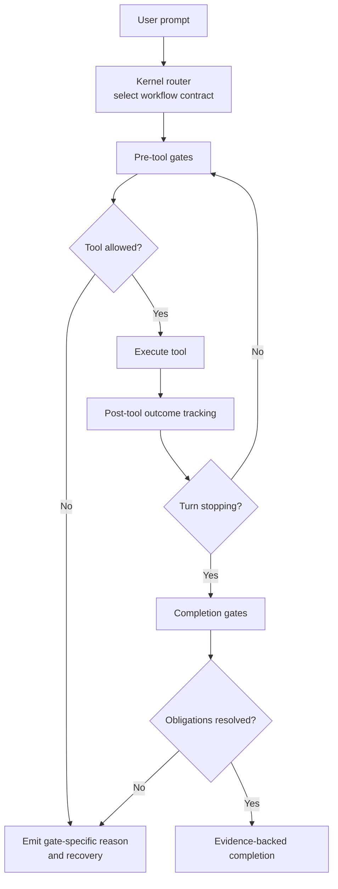
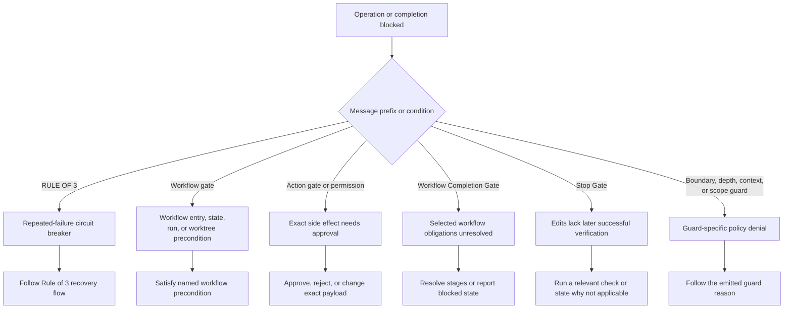

# Enforcement and Lock Diagnostic Flows

Harness has several mechanisms that can deny a tool call or delay completion. Only one of them is a repeated-failure circuit breaker. Use the emitted mechanism name and the flows below before describing a denial as a lock problem.

This guide describes the repository's current hook wiring. Mechanical enforcement depends on the host and installation surface; see [Platform Capability Matrix](platform-capabilities.md) before generalizing a behavior to every host.

## Lifecycle map

On the Claude hook surface, a request enters the router before tool use. Pre-tool gates decide whether a tool call may start, post-tool hooks record outcomes, and stop gates decide whether the turn may finish.

The important separation is:

- **Pre-tool denial:** the requested operation did not run.
- **Post-tool tracking:** the operation ran and its outcome updated state.
- **Stop denial:** the turn cannot claim completion yet; it does not necessarily prevent the next tool call.
- **Approval request:** the exact destructive or external action waits for authorization; it is not a retry lock.

## Which mechanism stopped progress?

Start with the prefix in the error or hook message. Do not infer the mechanism only from the fact that a command did not run.

If a message has no Harness prefix, check the host permission system and the tool's own error before changing Harness state.

## Mechanism reference

| Mechanism | Trigger | What it blocks | State and persistence | Recovery |
|---|---|---|---|---|
| Rule of 3 | The same normalized shell failure signature reaches its category threshold. Defaults to 3; timeout and permission use 2; environment and dependency use 4. | Mutating tools. Read-only investigation remains available, and the required zoom-out report is the only permitted write. | Session-scoped `rule-of-3-state.json`. A second trip of the same signature after one accepted reflection becomes a human-decision hard lock. | First trip: produce a fresh valid `zoom-out-report.md`. Repeat trip: human runs `npm run harness:reset`, starts a new session, or uses `/clear`. |
| Workflow gate | Active workflow state or entry contract is incompatible with the requested mutation; examples include blocked/failed/satisfied state, missing correlated Fable run, or missing linked worktree for major work. | The requested mutation. Read-only commands and trusted workflow-controller commands have narrow exceptions. | Session workflow state. Major-workflow isolation is a hard precondition, not an automatic fallback. | Use the exact message: enter a linked worktree, start/replan through the controller, resolve blocked state, or submit a new task after satisfaction. |
| Action gate | A shell rule or structured destructive/external action matches the policy. | Only the exact action payload; its hash is used for audit correlation. | Approval/audit state records pending, executed, failed, or rejected disposition. | Approve or reject through the host flow, or change the action. Approval of one payload does not authorize a different payload. |
| Workflow completion gate | A selected workflow is stopping with unresolved stage, correlation, or verification obligations. | Completion. On a repeated stop-hook attempt it records a blocked state instead of looping forever. | `workflow-run.json` plus correlated stage/handoff state. | Resolve the named obligation. If genuinely blocked, report the blocker rather than claim completion. |
| Ordinary stop gate | A dirty tree contains edits with no later successful verification-like command. | Completion once per edit batch. It is intentionally a bounce, not a persistent cage. | `stop-gate-state.json` remembers the edit timestamp already bounced. | Run a targeted test/build/lint check, or explicitly state why verification is not applicable and stop again. |
| Boundary/depth/context/scope guards | A guard-specific read, write, context-pressure, or subagent-scope condition matches. | The matching tool or workflow step. | Mechanism-specific; these are not Rule of 3 counters. | Follow the emitted reason and the corresponding architecture documentation. |

## Rule of 3 state transitions

The tracker hashes a normalized failure together with category, file path, and command context. A different signature starts a new counter. A confirmed successful action clears recovery state.

```mermaid
stateDiagram-v2
    [*] --> Counting
    Counting --> Counting: same signature below threshold
    Counting --> Reflecting: threshold reached
    Reflecting --> Counting: valid fresh report with RESUME
    Reflecting --> Escalating: valid fresh report with ESCALATE
    Counting --> HardLocked: same signature trips after reflection
    HardLocked --> [*]: human reset or new session
    Counting --> [*]: confirmed success
    Escalating --> HardLocked: mutation retried and signature trips again
```

A valid reflection report must be newer than the failure that tripped the breaker, contain `Goal`, `Failed Attempts`, `Verified Facts`, `Diagnosis`, and `Decision`, and end in a `RESUME` or `ESCALATE` decision. A stale report cannot release a later trip.

## Pre-tool ordering and overlapping denials

The configured Claude pre-tool order is workflow gate, action gate, Rule of 3, then the narrower boundary/depth/context/scope guards for their matched tools. This means the first emitted denial identifies the condition reached on that call; it does not prove that every later gate would pass.

For example:

1. A force push may first fail the workflow gate if the selected workflow has not been entered.
2. After workflow entry is fixed, the action gate may still require approval for the same force push.
3. Rule of 3 is relevant only when repeated tracked failures reached the signature threshold; it should not be reset to bypass workflow or approval requirements.

Treat each denial independently and re-evaluate after satisfying its stated condition.

## Host and evidence boundary

The hook sequence above is the canonical Claude package wiring. The local OpenAI/Codex plugin packages related lifecycle adapters, while general installer paths and the public Skills-only artifact may be advisory rather than mechanically enforced. OpenCode has a separate plugin implementation and a narrower retained live-host evidence boundary.

Repository mechanism tests show that packaged code follows its tested contract. They do not by themselves prove that a particular live host loaded the package, fired the hook, or improved agent behavior. Record live-host evidence before making that stronger claim.

## Source map

Use these implementation files when this guide and runtime appear to disagree:

- `hooks/hooks.json` — lifecycle wiring and order.
- `hooks/scripts/rule-of-3.js` and `rule-of-3-tracker.js` — counter, thresholds, reflection, and hard-lock behavior.
- `hooks/scripts/workflow-gate.js` and `workflow-stop-gate.js` — mutation and completion workflow contracts.
- `hooks/scripts/action-gate.js` and `action-gate-rules.json` — approval policy and audit behavior.
- `hooks/scripts/stop-gate.js` — ordinary one-bounce verification behavior.
- [Harness Architecture](architecture.md) and [Workflow Runtime](workflow-runtime.md) — broader runtime contracts and limitations.
