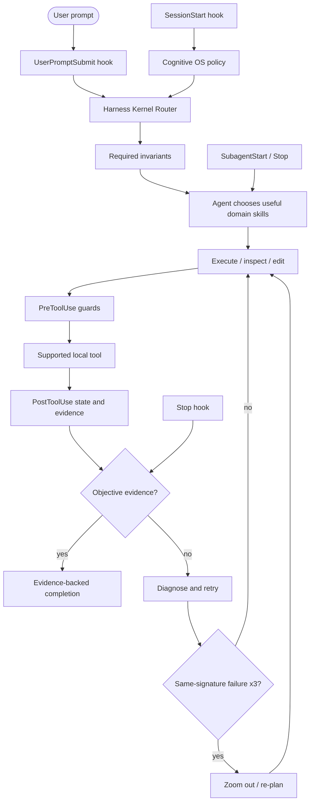

# OpenAI / ChatGPT Plugin Packaging

Harness Everything ships an OpenAI plugin package under `plugins/harness-everything/` while the root skill directories remain the canonical source.

## Architecture



The local OpenAI adapter enforces cross-cutting invariants through the lifecycle events that it packages. Tier-specific skills remain advisory; the model may choose, combine, reorder, or skip them. Tool enforcement is limited to the host tool names declared in `hooks/hooks.json`.

## Package layout

```text
.agents/plugins/
└── marketplace.json

plugins/harness-everything/
├── .codex-plugin/
│   └── plugin.json
├── hooks/
│   ├── hooks.json
│   └── session-start.js
└── skills/
    └── <26 canonical skills>

submission/openai/
├── listing.json
├── test-cases.json
└── README.md
```

The package copies canonical root skill directories so ChatGPT/Codex receives the standard `skills/<name>/SKILL.md` layout. It also carries the shared hook scripts under `hooks/scripts/` and their portable state dependencies under `hooks/scripts/lib/`; `hooks/session-start.js` is the OpenAI-specific JSON adapter. Do not edit generated packaged copies directly.

Run:

```bash
npm run plugin:sync
npm run test:plugin:openai
npm run test:plugin:submission
```

`plugin:sync` refreshes package copies from canonical skill directories and copies the shared hook runtime/dependencies into the package. Text parity is normalized to LF so the same package is reproducible from Windows and Unix checkouts. `test:plugin:openai` fails when the package drifts, a skill is missing/extra, the manifest/version is inconsistent, publication metadata is incomplete, the marketplace path is invalid, lifecycle hooks are missing, or packaged routing/runtime contracts stop being deterministic. `test:plugin:submission` validates the public-review materials and reproducible skills bundle.

## Publication metadata contract

The `.codex-plugin/plugin.json` manifest includes the interface fields checked by OpenAI's plugin evaluator:

- display name and descriptions;
- developer name and **Developer Tools** category;
- `Interactive`, `Read`, and `Write` capabilities;
- public website, privacy, and terms URLs;
- up to three starter prompts, each below the UI length limit.

Harness remains a **skill-only plugin**. It does not declare `apps` or `mcpServers`; those should only be introduced when a real external integration requires them. `SUPPORT.md`, `PRIVACY.md`, and `TERMS.md` provide the public support and policy URLs used by the submission form.

## Install from this repository in a managed ChatGPT workspace

OpenAI supports GitHub marketplace import from a repository-root `.agents/plugins/marketplace.json`.

Use:

```text
Source: https://github.com/dyphn1/Harness-everything
Path:   <empty>
Branch: main
```

Then in ChatGPT:

1. Open **Workspace settings > Plugins**.
2. Select **Add > Import marketplace**.
3. Enter the source/path/branch values above and authorize GitHub if prompted.
4. Review the import report and open **Harness Everything**.
5. Set the installation policy for the intended workspace roles.
6. Run a fresh-chat smoke test before enabling it broadly.
7. For later repository updates, open the imported marketplace and use **Sync now**; automatic daily sync may also update it.

Official import documentation: https://help.openai.com/en/articles/20001504-importing-and-syncing-plugin-marketplaces-from-github

Repository policy values such as `AVAILABLE` are useful marketplace metadata, but workspace administrators still control the effective installation policy after import.

## Install locally in ChatGPT desktop / Codex

The same repository marketplace can be discovered from a checked-out repo in supported desktop/Codex workflows.

1. Open this repository in ChatGPT desktop / Work or Codex.
2. Restart the host after pulling marketplace or plugin changes when required by the client.
3. Open the **Plugins Directory** and choose **Harness Everything**.
4. Install the plugin.
5. Review and trust bundled command hooks when prompted. Changed hook definitions may require review again.
6. Start a new chat for behavior tests.

The local install may be copied into the host's plugin cache; after modifying the package, refresh the repository copy and restart/refresh the client before retesting.

## Public Plugin Directory submission

OpenAI now documents a public submission path for **skills-only** plugins. This is separate from managed-workspace GitHub marketplace import.

Build the upload artifact:

```bash
npm run plugin:submission:build
```

This produces a deterministic `dist/openai-submission/harness-everything-skills.zip` plus a manifest containing every file hash and the final bundle SHA-256. The ZIP contains the exact packaged `skills/` tree and no MCP server or fake app wrapper.

Submission flow:

1. Open the OpenAI plugin submission portal.
2. Select **Create plugin**.
3. Choose **Skills only**.
4. Use `submission/openai/listing.json` for listing fields, starter prompts, and release notes.
5. Upload the generated skills ZIP.
6. Enter the five positive and three negative reviewer cases from `submission/openai/test-cases.json`.
7. Select the verified developer/business identity and production logo.
8. Choose supported countries/regions, complete attestations, and submit for review.
9. After approval, publish from the portal; only then does the plugin appear in the universal Plugins Directory.

Official submission documentation: https://developers.openai.com/plugins/deploy/submission

### Public skills-only boundary

The public skills bundle contains reusable skills and their referenced scripts/templates/assets. It does **not** include the local `.codex-plugin` lifecycle hooks. Do not describe `SessionStart`, `UserPromptSubmit`, or other host-specific hooks as hard enforcement in the published skills-only artifact unless OpenAI exposes and validates a submission mechanism for them.

The submitted review cases therefore measure skill/workflow behavior rather than depending on local hook execution.

## Publication smoke checklist

Before public submission:

- `npm run plugin:sync` produces no unexpected changes;
- `npm run test:plugin:openai` passes;
- `npm run test:plugin:submission` passes on Ubuntu and Windows;
- all 26 skills are present and content-identical to canonical sources after EOL normalization;
- the generated skills ZIP is reproducible for the same revision;
- marketplace and plugin names are `harness-everything` / **Harness Everything**;
- version matches the canonical Claude manifest;
- support, privacy, and terms links are public and current;
- the submission contains five positive and three negative reviewer cases;
- no secrets, private endpoints, machine-specific absolute paths, app IDs, or MCP definitions are added accidentally;
- the publisher identity is verified and the submitter has Apps Management write access;
- a production-ready logo and country/region availability are selected in the portal;
- final reviewer-facing cases are run against the exact submitted skills tree.

## Current compatibility boundary

The repository package validates the architecture-critical local layer:

- all 26 skills are discoverable from one plugin;
- `SessionStart` injects the compact Cognitive OS policy locally;
- `UserPromptSubmit` executes the invariant-first kernel locally before peer skill selection;
- `PreToolUse` / `PostToolUse` cover `Bash` and `apply_patch` for the packaged circuit-breaker, context, state, atomic-change, and contract checks;
- `SubagentStart` / `SubagentStop` record and report subagent scope changes;
- `Stop` runs the one-bounce verification gate;
- Linux and Windows hook commands are declared;
- routing is deterministic for identical input;
- the manifest carries the publication-facing interface fields expected by OpenAI's plugin evaluator.

The local package's claims are mechanism-tested, not live-host-verified. Hooks may require host review/trust, and the package only covers the declared local tool/event mappings. The public skills-only submission intentionally makes a narrower claim: reusable skill behavior plus packaged scripts/templates/assets. It does **not** claim lifecycle hook enforcement because it excludes the local `.codex-plugin` hooks.

OpenAI's current hook contract and supported event/tool schemas are documented in the [Codex/ChatGPT hooks reference](https://learn.chatgpt.com/docs/hooks). A fresh local host session is required to promote this package evidence to a live-host claim.
