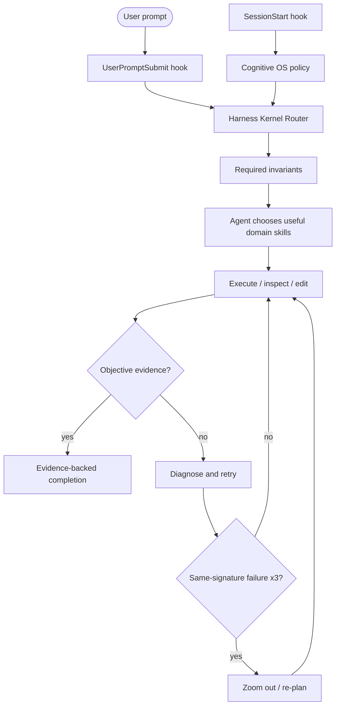

# OpenAI / ChatGPT Plugin Packaging

Harness Everything ships an OpenAI plugin package under `plugins/harness-everything/` while the root skill directories remain the canonical source.

## Architecture



The OpenAI adapter intentionally enforces only the cross-cutting invariants. Tier-specific skills remain advisory; the model may choose, combine, reorder, or skip them.

## Package layout

```text
.agents/plugins/
└── marketplace.json

plugins/harness-everything/
├── .codex-plugin/
│   └── plugin.json
├── hooks/
│   ├── hooks.json
│   └── session-start.js
└── skills/
    └── <26 canonical skills>
```

The package copies canonical root skill directories so ChatGPT/Codex receives the standard `skills/<name>/SKILL.md` layout. Do not edit packaged skill copies directly.

Run:

```bash
npm run plugin:sync
npm run test:plugin:openai
```

`plugin:sync` refreshes package copies from canonical skill directories. `test:plugin:openai` fails when the package drifts, a skill is missing/extra, the manifest/version is inconsistent, publication metadata is incomplete, the marketplace path is invalid, hooks are missing, or packaged routing stops being deterministic.

## Publication metadata contract

The `.codex-plugin/plugin.json` manifest includes the interface fields checked by OpenAI's plugin evaluator:

- display name and descriptions;
- developer name and **Developer Tools** category;
- `Interactive`, `Read`, and `Write` capabilities;
- public website, privacy, and terms URLs;
- up to three starter prompts, each below the UI length limit.

Harness remains a **skill-only plugin**. It does not declare `apps` or `mcpServers`; those should only be introduced when a real external integration requires them. `PRIVACY.md` and `TERMS.md` describe the current local/hosted-data boundary.

## Install from this repository in a managed ChatGPT workspace

OpenAI supports GitHub marketplace import from a repository-root `.agents/plugins/marketplace.json`.

Use:

```text
Source: https://github.com/dyphn1/Harness-everything
Path:   <empty>
Branch: main
```

Then in ChatGPT:

1. Open **Workspace settings > Plugins**.
2. Select **Add > Import marketplace**.
3. Enter the source/path/branch values above and authorize GitHub if prompted.
4. Review the import report and open **Harness Everything**.
5. Set the installation policy for the intended workspace roles.
6. Run a fresh-chat smoke test before enabling it broadly.
7. For later repository updates, open the imported marketplace and use **Sync now**; automatic daily sync may also update it.

Official import documentation: https://help.openai.com/en/articles/20001504-importing-and-syncing-plugin-marketplaces-from-github

Repository policy values such as `AVAILABLE` are useful marketplace metadata, but workspace administrators still control the effective installation policy after import.

## Install locally in ChatGPT desktop / Codex

The same repository marketplace can be discovered from a checked-out repo in supported desktop/Codex workflows.

1. Open this repository in ChatGPT desktop / Work or Codex.
2. Restart the host after pulling marketplace or plugin changes when required by the client.
3. Open the **Plugins Directory** and choose **Harness Everything**.
4. Install the plugin.
5. Review and trust bundled command hooks when prompted. Changed hook definitions may require review again.
6. Start a new chat for behavior tests.

The local install may be copied into the host's plugin cache; after modifying the package, refresh the repository copy and restart/refresh the client before retesting.

## Workspace distribution versus public Plugin Directory

GitHub marketplace import is an immediately testable **workspace distribution** path. A workspace can make an imported plugin available or installed for eligible members, and workspace sharing can make owned plugins visible in that workspace's directory.

That is not the same as publishing to the universal public Plugin Directory. The public, self-service submission path for a third-party **skill-only plugin** is not documented in the same GitHub-import flow. Issue #75 tracks confirmation of the current OpenAI review/submission path from the live developer/admin UI or official support documentation.

Do not add a fake Apps SDK or MCP wrapper just to obtain a listing. Add an app or MCP server only when Harness has a real external data/action requirement.

## Publication smoke checklist

Before a workspace import or public submission attempt:

- `npm run plugin:sync` produces no unexpected changes;
- `npm run test:plugin:openai` passes;
- all 26 skills are present and byte-identical to canonical sources;
- marketplace and plugin names are `harness-everything` / **Harness Everything**;
- version matches the canonical Claude manifest;
- privacy and terms links are public and current;
- no secrets, private endpoints, machine-specific absolute paths, app IDs, or MCP definitions are added accidentally;
- `SessionStart` and `UserPromptSubmit` behavior is tested in a fresh host session;
- import/sync results are saved as evidence in issue #75.

## Current compatibility boundary

This OpenAI package validates the architecture-critical layer:

- all 26 skills are discoverable from one plugin;
- `SessionStart` injects the compact Cognitive OS policy;
- `UserPromptSubmit` executes the invariant-first kernel before peer skill selection;
- Linux and Windows hook commands are declared;
- routing is deterministic for identical input;
- the manifest carries the publication-facing interface fields expected by OpenAI's plugin evaluator.

It does **not** claim full parity with every Claude-specific enforcement hook or the Claude `agents` manifest field. Those remain explicit compatibility work under issue #72 and must be proven with live host evidence before being labeled hard enforcement.
