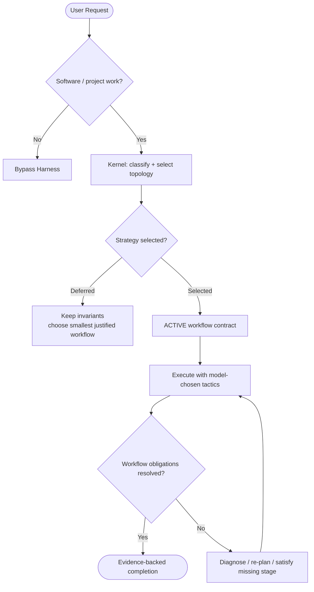

# Harness Routing & Task Triage

Harness classifies software work and selects the smallest sufficient execution topology. **A tier is a scope/risk signal, not a fixed skill sequence. A selected topology is an execution contract, not an optional suggestion.**

The current architecture follows two coupled rules:

> **Guidance-first workflow; flexible reasoning/implementation and execution.**
>
> **Skill applicability is evaluated explicitly; skipped guidance should have a concise evidence-based reason.**

A strong model remains free to decide *how* to perform the work. It may not decide that an applicable selected lifecycle can be skipped because the task feels simple or already understood.

## Kernel invariants

For software/project work, Harness establishes routing context and lightweight rails before broad mutation:

1. **Route before execution** — establish scope/tier and the smallest justified topology.
2. **Verify before claim** — completion requires objective evidence appropriate to the change.
3. **Re-plan after repeated failure** — after three same-signature failures, stop micro-retrying and use a fresh diagnosis / `zoom-out`.
4. **Evaluate before omission** — read every suggested skill's complete `SKILL.md` entry before deciding applicability.
5. **Review selected workflow** — use it as planning guidance and surface unresolved evidence before claiming completion.

The model owns tools, implementation technique, reasoning, and decomposition details inside those rails.

## Public routing path

```text
kernel-router.js
  ├─ delegates classification / guide discovery → tier-router.js
  ├─ preserves tier + rationale + dynamic-skill recommendations
  ├─ emits required invariants + structured workflow plan
  ├─ requires applicability evaluation for suggested skills
  ├─ records the selected workflow guidance
  └─ exposes warnings/degraded/escape evidence instead of silently hiding limitations
```

Use:

```bash
node harness-everything/scripts/kernel-router.js "<prompt>"
# or
npx github:dyphn1/Harness-everything next "<prompt>"
```

On a host where `UserPromptSubmit` is wired, reuse that hook output instead of running it twice.

## Suggested skills vs. selected workflow

These are intentionally different concepts.

For **every suggested skill**:

1. Resolve/read the complete `SKILL.md` entry.
2. Evaluate `USE FOR`, `DO NOT USE FOR`, workflow/basic flow, and hard rules.
3. Read extra material only when the entry explicitly requires it for applicability.
4. Resolve the suggestion as `use`, `not-applicable`, or `unresolved/unavailable`.

A name, description, router summary, tier label, or generic “routine/common task” judgement is not sufficient evidence for `not-applicable`.

For the **selected workflow topology**:

- enter it and execute it to resolution;
- do not silently replace it with a weaker/direct path because the model is confident;
- preserve objective checks, stage contracts, synthesis barriers, re-plan limits, and other obligations selected by the plan;
- use escape only for genuinely uncovered workflow scope, recording reason + uncovered scope + evidence.

This prevents two opposite failures: forcing every task through one giant pipeline, and allowing a model to rationalize away the entire engineering lifecycle.

## Three-tier recommendation model



### Tier 1 — Trivial

Typical triggers: typo/docs correction, narrow local edit, bounded explanation, straightforward Git operation. Usually selects `direct-single`; keep overhead minimal while still satisfying applicable verification/safety rails.

### Tier 2 — Standard

Typical triggers: normal feature work, bug fixes, multi-file changes, focused benchmark/review. Usually selects `iterative-single`: bounded reason/act work plus objective verification. Focused skills such as `tdd`, `verification-loop`, `security-review`, `using-git-worktrees`, and `eval-harness` may be surfaced and must be resolved for applicability.

No universal `TODO → TDD → verification-loop` order is implied. But when a skill is applicable, reading it does not grant permission to ignore its flow.

### Tier 3 — Macro

Typical triggers: repository-wide refactors, architecture/migration work, broad synthesis, or bounded delegation. The router may select `fable-staged`, `fable-parallel`, or `fable-multi-agent-workspace`.

A selected Fable topology is structured guidance for that run; dependency/write-set validation remains useful evidence, while missing workflow state does not hard-block execution.

Tier 3 does **not** automatically mean multi-agent. The smallest sufficient topology still wins.

## Pre-action `actionGate`

`workflowPlan.actionGate` is orthogonal to topology. The executable hook re-classifies the exact tool payload, so an incorrect router hint cannot authorize a destructive/external side effect.

Policy lives in `hooks/scripts/action-gate-rules.json`. Matched actions are handled according to host capability and configured policy; approved/executed payload identity is audited. `HARNESS_ACTION_GATE_POLICY=always-ask` forces Claude's ask path where supported. Unsupported host behavior must remain visible rather than being described as equivalent hard enforcement.

## Workflow lifecycle reminders

The [workflow runtime contract](workflow-runtime.md) defines the executable boundary:

- `workflow-gate.js` observes shell/direct mutation, Fable correlation, and major-workflow Git isolation and emits reminders.
- `workflow-stop-gate.js` reports unresolved stage/verification evidence without rejecting Stop.
- `workflow-disposition.js` starts/replans the run, records a scoped stage escape, or reports `blocked`.

Follow-up prompts retain useful evidence, but unresolved cognitive workflow state does not lock mutation or completion.

Direct/iterative verification milestones are checked, while semantic check quality and iteration budgeting remain executor obligations. Shell inspection does not contain arbitrary script side effects. Package/mechanism tests do not prove host loading or behavioral compliance; #82 owns retained live evidence.

## Cognitive OS relationship

`install-cognitive-os` remains the explanatory/manual entry point for Discover → Think → Try → Summarize → Record. It is a reasoning policy, not a peer skill that must be selected before domain work. The selected workflow guidance informs lifecycle choices; the model retains execution freedom.

## Guidance and enforcement strength

Workflow guidance is intentionally non-blocking across hosts. Keep that separate from Rule-of-3 and explicit permission enforcement.

- **contract:** what the agent is required to do;
- **mechanism:** which transitions a packaged hook/plugin can block or observe;
- **live evidence:** whether a real host actually loaded/fired that mechanism.

Instruction-only integrations receive the same workflow contract as guidance, but must not be labeled hard-enforced. Kernel emission alone does not prove model compliance. #82 owns host-specific retained evidence.

Do not infer cross-host parity from shared runtime code or passing package tests.
