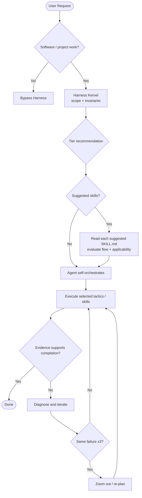
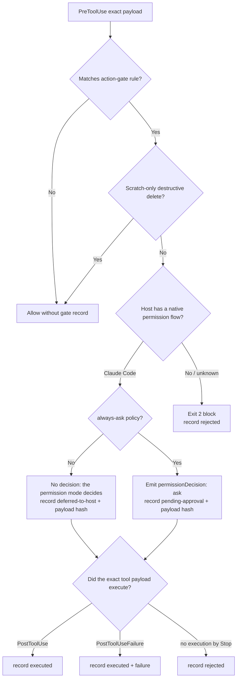

# Harness Routing & Task Triage

Harness classifies software work into three tiers to prevent both over-engineering and under-planning. **The tier is a scope recommendation, not a workflow pipeline.**

The current architecture follows two coupled rules:

> **Do not enforce workflow order. Enforce workflow invariants.**
>
> **Suggested skills are mandatory to evaluate and advisory to execute.**

A strong model should remain free to decide how to complete the task, but it may not discard a router suggestion without first reading the suggested skill's actual entry/basic flow.

## Kernel invariants

For software/project work, Harness establishes three baseline mandatory rails before mutation:

1. **Route before execution** — establish task scope/tier.
2. **Verify before claim** — completion requires objective evidence appropriate to the change.
3. **Re-plan after repeated failure** — after three same-signature failures, stop micro-retrying and use a fresh diagnosis / `zoom-out`.

When the router emits one or more skill suggestions, it adds a fourth conditional invariant:

4. **Evaluate before skip** — before omitting any suggested skill, read its complete `SKILL.md` entry and evaluate `USE FOR`, `DO NOT USE FOR`, workflow/basic flow, and hard rules against the task.

Execution, ordering, planning style, and delegation remain agent decisions after evaluation unless the user or an authoritative project contract explicitly requires them.

## Public routing path

```text
kernel-router.js
  ├─ delegates classification / guide discovery → tier-router.js
  ├─ preserves tier + rationale + dynamic-skill recommendations
  ├─ suppresses legacy fixed-pipeline wording
  ├─ emits required invariants
  ├─ requires evaluation of each suggested skill before omission
  └─ leaves suggested-skill execution advisory after evaluation
```

Use:

```bash
node harness-everything/scripts/kernel-router.js "<prompt>"
# or
npx github:dyphn1/Harness-everything next "<prompt>"
```

On a host where `UserPromptSubmit` is wired, reuse the hook output instead of running it twice.

## Suggestion evaluation contract

A router suggestion is not permission to make a decision from metadata alone. For **every** suggested skill:

1. Resolve and read the complete `SKILL.md` entry.
2. Evaluate `USE FOR`, `DO NOT USE FOR`, workflow/basic flow, and hard rules against the current task.
3. If the entry explicitly requires another document to determine applicability, read that required material too. Ordinary deep-dive/reference links remain optional unless the entry makes them decision-critical.
4. Choose `use`, `skip`, or `unresolved/unavailable` only after that evaluation.

The following are not sufficient skip evidence by themselves:

- the skill name,
- the frontmatter description,
- the router's one-line summary,
- the tier label,
- a generic judgement such as “routine/common task.”

Using one suggested skill does not waive read-before-skip for the other suggestions. If a suggested skill cannot be resolved or read, mark it `unresolved/unavailable` rather than silently treating it as inapplicable. If every suggestion is skipped after evaluation, give one brief flow-grounded reason in the visible routing checkpoint/progress update.

## Non-software bypass

General Q&A, translation, ordinary web search, and non-software writing bypass Harness routing. The model should answer directly and naturally.

A software prompt that already says "use TDD", "security review", `repo-docs`, or another skill **does not bypass the kernel**. Host skill routing and Harness routing are different layers: the kernel establishes cross-cutting invariants; the host/model selects useful expertise after evaluating router suggestions.

## Three-tier recommendation model



### Tier 1 — Trivial

Typical triggers: typos, narrow single-file edits, straightforward cleanup, code explanation, simple Git operations.

Guidance:
- prefer direct execution,
- avoid large plans/delegation,
- when there are no suggestions, use the bounded direct path,
- if a focused skill is suggested, read/evaluate its entry before omitting it,
- still gather enough evidence to support the completion claim.

### Tier 2 — Standard

Typical triggers: normal feature work, bug fixes, multi-file changes, security review, focused benchmark/evaluation.

Possible suggestions:
- `todo-driven-workflow` when explicit progress tracking helps,
- `tdd` when executable behavioral tests are a useful design/verification tool,
- `verification-loop` when systematic build/lint/test/diff selection helps,
- `security-review` for trust/input/auth/secrets/network boundaries,
- `using-git-worktrees` where isolation reduces workspace risk,
- `eval-harness` for quantitative scoring.

Every emitted suggestion must be evaluated from its `SKILL.md` flow before omission. After evaluation, none of those imply a universal `TODO → TDD → verification-loop` sequence.

### Tier 3 — Macro

Typical triggers: repository-wide refactors, architecture/migration work, large ambiguous requirements, broad documentation/system design, or work that may benefit from delegation.

Possible suggestions:
- `fable-mode` / `fable-discipline` for deliberate macro planning,
- `multi-agent-workspace` for bounded delegation,
- `repo-docs` for project-level documentation,
- `grill-with-docs`, `to-spec`, and `to-tickets` when design decisions/specs/issues genuinely help.

Tier 3 does **not** automatically mean multi-agent. It does mean that any emitted Tier 3 suggestions are read/evaluated before omission. If one capable agent can complete the work safely and efficiently after that evaluation, direct execution remains valid.

## Classifier tuning

`tier-router.js` reads keyword/guide tables from `harness-everything/scripts/routing-keywords.json`. Edit that data to tune Tier 2/3 signals or knowledge-guide matches without changing classifier code.

The classifier remains heuristic:
- its recommendation is the default, not an order,
- a clear task reading may override it,
- explicit user intent wins,
- when overriding a materially different tier, record the reason briefly.

## Pre-action `actionGate`

The router may predict that a request needs `workflowPlan.actionGate`, but the Phase 5 enforcement hook deliberately **re-classifies the exact tool payload**. A missing or incorrect router prediction therefore cannot authorize a destructive command.

The executable policy lives in `hooks/scripts/action-gate-rules.json`. A missing or invalid table activates built-in safety defaults and reports the degradation. A valid empty table remains empty so the CI negative control can detect accidental policy erasure.

| Exact tool action | Harness result | Audit disposition before execution |
|---|---|---|
| Safe unmatched command such as `git status` | allow/no decision | no gate record |
| Matched command on Claude Code (default policy) | no decision: the session's permission mode, rules and auto-mode classifier decide | `deferred-to-host` |
| Matched command on Claude Code with `HARNESS_ACTION_GATE_POLICY=always-ask` | `permissionDecision: "ask"` | `pending-approval` |
| Matched command on a host without Harness-verified ask semantics | block with exit 2 | `rejected` |
| Payload reaches `PostToolUse` | continue | `executed` with exact payload SHA-256 |
| Payload reaches `PostToolUseFailure` | continue | `executed` + failed execution outcome |
| Deferred or pending payload never executes before `Stop` | no execution | `rejected` |
| Hook internal error | Claude: no decision plus a `systemMessage` warning (`always-ask`: `ask`); other/unverified host: exit 2 | host decides on Claude; fail closed elsewhere |

`rm -rf` and `Remove-Item -Recurse -Force` are exempt only when every parsed target is inside the OS temp directory, the current session scratch directory, or an explicitly supplied Harness scratch directory. An uncertain target is gated conservatively.



On Claude Code the gate returns no decision by default. The [hooks reference](https://code.claude.com/docs/en/hooks) says a hook's `ask` "also forces a permission prompt in auto mode: the classifier can still deny the tool call, but it can't approve the call silently". A forced `ask` would therefore override the permission mode the user picked (#107).

With no decision, the normal permission flow applies:

- Manual and `acceptEdits` prompt unless a rule or the mode already allows the command.
- Auto mode lets the classifier decide.
- `dontAsk` denies anything that is not pre-approved.
- Deny rules apply in every mode.

Set `HARNESS_ACTION_GATE_POLICY=always-ask` to have Harness force its own prompt instead. Either way the gate classifies and audits every matched payload.

The deterministic suite verifies two things: the deferred result for every known `permission_mode` value, and the `ask` JSON under `always-ask`. That is **mechanism evidence only** until preserved live evidence exists.

## Cognitive OS relationship

`install-cognitive-os` remains the canonical explanatory/manual entry point for Discover → Think → Try → Summarize → Record. It is **not** required to win peer-skill selection before domain work begins. The runtime kernel establishes the smaller invariant contract independently; domain skills provide their own tactics inside that contract.

## Enforcement strength

A lifecycle hook can mechanically inject the read-before-skip contract into context, but that alone does not prove the model actually read every suggested `SKILL.md`. Instruction-only integrations can only instruct the model. Do not label either case as live behavioral enforcement without retained host/session evidence; #82 owns that evidence boundary.
