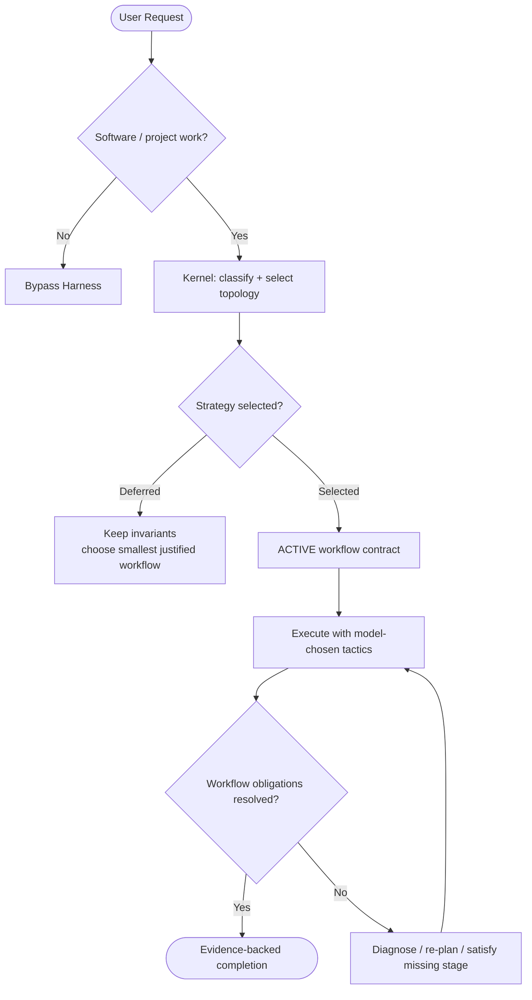

# Harness Routing & Task Triage

Harness classifies software work and selects the smallest sufficient execution topology. **A tier is a scope/risk signal, not a fixed skill sequence. A selected topology is an execution contract, not an optional suggestion.**

The current architecture follows two coupled rules:

> **Contract-first lifecycle; flexible reasoning/implementation and execution.**
>
> **Knowledge is step-scoped: the active step declares required/optional bindings, and required bindings resolve before that step passes.**

A strong model remains free to decide *how* to perform the work. It may not decide that an applicable selected lifecycle can be skipped because the task feels simple or already understood.

## Kernel invariants

For software/project work, Harness establishes routing context and lightweight rails before broad mutation:

1. **Route before execution** — establish scope/tier and the smallest justified topology.
2. **Verify before claim** — completion requires objective evidence appropriate to the change.
3. **Re-plan after repeated failure** — after three same-signature failures, stop micro-retrying and use a fresh diagnosis / `zoom-out`.
4. **Bind knowledge by step** — compose ordered requirement steps and declare their required/optional skill or reference bindings before execution.
5. **Resolve selected workflow** — satisfy the selected topology's required obligations before completion; tactics MAY adapt, but required lifecycle evidence cannot be silently skipped.
6. **Surface status** — non-trivial work MUST keep the user informed through the single Harness Status format at required phase boundaries.

The model owns tools, implementation technique, reasoning, and decomposition details inside those rails.

## Public routing path

```text
kernel-router.js
  ├─ delegates classification / knowledge-signal detection → tier-router.js
  ├─ preserves tier + rationale + normalized knowledge signals
  ├─ emits required invariants + structured workflow plan
  ├─ treats keyword hits as step-composition signals, not document selectors
  ├─ discloses bindings only for the active step / dependency-ready Fable stage
  ├─ records the selected workflow contract
  └─ exposes warnings/degraded/escape evidence instead of silently hiding limitations
```

Use:

```bash
node harness-everything/scripts/kernel-router.js "<prompt>"
# or
npx github:dyphn1/Harness-everything next "<prompt>"
```

On a host where `UserPromptSubmit` is wired, reuse that hook output instead of running it twice.

## User-visible status contract

For non-trivial software/project work, the user-facing progress protocol is a semantic **MUST** and uses the same readable Markdown presentation across execution topologies:

```md
### 🚦 Harness Status

- **Current:** <what is being done now>
- **Read / Evidence:**
  - <important file/source/evidence read or confirmed>
  - <another item when multiple evidence items improve scanability>
- **Next:** <next intended action>
- **Risk / Blocked:** <only when materially applicable; omit otherwise>
```

Keep one short evidence item inline when that reads better; use nested bullets for multiple evidence items. Emit the status before substantive execution, after a major phase, when direction materially changes, at meaningful long-running phase boundaries, and before final completion. The final response may fold the last status into its completion summary. The routing checkpoint is internal source state for this protocol, not a second user-facing progress template.

This MUST is semantic rather than a hard runtime lock: hosts may observe/remind with different strength, but lack of a blocking hook does not downgrade the contract to optional advice.

### Turn label line

End the final message of **every** turn with one line that rendered Markdown hides. This includes short answers, lookups, and turns that end with a question back to the user; unlike the Harness Status, it is not limited to non-trivial work:

```
<!-- harness-label {"v":1,"validity":"actionable","contextDependent":false,"tier":"tier2","intents":["fix","test"],"workflow":"iterative-single","skills":["tdd"]} -->
```

It states the agent's own judgement after the work, not a copy of the router's suggestion: `validity` (`actionable` or `invalid`), `contextDependent` (the prompt text alone would not have been enough), `tier` under tier rules v2, up to three `intents`, the `workflow` strategy and the `skills` actually used. The observation collector stores it as training data ([system-one-observations.md](system-one-observations.md)). A missing or malformed line is recorded with a reason code; it never blocks a turn or changes routing.

Tier values:

| Tier | Meaning |
| --- | --- |
| `tier1` | answer, lookup, status or Git operation; no file change |
| `tier2` | a bounded file change: code, config or docs |
| `tier3` | a new feature, a refactor, a redefinition, or cross-component work |
| `null` | only when `validity` is `invalid` |

The router prints this contract as the **last** section of its output, so it
is the nearest instruction when the turn ends. In live Claude Code runs the
label appeared on 1 of 4 turns while it sat inside the Harness Status contract
(which is scoped to non-trivial work), and on 5 of 6 turns as its own final
section.

## Knowledge signals and active-step bindings

Router keywords and domain matches are normalized planning inputs. They do not select, load, or print skill/reference paths. Requirement composition assigns needed knowledge to ordered steps:

- Each step declares `requiredBindings` and `optionalBindings` by stable id, with a concrete path when known.
- Only the active single-agent step or dependency-ready Fable stage exposes its bindings. Retained prompts and notifications keep this active-step view compact; future paths stay hidden.
- A required binding MUST be loaded and its applicable skill core contract followed before the step can pass. Optional bindings resolve as loaded or not-needed.
- An unknown/unavailable required binding remains visible and unresolved; it cannot be marked loaded without a declared path and evidence.
- On Fable plans, the existing stage dependency graph controls readiness. A successful objective check records `binding-unresolved` until bindings resolve; rerun the exact check before the stage passes.

For every active required skill binding, read its complete `SKILL.md` entry and follow its applicable core contract. If an active requirement does not need a discovered knowledge signal, do not bind or load an unrelated document. This replaces the former global read-every-suggestion rule while preserving per-step obligations.

For the **selected workflow topology**:

- enter it and execute it to resolution;
- do not silently replace it with a weaker/direct path because the model is confident;
- preserve objective checks, stage contracts, synthesis barriers, re-plan limits, and other obligations selected by the plan;
- use escape only for genuinely uncovered workflow scope, recording reason + uncovered scope + evidence.

This prevents two opposite failures: forcing every task through one giant pipeline, and allowing a model to rationalize away the entire engineering lifecycle.

## Three-tier routing model


```mermaid
flowchart TD
    U([User Request]) --> S{Software / project work?}
    S -- No --> B[Bypass Harness]
    S -- Yes --> K[Kernel: classify + select topology]
    K --> W{Strategy selected?}
    W -- Deferred --> D[Keep invariants<br/>choose smallest justified workflow]
    W -- Selected --> A[ACTIVE workflow contract]
    A --> E[Execute with model-chosen tactics]
    E --> V{Workflow obligations resolved?}
    V -- Yes --> Done([Evidence-backed completion])
    V -- No --> X[Diagnose / re-plan / satisfy missing stage]
    X --> E
```

### Tier 1 — Trivial

Typical triggers: typo/docs correction, narrow local edit, bounded explanation, straightforward Git operation. Usually selects `direct-single`; keep overhead minimal while still satisfying applicable verification/safety rails.

### Tier 2 — Standard

Typical triggers: normal feature work, bug fixes, multi-file changes, focused benchmark/review. Usually selects `iterative-single`: bounded reason/act work plus objective verification. Compose ordered requirements before execution; bind TDD to behavior-change steps, verification-loop to verification steps, and domain knowledge only where that step needs it.

Operation labels such as `audit`, `evaluate`, `benchmark`, or `compare` describe **what** work is being done; they do not by themselves establish macro scope. A focused audit/review remains bounded unless an independent scope/structure signal (for example repository-wide, all files/modules, or multi-workstream structure) elevates it. A structured A/B experiment is different: its explicit control/treatment comparison is itself a multi-lane execution structure, so `A/B test` / `A/B benchmark` remains a macro signal.

No universal `TODO → TDD → verification-loop` order is implied. But when a skill is applicable, reading it does not grant permission to ignore its flow.

### Tier 3 — Macro

Typical triggers: repository-wide refactors, architecture/migration work, broad synthesis, or bounded delegation. The router may select `fable-staged`, `fable-parallel`, or `fable-multi-agent-workspace`.

A selected Fable topology is a semantic execution contract for that run: required stage contracts, dependency/write-set validation, objective checks, synthesis, and cold verification **MUST** resolve. Host hooks may only remind when evidence is missing; that fail-open mechanism does not make the obligations optional.

Tier 3 does **not** automatically mean multi-agent. The smallest sufficient topology still wins.

## Pre-action `actionGate`

`workflowPlan.actionGate` is orthogonal to topology. The executable hook re-classifies the exact tool payload, so an incorrect router hint cannot authorize a destructive/external side effect.

Policy lives in `hooks/scripts/action-gate-rules.json`. Matched actions are handled according to host capability and configured policy; approved/executed payload identity is audited. `HARNESS_ACTION_GATE_POLICY=always-ask` forces Claude's ask path where supported. Unsupported host behavior must remain visible rather than being described as equivalent hard enforcement.

## Workflow lifecycle reminders

The [workflow runtime contract](workflow-runtime.md) defines the executable boundary:

- `workflow-gate.js` observes shell/direct mutation, Fable correlation, and major-workflow Git isolation and emits reminders.
- `workflow-stop-gate.js` reports unresolved stage/verification evidence without rejecting Stop.
- `workflow-disposition.js` starts/replans the run, resolves active step/stage bindings, records a scoped stage escape, or reports `blocked`.

Follow-up prompts retain useful evidence, but unresolved cognitive workflow state does not lock mutation or completion.

Direct/iterative verification milestones are checked, while semantic check quality and iteration budgeting remain executor obligations. Shell inspection does not contain arbitrary script side effects. Package/mechanism tests do not prove host loading or behavioral compliance; #82 owns retained live evidence.

## Cognitive OS relationship

`install-cognitive-os` remains the explanatory/manual entry point for Discover → Think → Try → Summarize → Record. It is a reasoning policy, not a peer skill that must be selected before domain work. The selected workflow contract defines lifecycle obligations; the model retains freedom over reasoning and implementation tactics.

## Contract and Enforcement Strength

Canonical strength definitions live in [philosophy.md](philosophy.md#contract-strength-must--should--may):

- **MUST:** skipping violates the semantic contract.
- **SHOULD:** expected default with a concrete evidence-based exception.
- **MAY:** optional optimization/capability.

Keep semantic strength separate from runtime mechanics:

- **semantic contract:** what the agent MUST/SHOULD/MAY do;
- **mechanism:** which transitions a packaged hook/plugin can block, observe, or remind about;
- **live evidence:** whether a real host actually loaded/fired that mechanism.

A semantic MUST does not require a hard lock. Outside Rule-of-3 reflection and explicit permission/safety boundaries, lifecycle hooks stay fail-open/reminder-oriented.

Instruction-only integrations receive the same semantic contract through instructions, but must not be labeled hard-enforced. Kernel emission alone does not prove model compliance. #82 owns host-specific retained evidence.

Do not infer cross-host parity from shared runtime code or passing package tests.
