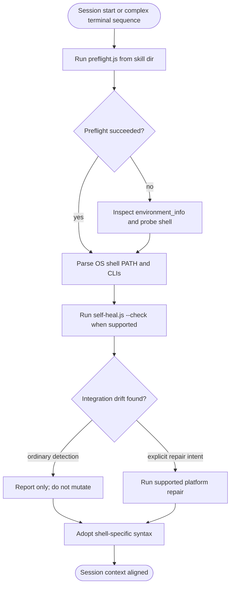
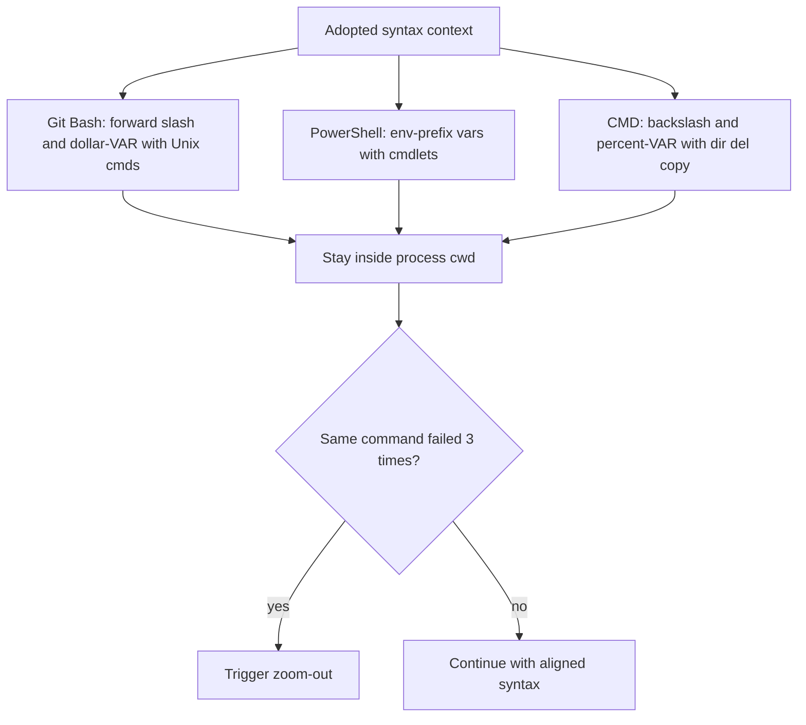
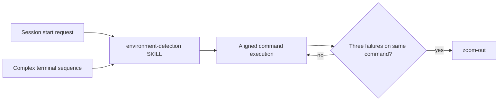
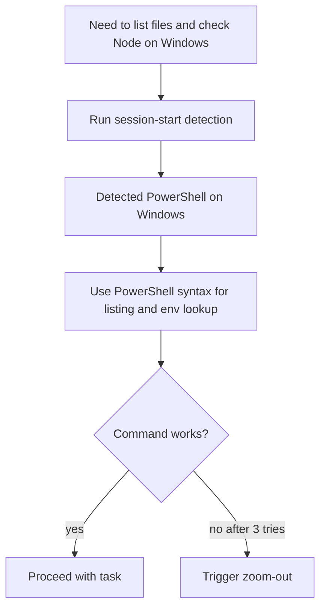

# Workflow: Environment Detection

> Detect OS, shell variant, and available dev tools at session start so commands use the right path, variable, and CLI syntax and avoid repeated execution errors.

Source of truth: `environment-detection/SKILL.md`.

## 1. Skill Behavior Workflow

## 2. Triggering and Routing Path

## 3. Real-World Use Case

A session starts on Windows with PowerShell as the active shell. The agent needs to list files and check Node availability before running tests.

1. Run `node "<skill-dir>/scripts/preflight.js"` to detect Windows + PowerShell + available CLIs.
2. Where the local Harness runtime exists, run self-heal in `--check` mode only; report drift without changing hooks or advisory files.
3. If the helper/runtime is absent (for example a skills-only distribution), report that the local repair surface is unavailable and continue without searching parent/cache paths.
4. Only an explicit install/setup/repair request may invoke mutating self-heal. OpenCode keeps its separate plugin installation/runtime boundary.
5. Adopt PowerShell syntax for paths and env vars instead of Git Bash assumptions. If `preflight.js` cannot run, inspect `<environment_info>` and probe minimally.
6. Stay inside `process.cwd()`; if the same aligned command still fails three times, trigger `zoom-out`.

## 4. Verification Check

- [ ] Detection ran at session start via `environment-detection/scripts/preflight.js`, with `<environment_info>` inspection and probing used only as fallback
- [ ] Adopted syntax matches detected shell: Git Bash uses `/`, `$VAR`, Unix cmds without `dir`/`del`; PowerShell uses `$env:VAR` and cmdlets; CMD uses `\`, `%VAR%`, `dir`/`del`/`copy` without Unix cmds
- [ ] All commands stayed inside `process.cwd()`; no commands ran outside the current project root
- [ ] Ordinary detection changed no workspace integration files; touchpoint inspection used `--check` or safely skipped an unavailable local runtime
- [ ] Mutating self-heal ran only for explicit install/setup/repair intent and only on a supported local platform surface
- [ ] OpenCode was kept on its separate plugin runtime; skills-only distributions did not assume a local installer
- [ ] No toolchain installation was attempted; scope stayed to detection and alignment
- [ ] After three failures of the same command, execution stopped blind retry and triggered `zoom-out`
- [ ] Shell detail followed `environment-detection/references/shell-syntax-rules.md` where needed
