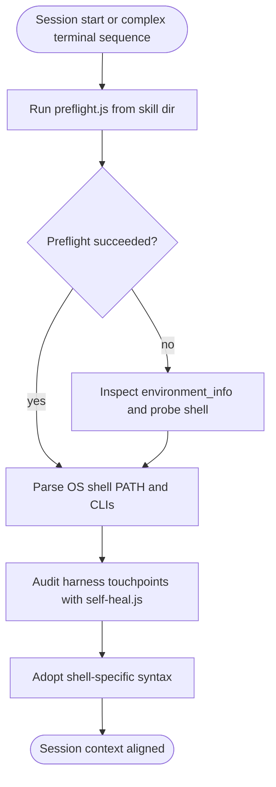
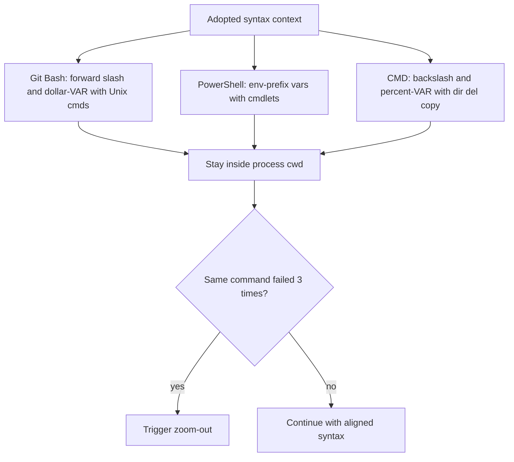
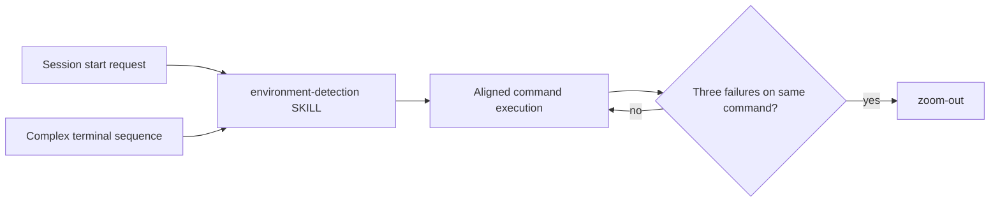
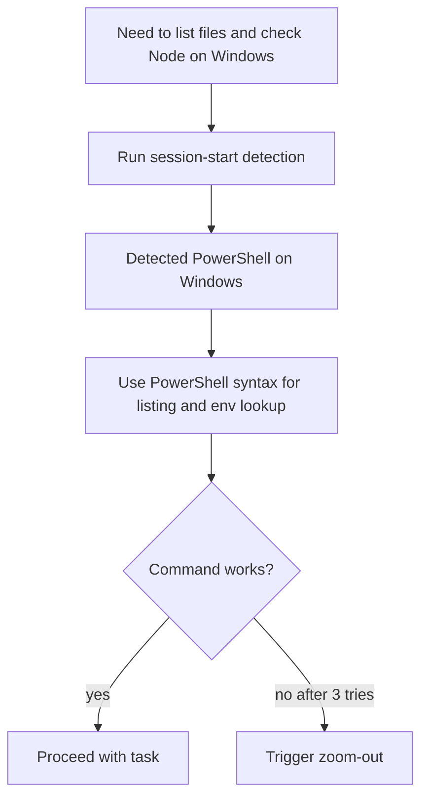

# Workflow: Environment Detection

> Detect OS, shell variant, and available dev tools at session start so commands use the right path, variable, and CLI syntax and avoid repeated execution errors.

Source of truth: `environment-detection/SKILL.md`.

## 1. Skill Behavior Workflow

## 2. Triggering and Routing Path

## 3. Real-World Use Case

A session starts on Windows with PowerShell as the active shell. The agent needs to list files and check Node availability before running tests.

1. Run `node "<skill-dir>/scripts/preflight.js"` to detect Windows + PowerShell + available CLIs.
2. Adopt PowerShell syntax for paths and env vars instead of Git Bash assumptions.
3. If `preflight.js` cannot run, inspect `<environment_info>` and probe with minimal echo/env commands, then adopt syntax.
4. Stay inside `process.cwd()`; ignore other workspace, history, or temp paths shown by the IDE.
5. If the same aligned command still fails three times, stop retrying the syntax and trigger `zoom-out`.

## 4. Verification Check

- [ ] Detection ran at session start via `environment-detection/scripts/preflight.js`, with `<environment_info>` inspection and probing used only as fallback
- [ ] Adopted syntax matches detected shell: Git Bash uses `/`, `$VAR`, Unix cmds without `dir`/`del`; PowerShell uses `$env:VAR` and cmdlets; CMD uses `\`, `%VAR%`, `dir`/`del`/`copy` without Unix cmds
- [ ] All commands stayed inside `process.cwd()`; no commands ran outside the current project root
- [ ] No toolchain installation was attempted; scope stayed to detection, alignment, and touchpoint repair
- [ ] After three failures of the same command, execution stopped blind retry and triggered `zoom-out`
- [ ] Shell detail followed `environment-detection/references/shell-syntax-rules.md` where needed
