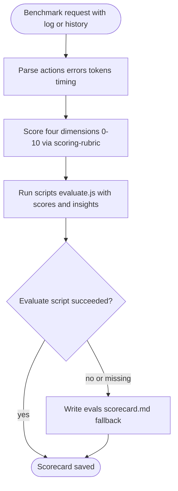
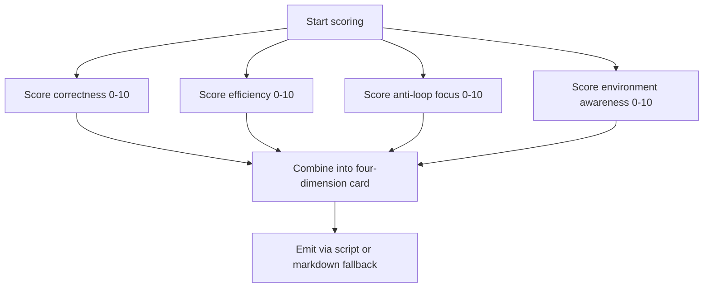
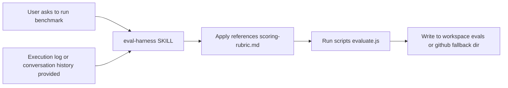
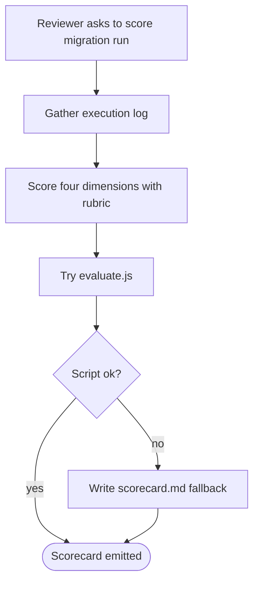

# Workflow: Eval Harness

> Score an agent execution log or conversation history on correctness, token efficiency, anti-loop focus, and environment awareness, and save the result as a scorecard when a benchmark is requested.

Source of truth: `eval-harness/SKILL.md`.

## 1. Skill Behavior Workflow

## 2. Triggering and Routing Path

## 3. Real-World Use Case

A reviewer wants to compare two runs of a file-migration task.

1. Collect the execution log with tool calls, errors, tokens, and timing.
2. Score correctness, efficiency, anti-loop focus, and environment awareness 0–10 using `eval-harness/references/scoring-rubric.md`.
3. Run `node <skill-dir>/scripts/evaluate.js <A> <B> <C> <D> "insights"`.
4. On script failure or absence, write `<workspace>/evals/scorecard.md`, or `<workspace>/.github/harness-everything/evals/` if needed.
5. Leave the evaluated code unchanged; output is only the scorecard and insights.

## 4. Verification Check

- [ ] Input included both a benchmark request and an execution log or conversation history; tasks without a log were declined
- [ ] All four dimensions were scored 0–10 using `eval-harness/references/scoring-rubric.md`: correctness, efficiency, anti-loop focus, environment awareness
- [ ] `eval-harness/scripts/evaluate.js` was run with four scores plus insights; markdown fallback was used only if the script failed or was missing
- [ ] Scorecard was written under `<workspace>/evals/` or `<workspace>/.github/harness-everything/evals/`
- [ ] No evaluated code was written or fixed, and no general review was substituted for dimension scoring
