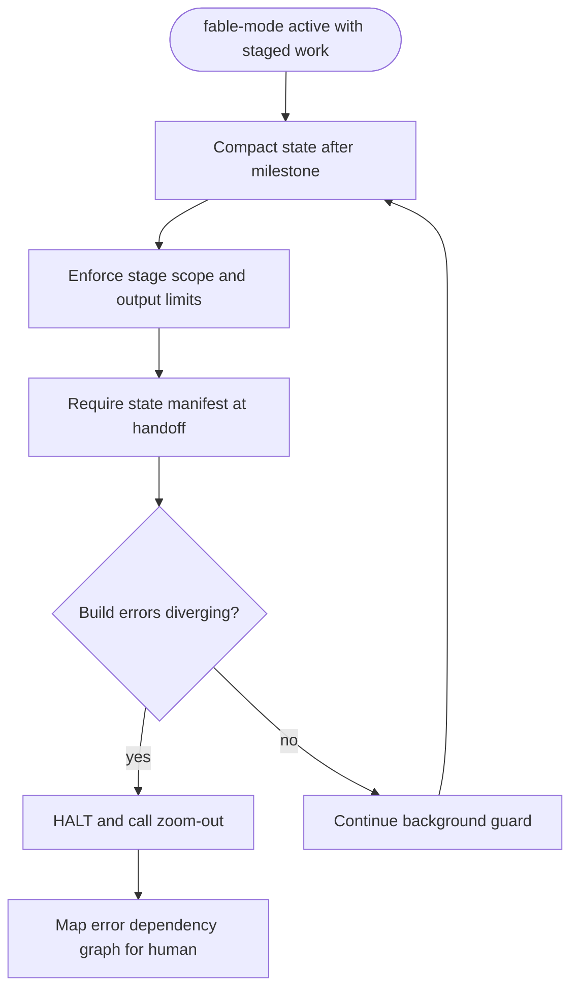
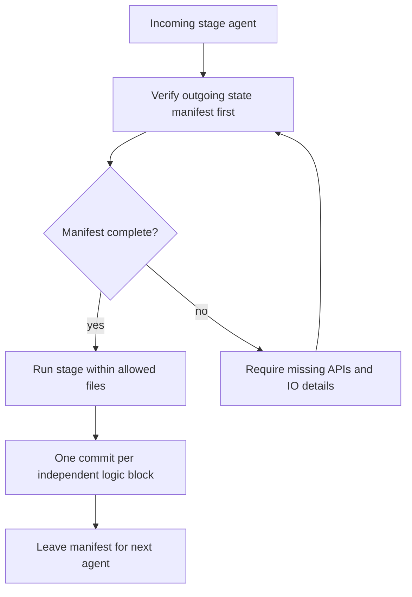
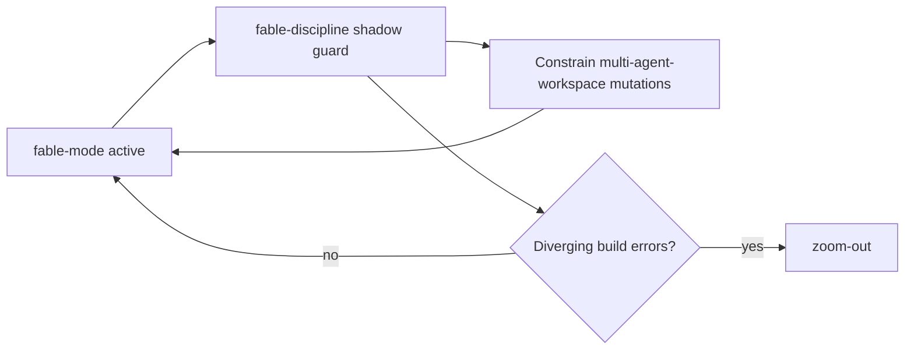
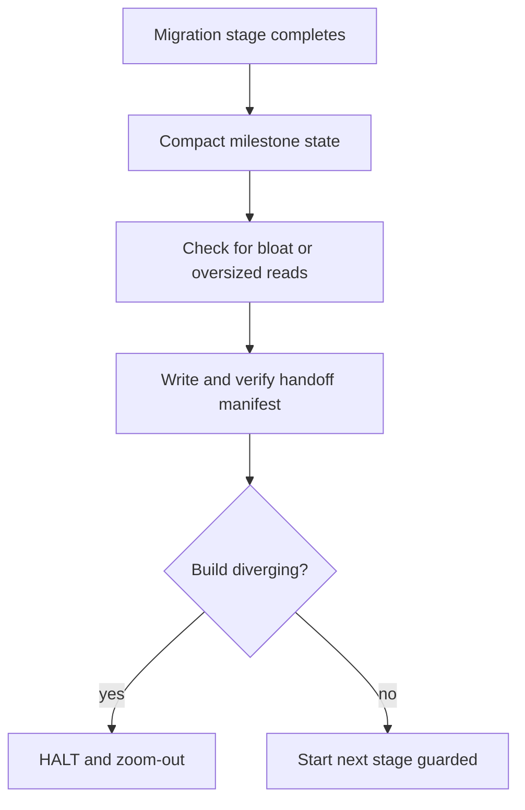

# Workflow: Fable Discipline

> Act as a background guard while staged multi-agent work runs, keeping output compact, stage scope tight, handoffs explicit, and diverging builds halted.

Source of truth: `fable-discipline/SKILL.md`.

## 1. Skill Behavior Workflow

## 2. Triggering and Routing Path

## 3. Real-World Use Case

Long architectural migration runs under `fable-mode` with sub-agents handling separate stages.

1. After each milestone, compact decisions and drop unneeded history; avoid broad regex and avoid reading irrelevant files over 1000 lines.
2. Confirm working directory before touching core architecture; keep one commit per independent logic block.
3. Outgoing agent leaves a manifest with completed APIs and expected inputs/outputs; incoming agent verifies it first.
4. If fixes create more breakage, halt immediately, call `zoom-out`, and map the error dependency graph instead of continued patching.

## 4. Verification Check

- [ ] Ran only as a background shadow for the whole `fable-mode` duration; not used standalone, not used for small tasks or routine single-file edits
- [ ] After each milestone, state was compacted and unneeded history dropped; no broad regex without precise conditions and no irrelevant 1000+ line reads
- [ ] Working directory was confirmed before core changes, with one commit per independent logic block
- [ ] Every sub-agent handoff via `multi-agent-workspace` left a state manifest with completed APIs and expected inputs/outputs, verified by the incoming agent first
- [ ] On diverging build errors, execution halted immediately and called `zoom-out` with an error dependency map instead of continued patching
- [ ] Made no direct state mutations of its own; only constrained `fable-mode` and `multi-agent-workspace` mutations
- [ ] Detail followed `fable-discipline/references/discipline-rules.md` where needed
