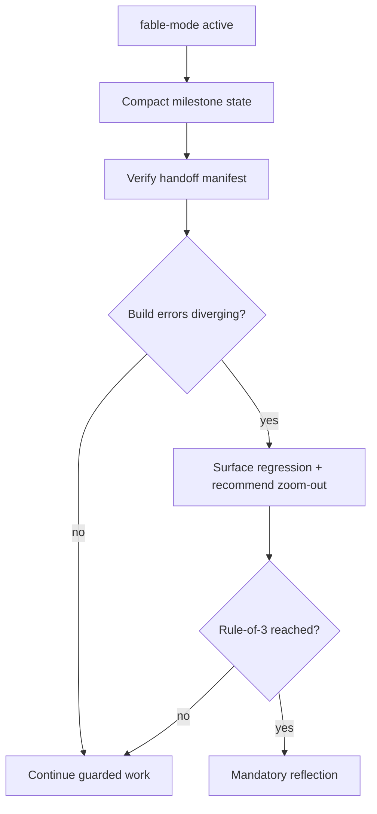

# Workflow: Fable Discipline

> Background guard for compact context, bounded stage scope, explicit handoffs, authorized commit boundaries, and build-divergence signals.

Source of truth: `fable-discipline/SKILL.md`.

## 1. Workflow

```mermaid
graph TD
  Active[fable-mode active] --> Compact[Compact milestone state]
  Compact --> Handoff[Verify handoff manifest]
  Handoff --> Diverge{Build errors diverging?}
  Diverge -->|no| Continue[Continue guarded work]
  Diverge -->|yes| Warn[Surface regression + recommend zoom-out]
  Warn --> Rule3{Rule-of-3 reached?}
  Rule3 -->|yes| Reflect[Mandatory reflection]
  Rule3 -->|no| Continue
```

Commit boundaries are guidance only. Create commits only when the user or active host/workflow has authorized them; otherwise leave changes uncommitted.

## 2. Verification

- [ ] Milestone state compacted and irrelevant broad reads avoided.
- [ ] Handoff manifest written and verified.
- [ ] Divergence surfaced without creating an independent hard stop.
- [ ] Rule-of-3 remains the mandatory reflection owner.
- [ ] Commits occur only with user/host authorization.
- [ ] Detail follows `fable-discipline/references/discipline-rules.md`.
