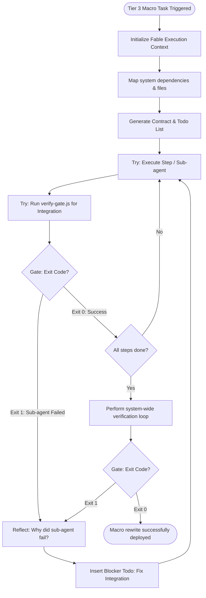

# Workflow: Fable Mode

> Macro-task planning and execution engine. Like all Harness workflows, this is not a straight line to success. It requires continuous verification and course correction.

---

## 1. Skill Behavior Workflow

This section visualizes how `fable-mode` handles macro tasks. Subagent failure or integration crashes are expected realities, not edge cases.

