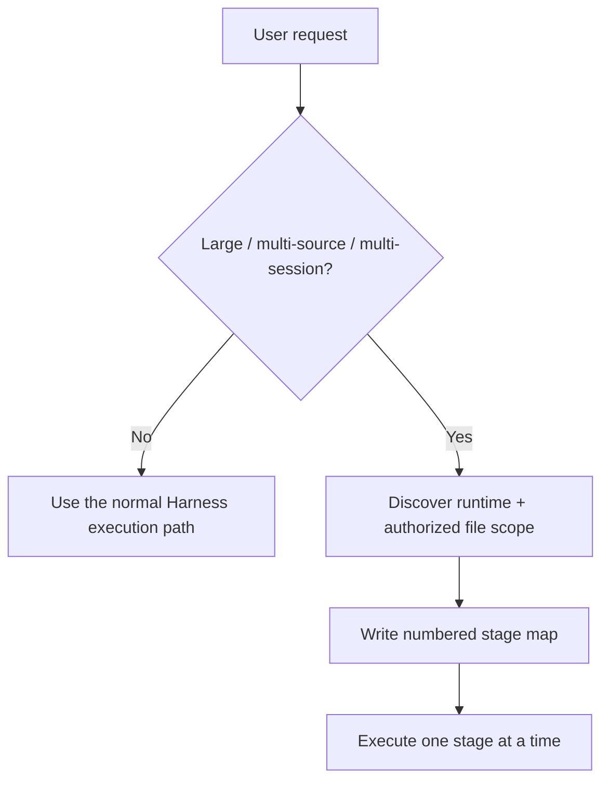
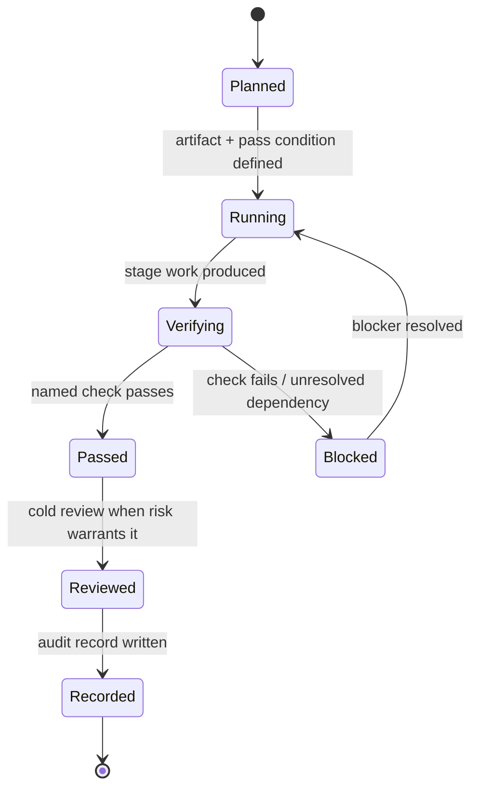
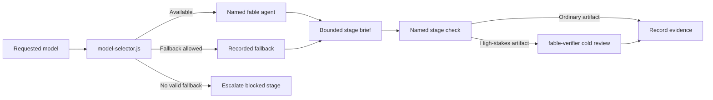
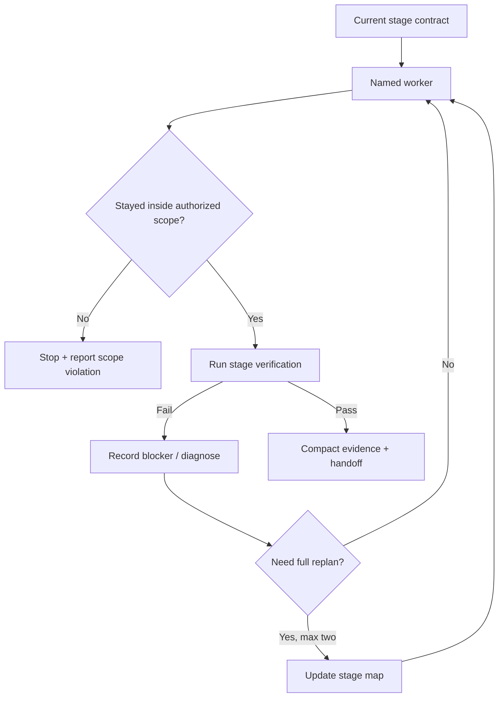

# Workflow: Fable Mode (v3)

> Stage large, multi-source or multi-session work through an explicit stage map, named agents, failable per-stage checks, and skeptical delivery review. Fable is not the default path for ordinary Tier 2 work.

---

## 1. When Fable Mode Applies

Use `fable-mode` when the work is large enough that one undifferentiated execution loop would lose scope or evidence: multi-file architectural work, multi-source investigation, multi-session execution, or an explicit `fable on haiku|sonnet|opus` request.

```mermaid
flowchart TD
  Request[User request] --> Scope{Large / multi-source / multi-session?}
  Scope -->|No| Normal[Use the normal Harness execution path]
  Scope -->|Yes| Discover[Discover runtime + authorized file scope]
  Discover --> Map[Write numbered stage map]
  Map --> Run[Execute one stage at a time]
```

`fable-mode` does **not** imply a mandatory `todo-driven-workflow → TDD` pipeline. Each stage chooses only the tactics and domain skills needed for its own artifact and pass condition.

## 2. Stage Contract

Every stage owns one concrete artifact and one explicit pass condition. A stage is not complete because an agent says it is complete; its named check must pass.

```mermaid
stateDiagram-v2
  [*] --> Planned
  Planned --> Running: artifact + pass condition defined
  Running --> Verifying: stage work produced
  Verifying --> Passed: named check passes
  Verifying --> Blocked: check fails / unresolved dependency
  Blocked --> Running: blocker resolved
  Passed --> Reviewed: cold review when risk warrants it
  Reviewed --> Recorded: audit record written
  Recorded --> [*]
```

The stage record preserves the requested/effective model, fallback reason, stage brief, artifact, pass condition, verification command, and verifier result.

## 3. Model Selection and Delegation

Explicit model requests are resolved through `model-selector.js`. Fable never silently downgrades a requested model.

```mermaid
flowchart LR
  Requested[Requested model] --> Selector[model-selector.js]
  Selector -->|Available| Named[Named fable agent]
  Selector -->|Fallback allowed| Fallback[Recorded fallback]
  Selector -->|No valid fallback| Blocked[Escalate blocked stage]
  Named --> Stage[Bounded stage brief]
  Fallback --> Stage
  Stage --> Verify[Named stage check]
  Verify -->|High-stakes artifact| Cold[fable-verifier cold review]
  Verify -->|Ordinary artifact| Record[Record evidence]
  Cold --> Record
```

The intended role split is explicit rather than magical: Opus is suitable for orchestration, Sonnet for reasoning-heavy stage work, and Haiku for bounded mechanical work. Workers do not spawn workers.

## 4. Scope and Context Discipline

`fable-discipline` acts as the shadow guard while Fable is active. A worker receives the current stage contract and authorized scope, not the entire unresolved history.

```mermaid
flowchart TD
  Stage[Current stage contract] --> Worker[Named worker]
  Worker --> Scope{Stayed inside authorized scope?}
  Scope -->|No| Block[Stop + report scope violation]
  Scope -->|Yes| Check[Run stage verification]
  Check -->|Fail| Diagnose[Record blocker / diagnose]
  Diagnose --> Replan{Need full replan?}
  Replan -->|No| Worker
  Replan -->|Yes, max two| Map[Update stage map]
  Map --> Worker
  Check -->|Pass| Handoff[Compact evidence + handoff]
```

At most two full replans are allowed before unresolved blockers are escalated rather than hidden behind endless restructuring.

## 5. Completion Boundary

Fable completion means the planned stages have produced their artifacts, their checks have passed, and high-risk outputs have received skeptical review where required. It does not mean every possible companion skill was invoked.

The canonical executable and policy details live in `fable-mode/SKILL.md`, `fable-mode/model-matrix.json`, `fable-mode/scripts/model-selector.js`, and `fable-mode/references/model-matrix.md`.