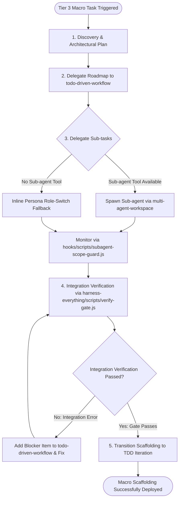
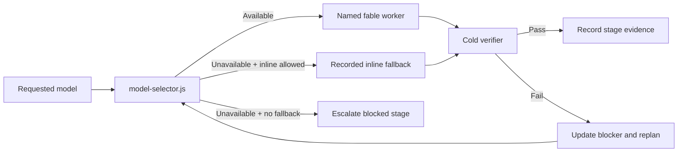
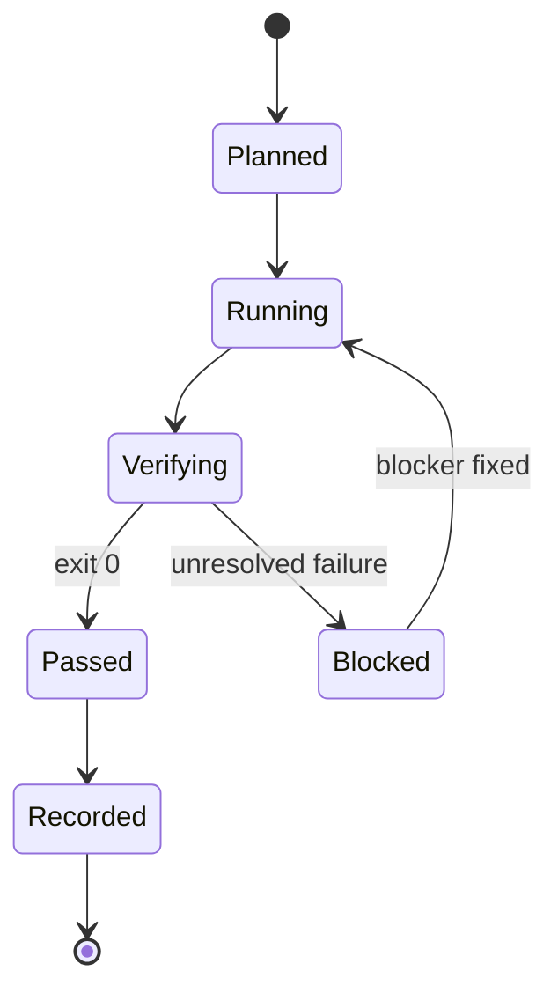

# Workflow: Fable Mode

> Macro-task planning and execution engine. Like all Harness workflows, this is not a straight line to success. It requires continuous verification and course correction.

---

## 1. Skill Behavior Workflow

This section visualizes how `fable-mode` handles macro tasks. Subagent failure or integration crashes are expected realities, not edge cases.

```mermaid
graph TD
  Start([Tier 3 Macro Task Triggered]) --> Discovery["1. Discovery & Architectural Plan"]
  Discovery --> InitTodo["2. Delegate Roadmap to todo-driven-workflow"]
  
  InitTodo --> Delegate{3. Delegate Sub-tasks}
  Delegate -->|Sub-agent Tool Available| SpawnSub["Spawn Sub-agent via multi-agent-workspace"]
  Delegate -->|No Sub-agent Tool| InlinePersona["Inline Persona Role-Switch Fallback"]
  
  SpawnSub --> ScopeCheck["Monitor via hooks/scripts/subagent-scope-guard.js"]
  InlinePersona --> ScopeCheck
  
  ScopeCheck --> VerifyStep["4. Integration Verification via harness-everything/scripts/verify-gate.js"]
  VerifyStep --> CheckGate{Integration Verification Passed?}
  
  CheckGate -->|No: Integration Error| FixBlocker["Add Blocker Item to todo-driven-workflow & Fix"] --> VerifyStep
  CheckGate -->|Yes: Gate Passes| Transition["5. Transition Scaffolding to TDD Iteration"]
  Transition --> End([Macro Scaffolding Successfully Deployed])
```

## Model and verifier decisions

Fable keeps the requested model explicit. A missing worker or unavailable
model is a recorded fallback or a blocked stage, never a silent downgrade.

```mermaid
flowchart LR
  Request[Requested model] --> Select[model-selector.js]
  Select -->|Available| Worker[Named fable worker]
  Select -->|Unavailable + inline allowed| Fallback[Recorded inline fallback]
  Select -->|Unavailable + no fallback| Blocked[Escalate blocked stage]
  Worker --> Verify[Cold verifier]
  Fallback --> Verify
  Verify -->|Pass| Record[Record stage evidence]
  Verify -->|Fail| Replan[Update blocker and replan]
  Replan --> Select
```

## Stage contract state

Each stage has one artifact and one pass condition. The audit record preserves
the model choice, fallback reason, and verification result for later review.

```mermaid
stateDiagram-v2
  [*] --> Planned
  Planned --> Running
  Running --> Verifying
  Verifying --> Passed: exit 0
  Verifying --> Blocked: unresolved failure
  Blocked --> Running: blocker fixed
  Passed --> Recorded
  Recorded --> [*]
```
