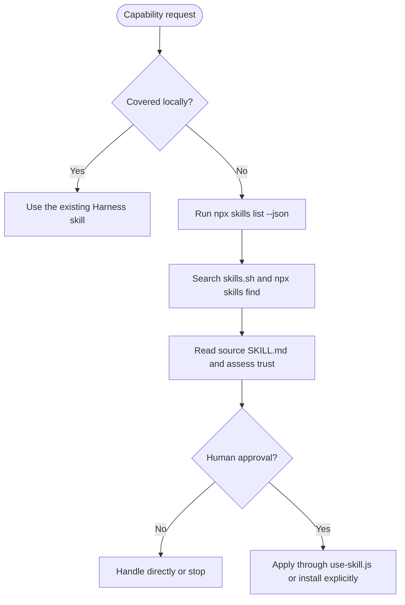

# Workflow: Find Skills

> Discover a third-party skill only after the reviewed local catalog and
> self-evolved manifest do not cover the requested capability.

## 1. Decision flow

## 2. Operating contract

1. Check `harness-everything`'s registry and `generated[]` entries first.
2. Query project and global installs live with `npx skills list --json`.
3. Search `skills.sh` and `npx skills find <query>` only when local coverage is
   absent; inspect the actual `SKILL.md`, source, and install signal.
4. Present the candidate and source. Do not fetch or apply it without explicit
   user approval.
5. Use `node "<this-skill-dir>/scripts/use-skill.js" <owner/repo[@skill]>` for
   the default six-hour OS-temp application. Use `npx skills add` only when the
   user explicitly wants a permanent install.

## 3. Verification

If search, network, or application fails, report the failure and continue with
the direct built-in solution. Never treat an unaudited third-party skill as a
first-party Harness skill or add it to the static manifest.
