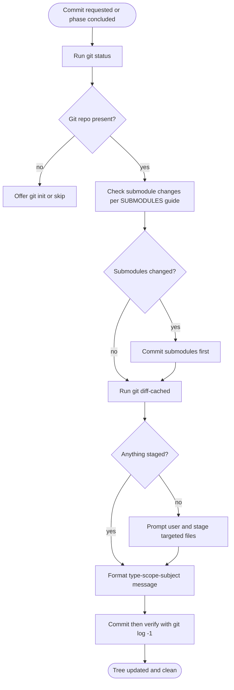
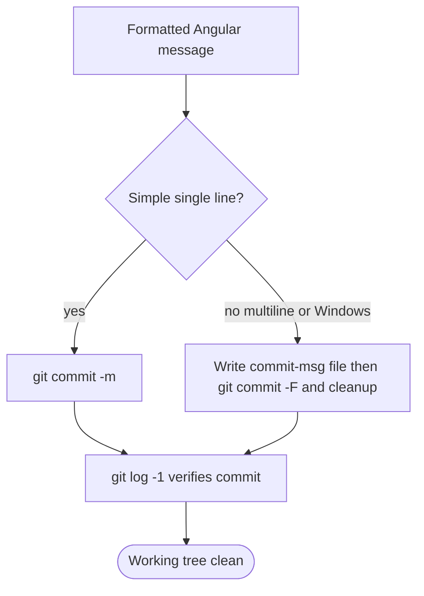
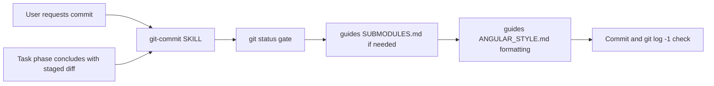
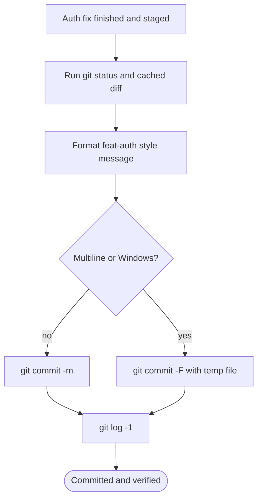

# Workflow: Git Commit

> Create clean Angular-style commit messages for an explicit commit request or a finished task phase, after checking repo state, submodules, and staged changes.

Source of truth: `git-commit/SKILL.md`.

## 1. Skill Behavior Workflow

## 2. Triggering and Routing Path

## 3. Real-World Use Case

Developer finishes an auth fix and asks for a commit.

1. Run `git status`; if not a repo, offer `git init` or skip.
2. If submodules changed, commit those first per `git-commit/guides/SUBMODULES.md`.
3. Run `git diff --cached`; if nothing staged, prompt before staging targeted files.
4. Format `<type>(<scope>): <subject>` per `git-commit/guides/ANGULAR_STYLE.md`.
5. Use `git commit -m` for a simple line, or `.git-commit-msg.txt` + `git commit -F` with cleanup for multiline/Windows, then verify with `git log -1`.

## 4. Verification Check

- [ ] `git status` ran first; non-repo offered `git init` or skip, and empty staging prompted the user instead of committing nothing
- [ ] Submodule changes were handled first per `git-commit/guides/SUBMODULES.md`
- [ ] Staged diff was reviewed with `git diff --cached`, with targeted staging only after confirmation
- [ ] Message followed `<type>(<scope>): <subject>` per `git-commit/guides/ANGULAR_STYLE.md`
- [ ] Multiline/Windows path used `.git-commit-msg.txt` + `git commit -F` with cleanup; simple path used `git commit -m`; result verified with `git log -1`
- [ ] No branch, rebase, merge, or push was performed, and no staging happened without confirmation
- [ ] Detail followed `git-commit/references/commit-flow.md` where needed
