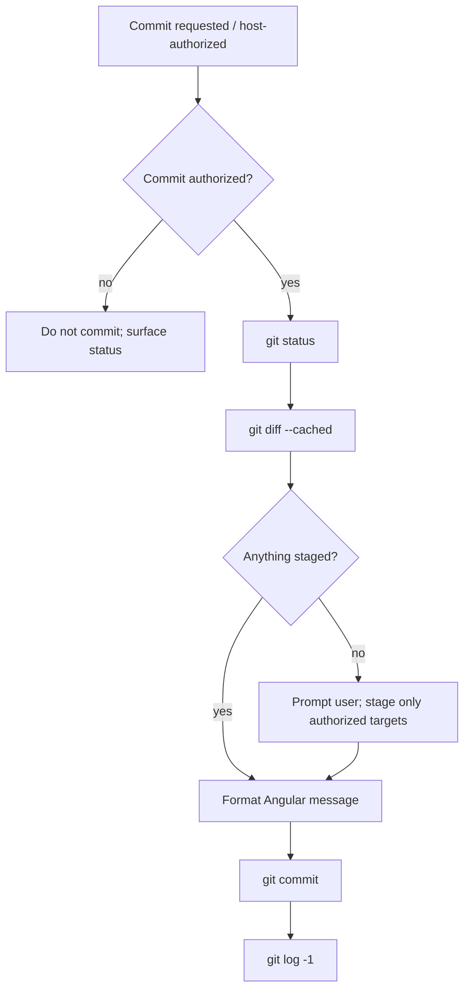

# Workflow: Git Commit

> Create and verify an Angular-style commit only after the user or active host/workflow authorizes the mutation.

Source of truth: `git-commit/SKILL.md`.

## 1. Workflow

```mermaid
graph TD
  Trigger[Commit requested / host-authorized] --> Auth{Commit authorized?}
  Auth -->|no| Stop[Do not commit; surface status]
  Auth -->|yes| Status[git status]
  Status --> Diff[git diff --cached]
  Diff --> Staged{Anything staged?}
  Staged -->|no| Ask[Prompt user; stage only authorized targets]
  Staged -->|yes| Format[Format Angular message]
  Ask --> Format
  Format --> Commit[git commit]
  Commit --> Verify[git log -1]
```

A completed task phase does **not** authorize a commit.

## 2. Verification

- [ ] Commit authorization existed before mutation.
- [ ] `git status` and `git diff --cached` were inspected.
- [ ] Only authorized targeted files were staged.
- [ ] Message follows `<type>(<scope>): <subject>`.
- [ ] Result verified with `git log -1`.
- [ ] No branch/rebase/merge/push side effects were introduced.
- [ ] Detail follows `git-commit/references/commit-flow.md`.
