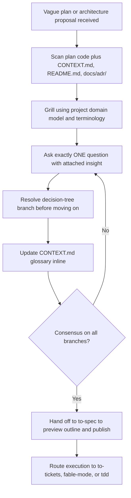
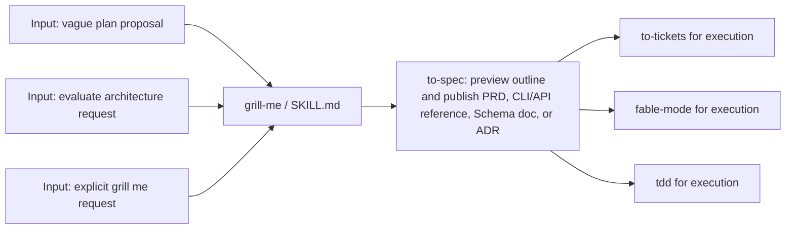
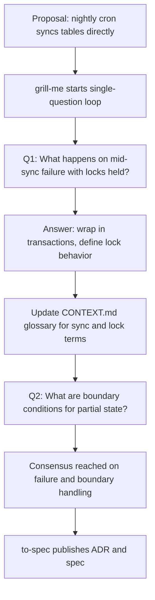

# Workflow: Grill Me

> A demanding challenger that pressure-tests vague plans and architectures one question at a time, exposes loopholes and undefined boundaries, counters sycophantic agreement, keeps the CONTEXT.md glossary current, and passes settled decisions to to-spec for formal specs and ADRs.

Source of truth: `grill-me/SKILL.md`.

## 1. Skill Behavior Workflow

## 2. Triggering and Routing Path

## 3. Real-World Use Case

Concrete example: a developer proposes a direct table-sync cron job. `grill-me` scans `CONTEXT.md` and related code, asks one question about mid-sync failure, resolves it, updates the glossary, asks the next question about monitoring and boundary conditions, then hands the hardened decisions to `to-spec` for a PRD or ADR. Execution follows via `to-tickets`, `fable-mode`, or `tdd`.

Deep detail: `grill-me/references/grilling-playbook.md`.

## 4. Verification Check

- [ ] Exactly ONE question asked at a time; questionnaires prohibited
- [ ] Each question carries the agent's insight and its branch is resolved before advancing
- [ ] Questions use the project's domain model and terminology from `CONTEXT.md`, `README.md`, and `docs/adr/`
- [ ] `CONTEXT.md` glossary updated inline as terms resolve; document creation left to `to-spec`
- [ ] On consensus, `to-spec` invoked to preview outline and publish PRD, CLI/API reference, Schema doc, or ADR
- [ ] No code implementation or ticket breakdown inside this skill; execution routed to `to-tickets`, `fable-mode`, or `tdd`
- [ ] Not used for casual Q and A, direct spec writing, or ticket breakdown of an approved spec
