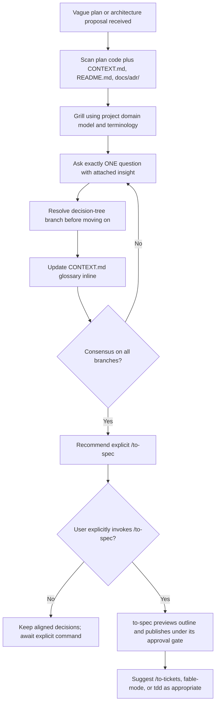
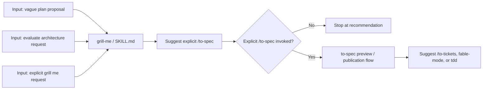
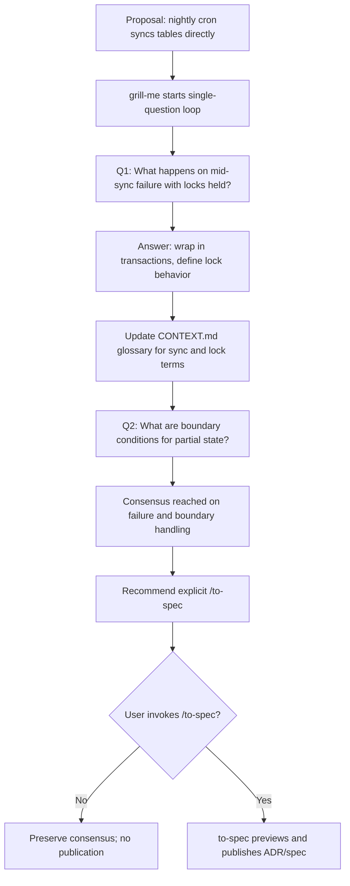

# Workflow: Grill Me

> A demanding challenger that pressure-tests vague plans and architectures one question at a time, keeps the CONTEXT.md glossary current, and recommends an explicit `/to-spec` handoff after consensus.

Source of truth: `grill-me/SKILL.md`.

## 1. Skill Behavior Workflow

```mermaid
graph TD
  Propose["Vague plan or architecture proposal received"] --> Discover["Scan plan code plus CONTEXT.md, README.md, docs/adr/"]
  Discover --> DomainTerms["Grill using project domain model and terminology"]
  DomainTerms --> AskOne["Ask exactly ONE question with attached insight"]
  AskOne --> ResolveBranch["Resolve decision-tree branch before moving on"]
  ResolveBranch --> UpdateGlossary["Update CONTEXT.md glossary inline"]
  UpdateGlossary --> ConsensusCheck{"Consensus on all branches?"}
  ConsensusCheck -->|No| AskOne
  ConsensusCheck -->|Yes| SuggestSpec["Recommend explicit /to-spec"]
  SuggestSpec --> InvokeSpec{"User explicitly invokes /to-spec?"}
  InvokeSpec -->|No| Await["Keep aligned decisions; await explicit command"]
  InvokeSpec -->|Yes| ToSpec["to-spec previews outline and publishes under its approval gate"]
  ToSpec --> SuggestExec["Suggest /to-tickets, fable-mode, or tdd as appropriate"]
```

## 2. Triggering and Routing Path

```mermaid
graph LR
  VaguePlan["Input: vague plan proposal"] --> GrillMe["grill-me / SKILL.md"]
  EvaluateArch["Input: evaluate architecture request"] --> GrillMe
  ExplicitAsk["Input: explicit grill me request"] --> GrillMe
  GrillMe --> SuggestSpec["Suggest explicit /to-spec"]
  SuggestSpec --> InvokeGate{"Explicit /to-spec invoked?"}
  InvokeGate -->|No| Wait["Stop at recommendation"]
  InvokeGate -->|Yes| ToSpec["to-spec preview / publication flow"]
  ToSpec --> SuggestRoutes["Suggest /to-tickets, fable-mode, or tdd"]
```

## 3. Real-World Use Case

```mermaid
graph TD
  CronProposal["Proposal: nightly cron syncs tables directly"] --> GrillStart["grill-me starts single-question loop"]
  GrillStart --> Q1["Q1: What happens on mid-sync failure with locks held?"]
  Q1 --> A1["Answer: wrap in transactions, define lock behavior"]
  A1 --> Glossary1["Update CONTEXT.md glossary for sync and lock terms"]
  Glossary1 --> Q2["Q2: What are boundary conditions for partial state?"]
  Q2 --> Consensus["Consensus reached on failure and boundary handling"]
  Consensus --> Recommend["Recommend explicit /to-spec"]
  Recommend --> UserInvoke{"User invokes /to-spec?"}
  UserInvoke -->|No| End["Preserve consensus; no publication"]
  UserInvoke -->|Yes| Spec["to-spec previews and publishes ADR/spec"]
```

Concrete example: a developer proposes a direct table-sync cron job. `grill-me` resolves the design one question at a time and updates glossary terms. Once consensus is reached, it recommends explicit `/to-spec`; it does not publish automatically. Only after that command is invoked does `to-spec` enter its preview/publication flow. Any later execution route is suggested rather than auto-invoked.

Deep detail: `grill-me/references/grilling-playbook.md`.

## 4. Verification Check

- [ ] Exactly ONE question asked at a time; questionnaires prohibited
- [ ] Each question carries the agent's insight and its branch is resolved before advancing
- [ ] Questions use the project's domain model and terminology from `CONTEXT.md`, `README.md`, and `docs/adr/`
- [ ] `CONTEXT.md` glossary updated inline as terms resolve
- [ ] On consensus, explicit `/to-spec` is recommended, not auto-run
- [ ] Publication occurs only after explicit `/to-spec` invocation and its approval flow
- [ ] Execution routes such as `/to-tickets`, `fable-mode`, or `tdd` are suggested; explicit-only skills are not auto-invoked
- [ ] Not used for casual Q and A, direct spec writing, or ticket breakdown of an approved spec
