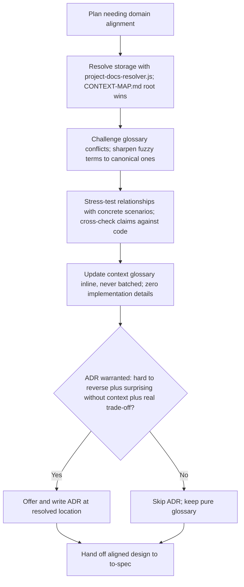
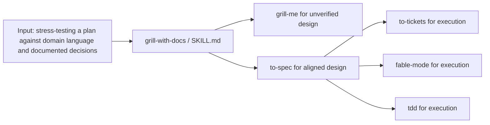
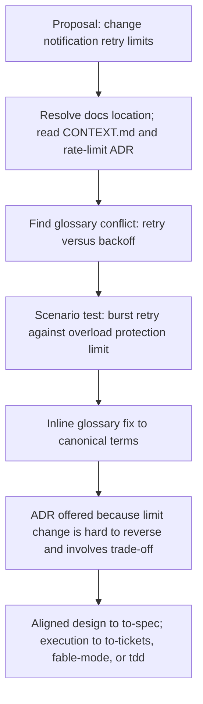

# Workflow: Grill With Docs

> Tests a plan against the recorded domain language and past decisions, tightens fuzzy terminology into canonical terms, and writes CONTEXT.md and ADR updates inline as choices settle.

Source of truth: `grill-with-docs/SKILL.md`.

## 1. Skill Behavior Workflow

```mermaid
graph TD
  PlanInput["Plan needing domain alignment"] --> ResolveStorage["Resolve storage with project-docs-resolver.js; CONTEXT-MAP.md root wins"]
  ResolveStorage --> ChallengeTerms["Challenge glossary conflicts; sharpen fuzzy terms to canonical ones"]
  ChallengeTerms --> ScenarioTest["Stress-test relationships with concrete scenarios; cross-check claims against code"]
  ScenarioTest --> InlineUpdate["Update context glossary inline, never batched; zero implementation details"]
  InlineUpdate --> ADRGate{"ADR warranted: hard to reverse plus surprising without context plus real trade-off?"}
  ADRGate -->|Yes| WriteADR["Offer and write ADR at resolved location"]
  ADRGate -->|No| SkipADR["Skip ADR; keep pure glossary"]
  WriteADR --> Handoff["Hand off aligned design to to-spec"]
  SkipADR --> Handoff
```

## 2. Triggering and Routing Path

```mermaid
graph LR
  DomainStress["Input: stress-testing a plan against domain language and documented decisions"] --> GWD["grill-with-docs / SKILL.md"]
  GWD --> GrillMe["grill-me for unverified design"]
  GWD --> ToSpec["to-spec for aligned design"]
  ToSpec --> ToTickets["to-tickets for execution"]
  ToSpec --> FableMode["fable-mode for execution"]
  ToSpec --> TDD["tdd for execution"]
```

## 3. Real-World Use Case

```mermaid
graph TD
  RetryProposal["Proposal: change notification retry limits"] --> ResolveDocs["Resolve docs location; read CONTEXT.md and rate-limit ADR"]
  ResolveDocs --> Conflict["Find glossary conflict: retry versus backoff"]
  Conflict --> Scenario["Scenario test: burst retry against overload protection limit"]
  Scenario --> GlossaryFix["Inline glossary fix to canonical terms"]
  GlossaryFix --> ADRDecision["ADR offered because limit change is hard to reverse and involves trade-off"]
  ADRDecision --> AlignedHandoff["Aligned design to to-spec; execution to to-tickets, fable-mode, or tdd"]
```

Concrete example: a retry-limit change is checked against the existing rate-limiting ADR and code. Fuzzy retry language is sharpened, the glossary is fixed inline, and only because the decision is hard to reverse and surprising without context is an ADR written. An unverified design would go to `grill-me` first instead.

Deep detail: `grill-with-docs/references/session-playbook.md`. Formats: `grill-with-docs/ADR-FORMAT.md`, `grill-with-docs/CONTEXT-FORMAT.md`.

## 4. Verification Check

- [ ] Storage resolved with `multi-agent-workspace/scripts/project-docs-resolver.js`; `<workspace>/CONTEXT-MAP.md` root wins
- [ ] Fuzzy terms sharpened to canonical ones; glossary stays pure with zero implementation details
- [ ] Relationships tested with concrete scenarios and claims cross-checked against code
- [ ] Context glossary updated inline, never batched
- [ ] ADR offered only when hard to reverse plus surprising without context plus a real trade-off
- [ ] ADRs meet the 3-part bar; handoff to `to-spec` after alignment
- [ ] Routing respected: unverified design to `grill-me`; aligned design to `to-spec`; execution to `to-tickets`, `fable-mode`, or `tdd`
- [ ] Not used for verifying unstable designs without a grilling pass, and not used for spec publishing without grilling
