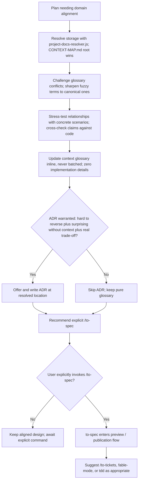
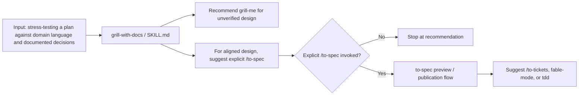
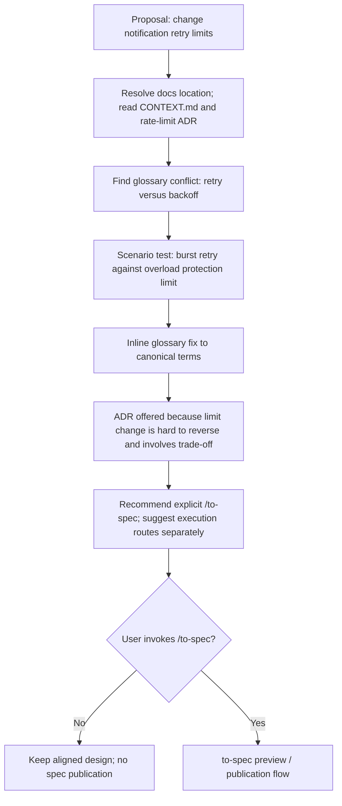

# Workflow: Grill With Docs

> Tests a plan against recorded domain language and decisions, sharpens terminology, updates CONTEXT.md/ADRs inline, and recommends explicit downstream commands after alignment.

Source of truth: `grill-with-docs/SKILL.md`.

## 1. Skill Behavior Workflow

```mermaid
graph TD
  PlanInput["Plan needing domain alignment"] --> ResolveStorage["Resolve storage with project-docs-resolver.js; CONTEXT-MAP.md root wins"]
  ResolveStorage --> ChallengeTerms["Challenge glossary conflicts; sharpen fuzzy terms to canonical ones"]
  ChallengeTerms --> ScenarioTest["Stress-test relationships with concrete scenarios; cross-check claims against code"]
  ScenarioTest --> InlineUpdate["Update context glossary inline, never batched; zero implementation details"]
  InlineUpdate --> ADRGate{"ADR warranted: hard to reverse plus surprising without context plus real trade-off?"}
  ADRGate -->|Yes| WriteADR["Offer and write ADR at resolved location"]
  ADRGate -->|No| SkipADR["Skip ADR; keep pure glossary"]
  WriteADR --> SuggestSpec["Recommend explicit /to-spec"]
  SkipADR --> SuggestSpec
  SuggestSpec --> InvokeSpec{"User explicitly invokes /to-spec?"}
  InvokeSpec -->|No| Await["Keep aligned design; await explicit command"]
  InvokeSpec -->|Yes| ToSpec["to-spec enters preview / publication flow"]
  ToSpec --> SuggestExec["Suggest /to-tickets, fable-mode, or tdd as appropriate"]
```

## 2. Triggering and Routing Path

```mermaid
graph LR
  DomainStress["Input: stress-testing a plan against domain language and documented decisions"] --> GWD["grill-with-docs / SKILL.md"]
  GWD --> GrillMe["Recommend grill-me for unverified design"]
  GWD --> SuggestSpec["For aligned design, suggest explicit /to-spec"]
  SuggestSpec --> InvokeGate{"Explicit /to-spec invoked?"}
  InvokeGate -->|No| Wait["Stop at recommendation"]
  InvokeGate -->|Yes| ToSpec["to-spec preview / publication flow"]
  ToSpec --> SuggestRoutes["Suggest /to-tickets, fable-mode, or tdd"]
```

## 3. Real-World Use Case

```mermaid
graph TD
  RetryProposal["Proposal: change notification retry limits"] --> ResolveDocs["Resolve docs location; read CONTEXT.md and rate-limit ADR"]
  ResolveDocs --> Conflict["Find glossary conflict: retry versus backoff"]
  Conflict --> Scenario["Scenario test: burst retry against overload protection limit"]
  Scenario --> GlossaryFix["Inline glossary fix to canonical terms"]
  GlossaryFix --> ADRDecision["ADR offered because limit change is hard to reverse and involves trade-off"]
  ADRDecision --> Recommend["Recommend explicit /to-spec; suggest execution routes separately"]
  Recommend --> Invoke{"User invokes /to-spec?"}
  Invoke -->|No| End["Keep aligned design; no spec publication"]
  Invoke -->|Yes| Spec["to-spec preview / publication flow"]
```

Concrete example: a retry-limit change is checked against the existing rate-limiting ADR and code. Fuzzy language is sharpened and the glossary is fixed inline. Once alignment is complete, the skill recommends explicit `/to-spec`; it does not invoke publication or ticket generation automatically. An unverified design is directed back to `grill-me` first.

Deep detail: `grill-with-docs/references/session-playbook.md`. Formats: `grill-with-docs/ADR-FORMAT.md`, `grill-with-docs/CONTEXT-FORMAT.md`.

## 4. Verification Check

- [ ] Storage resolved with `multi-agent-workspace/scripts/project-docs-resolver.js`; `<workspace>/CONTEXT-MAP.md` root wins
- [ ] Fuzzy terms sharpened to canonical ones; glossary stays pure with zero implementation details
- [ ] Relationships tested with concrete scenarios and claims cross-checked against code
- [ ] Context glossary updated inline, never batched
- [ ] ADR offered only when hard to reverse plus surprising without context plus a real trade-off
- [ ] After alignment, explicit `/to-spec` is recommended rather than auto-run
- [ ] Specification publication requires explicit `/to-spec` invocation
- [ ] `/to-tickets`, `fable-mode`, and `tdd` are suggestions; explicit-only skills are not auto-invoked
- [ ] Not used for verifying unstable designs without a grilling pass, and not used for spec publishing without grilling
