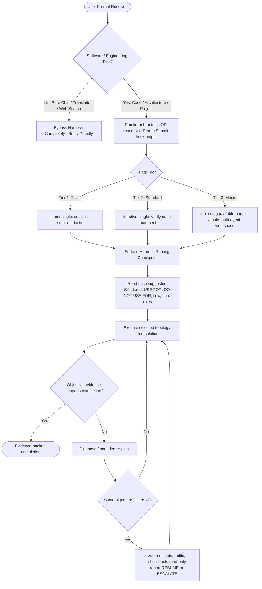
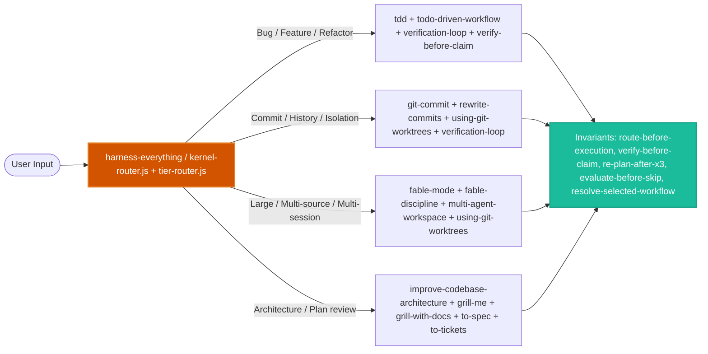
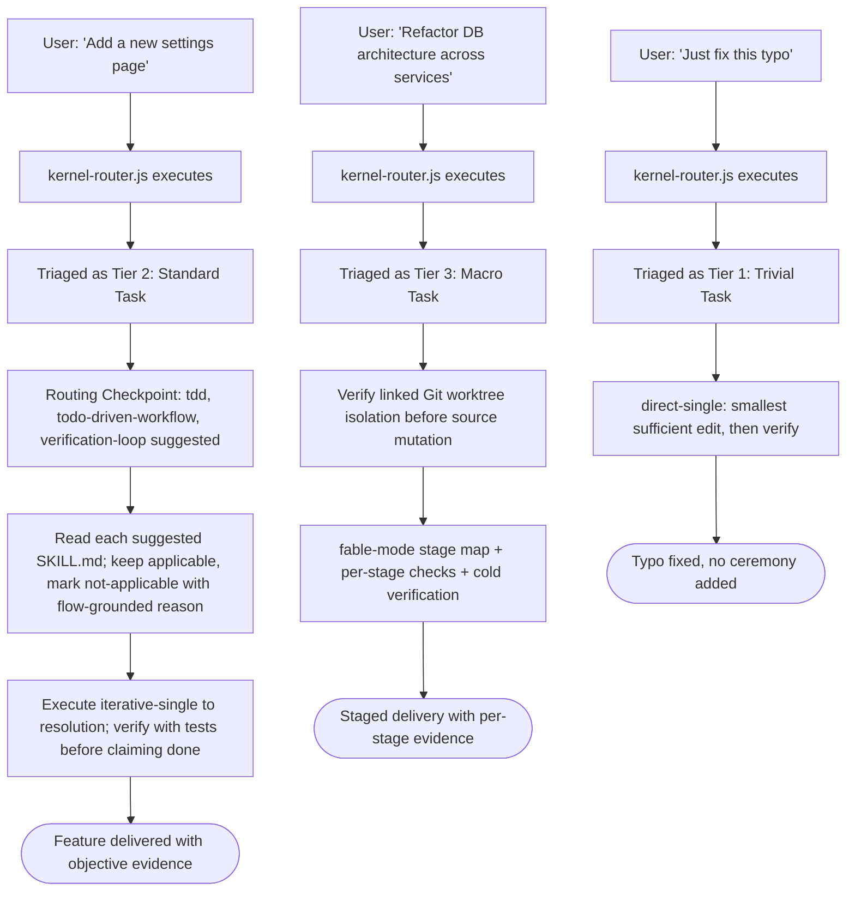

# Workflow: Harness Everything

> Route software/project work through the Harness kernel: classify Tier 1/2/3, establish mandatory invariants, then let the agent choose tactics and domain skills. Not general Q&A or non-software writing.

Source of truth: `harness-everything/SKILL.md`. Deep dive: `harness-everything/references/triage-and-tiers.md`.

---

## 1. Skill Behavior Workflow

The kernel establishes the smallest applicable workflow before mutation. Suggested skills are mandatory to evaluate and advisory to execute; the selected topology is mandatory to resolve.

---

## 2. Triggering and Routing Path

This diagram shows how the `harness-everything` skill is triggered and how it chains with companion skills. Routing suggestions are conditional on applicability; the selected topology is not advisory.

---

## 3. Real-World Use Case Flowchart

Escape applies only to genuinely uncovered workflow scope with explicit scope + evidence; covered obligations, isolation, and independent verification survive escape. Model confidence alone never justifies skipping the selected topology.

---

## 4. Verification Check

To ensure that the `harness-everything` skill is operating in strict compliance with Harness OS design laws, verify the following:

- [ ] **Route before execution**: scope/tier and smallest applicable workflow established before mutation.
- [ ] **Evaluate before omission**: each suggested skill's complete `SKILL.md` flow evaluated before deciding applicability.
- [ ] **Resolve selected workflow**: the selected topology executed to resolution; escape only for uncovered scope with evidence.
- [ ] **Verify before claim**: objective evidence (tests, checks, quoted tool output) supports completion.
- [ ] **Re-plan on repetition**: after 3 same-signature failures, `zoom-out` reflection completed before resuming.
