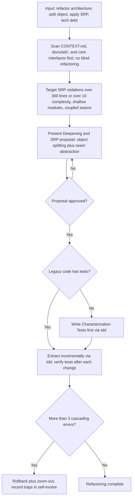
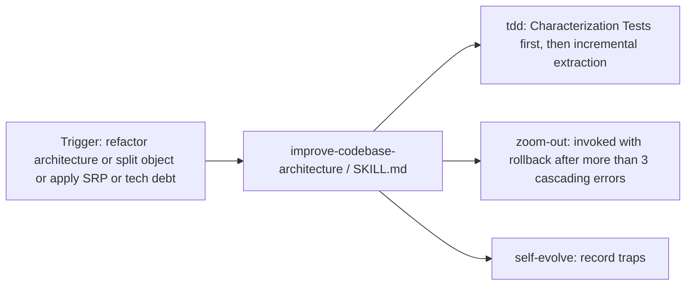
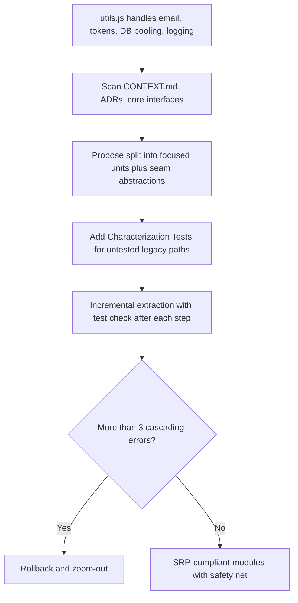

# Workflow: Improve Codebase Architecture

> Finds thin or overweight modules and reshapes them into focused, single-responsibility units by dividing large objects and functions, isolating seams, and separating interfaces.

Source of truth: `improve-codebase-architecture/SKILL.md`.

## 1. Skill Behavior Workflow

## 2. Triggering and Routing Path

## 3. Real-World Use Case

Concrete example: a 600-line utility module is scanned for interfaces and ADR constraints, proposed for splitting into single-purpose units, guarded by Characterization Tests, then extracted step by step with verification after each change.

Deep detail: `improve-codebase-architecture/references/README.md`.

## 4. Verification Check

- [ ] `CONTEXT.md`, `docs/adr/`, and core interfaces scanned first; no blind refactoring
- [ ] Targets match the skill bar: SRP violations over 300 lines or over 10 complexity, shallow modules, coupled seams
- [ ] Deepening and SRP proposal with object splitting and seam abstraction presented and approved before code changes
- [ ] `tdd` launched; Characterization Tests added first when legacy code lacks tests
- [ ] Extraction done incrementally with tests verified after each change
- [ ] On more than 3 cascading errors, changes rolled back with `zoom-out` and traps recorded in `self-evolve`
- [ ] Not used for features, bugfixes, or style-only cleanups with no structure change
