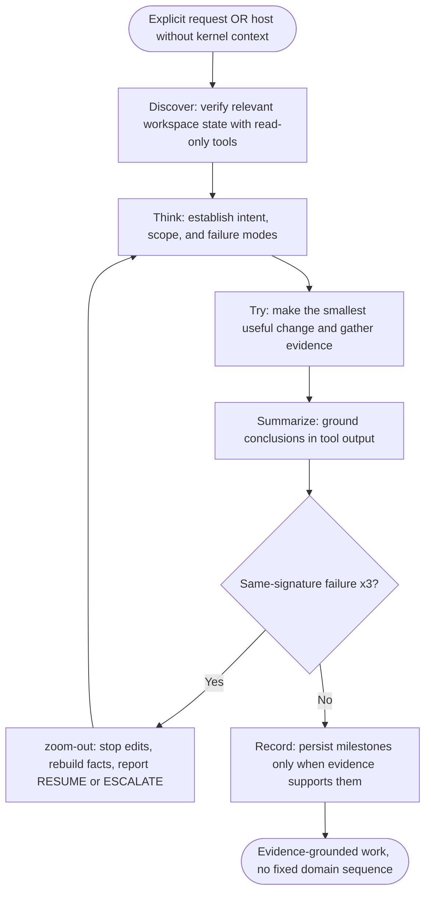
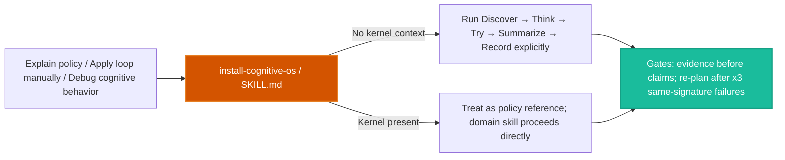
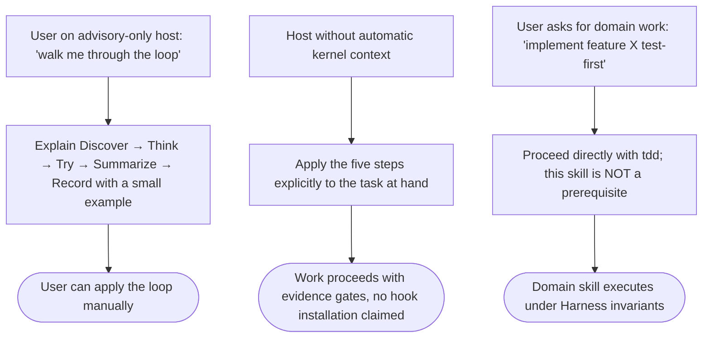

# Workflow: Install Cognitive OS

> Explain or explicitly apply the Harness cognitive policy: Discover, Think, Try, Summarize, Record. This skill is a human-readable/manual entry point, not an installer and not a required peer-skill selection.

Source of truth: `install-cognitive-os/SKILL.md`. Deep dive: `install-cognitive-os/references/cognitive-loop.md`.

The runtime invariant contract is established by supported host integrations independently of this skill. Domain skills never need to invoke this skill first as long as Harness invariants remain satisfied.

---

## 1. Skill Behavior Workflow

This skill writes no installer state, deploys no hooks, and copies no skill directories. Workspace installation is owned by the general installer (`node scripts/installer.js`), not by this skill.

---

## 2. Triggering and Routing Path

---

## 3. Real-World Use Case Flowchart

## 4. Verification Check

To ensure that the `install-cognitive-os` skill is operating in strict compliance with Harness OS design laws, verify the following:

- [ ] **Policy, not installation**: no hook deployment, file copying, or config mutation claimed as this skill's effect.
- [ ] **Full five-step loop**: Discover → Think → Try → Summarize → Record applied in order, not the truncated four-step variant.
- [ ] **Evidence gates honored**: completion claims need evidence; repeated same-signature failures require re-planning via `zoom-out`.
- [ ] **No prerequisite fabrication**: domain skills (`tdd`, `security-review`, `repo-docs`) proceed without selecting this skill first.
