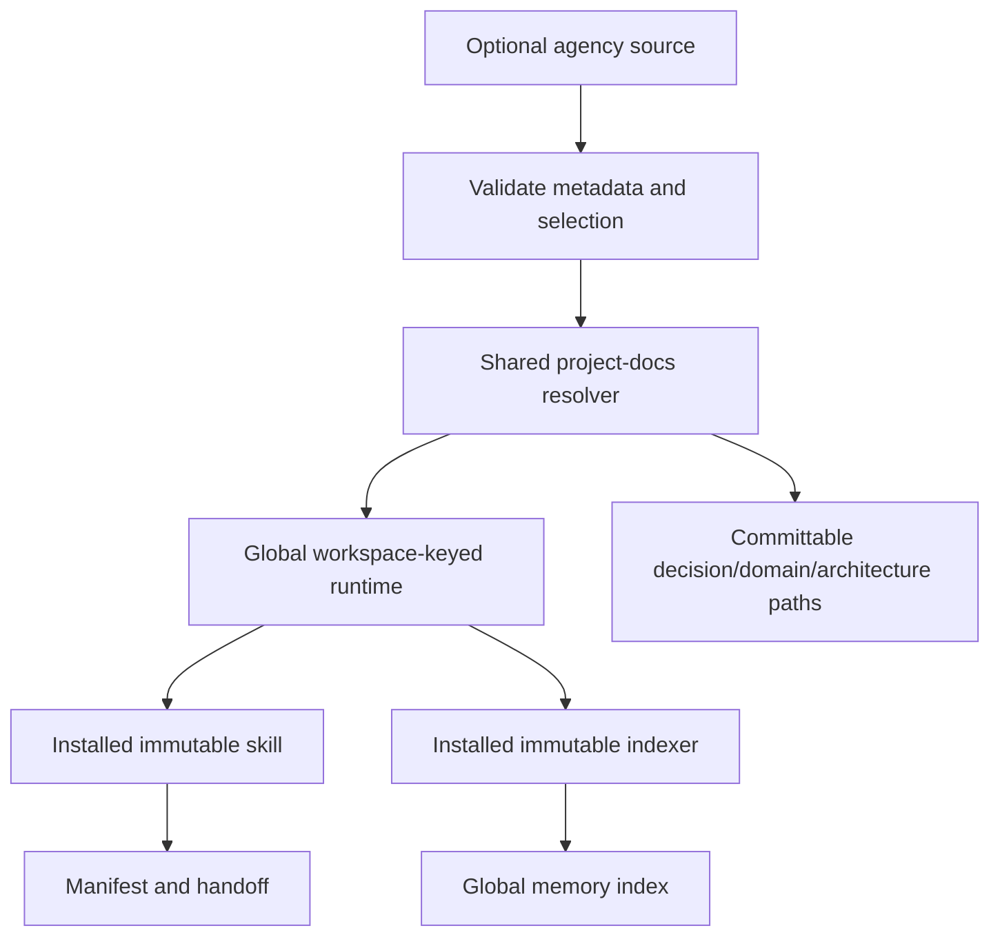

# Workflow: Multi-Agent Workspace

`multi-agent-workspace` is the single routed entrypoint for permanent
multi-agent infrastructure. It combines the former launcher and workspace
scaffold responsibilities and adds an optional agency-agents metadata source.

```text
Discover target + source
        |
Validate divisions, frontmatter, names, slugs, revision, platform
        |
Resolve global runtime + repository document paths
        |
Write global manifest/handoff + selected roles
        |
Run installed immutable index_memory.js -> global memory-index.md
```



## Selection contract

Use `--workspace <path>` plus `--agency-source <path>` or `AGENCY_AGENTS_SOURCE`. Select by repeated
`--division` or `--agent`; `--all-agents` is explicit and metadata-only. The
generated launcher lists each selected role's division, source-relative file,
description, and boundary. Specialist bodies are loaded only on demand after a
bounded brief is assigned.

## Failure contract

No source creates a visible `agency.status: unavailable` fallback. Invalid
frontmatter, missing or empty divisions, duplicate names/slugs, unknown
agents, and unsupported platforms fail before output is written. A changed
source revision requires `--allow-source-drift` to refresh a Harness-owned
catalog. Runtime artifacts are regenerated under the global workspace key;
authored document conflicts fail before migration.

## Handoff

The launcher and `handoff.json` require `status`, `changes`, `verification`,
`risks`, and `nextAction`. The global manifest carries resolved paths, selected
roles, and execution metadata; the installed skill and indexer remain
immutable. Fable remains responsible for macro planning; TDD remains
responsible for ordinary feature implementation.
