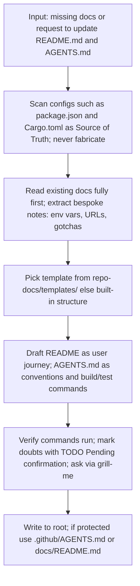
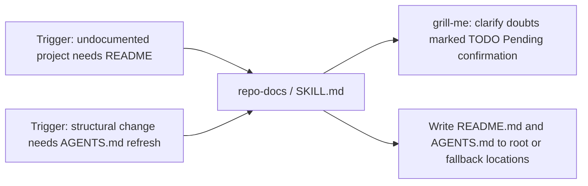
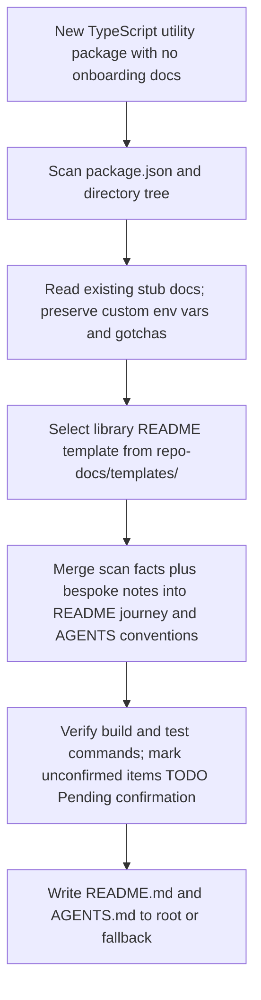

# Workflow: Repo Docs

> Creates or refreshes reader-focused README.md and AGENTS.md from real repository scans, carefully blending discovered facts with existing custom notes for projects missing docs or needing better agent onboarding.

Source of truth: `repo-docs/SKILL.md`.

## 1. Skill Behavior Workflow

## 2. Triggering and Routing Path

## 3. Real-World Use Case

Concrete example: an undocumented utility repo is scanned for its real entry points and scripts, its bespoke environment notes are preserved, a template from `repo-docs/templates/` shapes the draft, commands are verified, and the merged README and AGENTS files are written without blind overwrites.

Deep detail: `repo-docs/references/process-guide.md`.

## 4. Verification Check

- [ ] Configs scanned as Source of Truth; no facts fabricated without repo evidence
- [ ] Existing docs read fully first; bespoke notes preserved and never overwritten blindly
- [ ] Template picked from `repo-docs/templates/` or built-in structure applied
- [ ] `README.md` covers the user journey; `AGENTS.md` covers conventions and build/test commands
- [ ] Commands verified to run; unresolved doubts marked `// TODO: Pending confirmation` and clarified with `grill-me`
- [ ] Written to root, or to `<workspace>/.github/AGENTS.md` and `<workspace>/docs/README.md` when root is protected
- [ ] Not used for marketing copy, fabrication without scanning, or non-repository wikis
