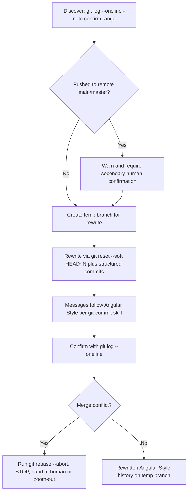
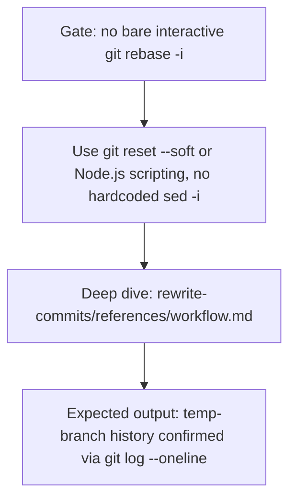
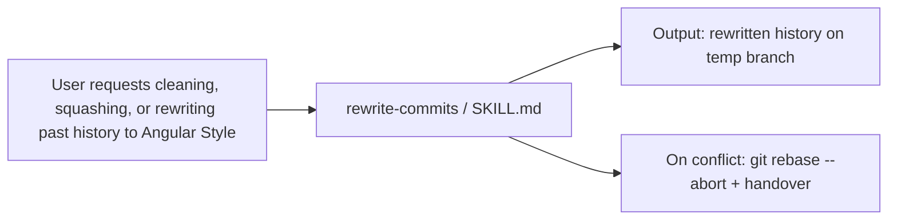
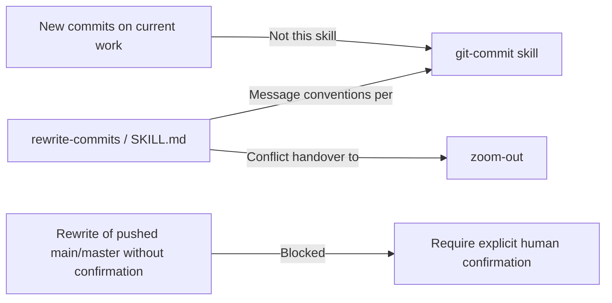

# Workflow: Rewrite Commits

> Rewrites past Git history into Angular Style messages — cleaning unpushed commits before a PR, squashing fixups, rewording, and reordering safely on a temp branch with abort on conflict.

Source of truth: `rewrite-commits/SKILL.md`.

---

## 1. Skill Behavior Workflow

## 2. Triggering and Routing Path

## 3. Real-World Use Case

A branch has 4 messy unpushed commits before a PR (`wip`, `fix`, `oops`, `final fix`). The user asks to squash to Angular Style. The skill runs `git log --oneline -n 4` to confirm the range, verifies the commits are not pushed to `main`, creates a temp branch, uses `git reset --soft HEAD~4` plus structured recommits with Angular Style messages, then confirms with `git log --oneline`. If a rebase conflict appears, it runs `git rebase --abort`, stops, and hands over for a human decision.

## 4. Verification Check

- [ ] Range confirmed with `git log --oneline -n <num>` before rewriting
- [ ] Rewrite done on a temp branch first, not directly on `main` / release branches
- [ ] No bare interactive `git rebase -i` used; used `git reset --soft HEAD~<N>` or script editors
- [ ] No hardcoded `sed -i` scripting used
- [ ] All new messages follow Angular Style per the `git-commit` skill
- [ ] Final history confirmed with `git log --oneline`
- [ ] If commits were pushed to remote `main` / `master`, warned and obtained secondary human confirmation
- [ ] On merge conflict, ran `git rebase --abort`, stopped, and handed over instead of resolving beyond abort
- [ ] Not used for creating new commits on current work (belongs to `git-commit`)
- [ ] Deep detail checked in `rewrite-commits/references/workflow.md` where needed
