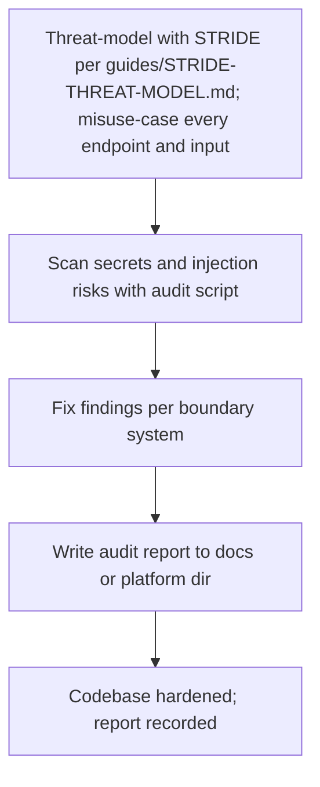
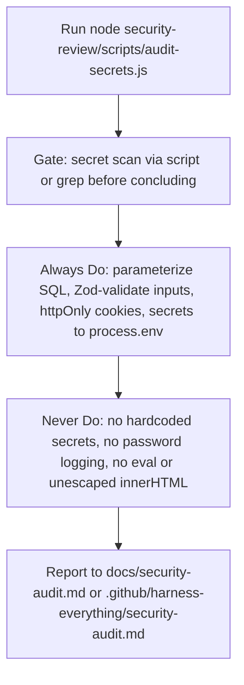
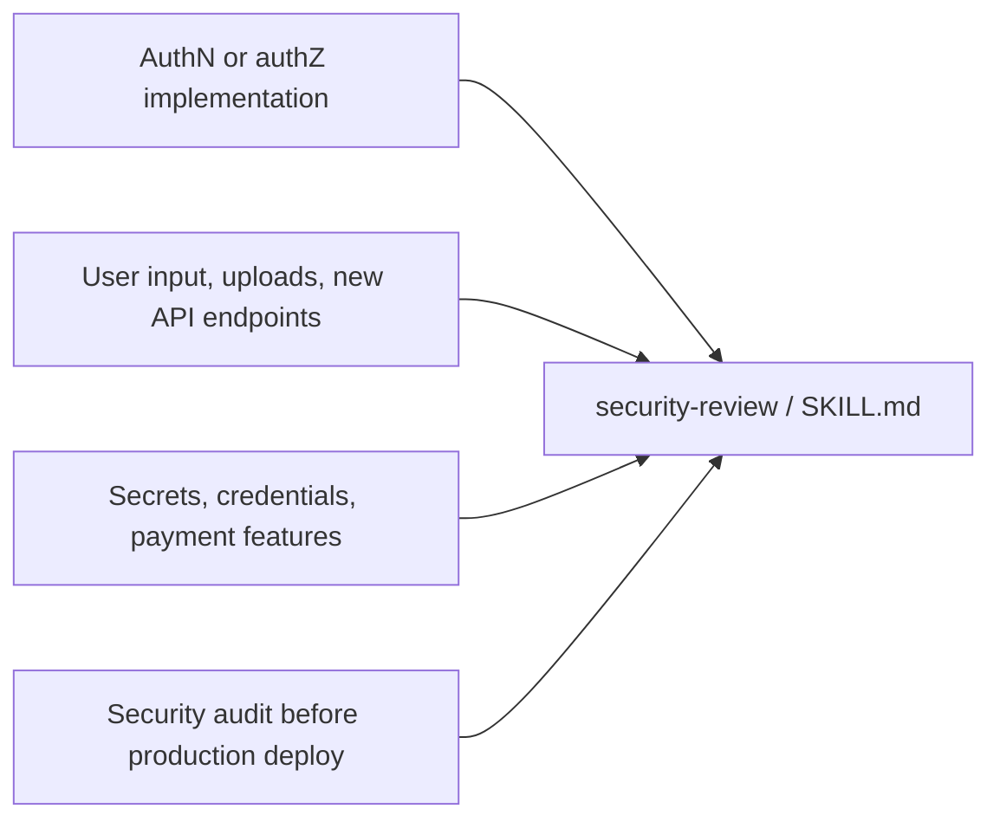
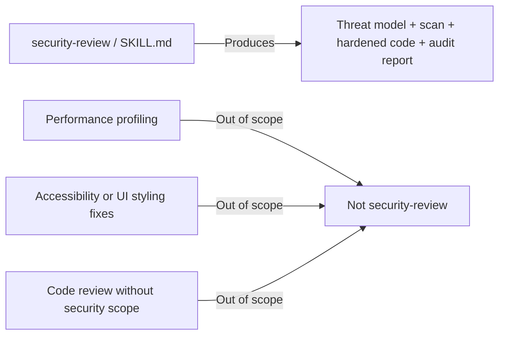

# Workflow: Security Review

> Runs STRIDE threat modeling, scans secrets with the audit script, and hardens code against OWASP Top 10 risks using three-tier boundary controls — for auth, inputs, uploads, secrets, and pre-deploy audits.

Source of truth: `security-review/SKILL.md`.

---

## 1. Skill Behavior Workflow

## 2. Triggering and Routing Path

## 3. Real-World Use Case

A new profile endpoint accepts a username and avatar upload before a production deploy. The skill threat-models it with STRIDE, misuse-cases the input and upload path, runs `node "security-review/scripts/audit-secrets.js"`, finds an unvalidated input and a hardcoded secret, fixes them per the boundary system (Zod validation, secret moved to `process.env`, parameterized query), and writes the report to `<workspace>/docs/security-audit.md`, falling back to `<workspace>/.github/harness-everything/security-audit.md` when `docs/` is protected or absent.

## 4. Verification Check

- [ ] STRIDE threat model completed per `security-review/guides/STRIDE-THREAT-MODEL.md`, with misuse-case for every endpoint and input
- [ ] Secret and injection scan run via `security-review/scripts/audit-secrets.js`, or grep, before concluding
- [ ] OWASP patterns checked per `security-review/guides/OWASP-PATTERNS.md` and `security-review/references/security-checklist.md`
- [ ] Always Do applied: parameterized SQL, Zod-validated inputs, httpOnly cookies, secrets in `process.env`
- [ ] Ask First respected: CORS changes, auth and login flows, file uploads, rate limits
- [ ] Never Do respected: no committed hardcoded secrets, no logged passwords or tokens, no `eval()` or unescaped `innerHTML`
- [ ] Audit report written to `<workspace>/docs/security-audit.md`, or `<workspace>/.github/harness-everything/security-audit.md` when docs is protected or absent
- [ ] Scope kept to auth, inputs, uploads, endpoints, secrets, and audits — not general review, performance, or UI styling
