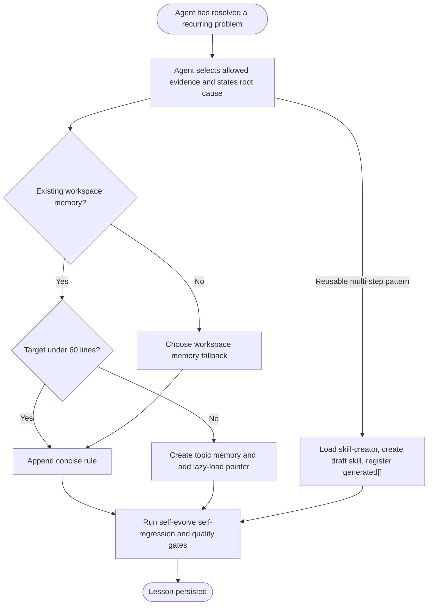

# Workflow: Self-Evolve

> The host agent supplies relevant session evidence and a generalized root-cause analysis. `self-evolve` classifies, validates, and persists the lesson; it does not collect host transcripts.

Load `self-evolve/references/memory-resolution.md` on demand when the persistence decision, fallback path, lazy-loading rule, or dynamic-skill registration details are needed.

## 1. Responsibility boundary

The host agent may inspect the current session and any history explicitly exposed by the host. It selects the evidence and states the reusable root cause. `self-evolve` MUST NOT scan global host transcript stores or persist raw transcripts.

## 2. Persistence flow

## 3. Triggering and routing

The agent invokes `self-evolve/SKILL.md` after a resolved struggle, zoom-out recovery, or explicit request. It passes the selected evidence and root cause to `persist-memory.js`, or routes a reusable pattern through `skill-creator` and `register-dynamic-skill.js`. The router later matches registered `generated[]` metadata; this is not an automatic transcript scan.

## 4. Example

After resolving a recurring Windows path error, the agent summarizes the cause, checks existing memory, and chooses either a concise rule or a draft dynamic skill. It runs the relevant quality/self-regression gate before persistence and records only the generalized lesson.

## 5. Verification checklist

- [ ] Evidence came from the host context the agent is authorized to inspect.
- [ ] No raw transcript, secret, or one-off detail was persisted.
- [ ] Rule/dynamic-skill classification and deduplication passed.
- [ ] Self-regression passed before the memory or manifest changed.
