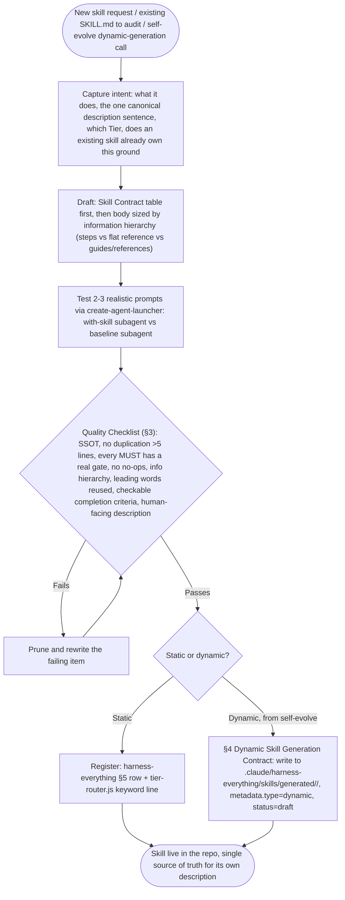
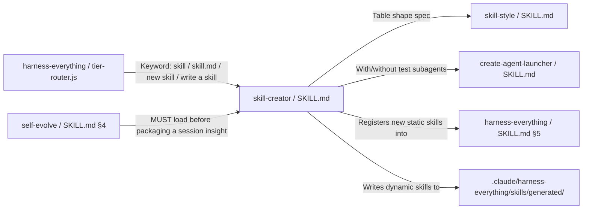
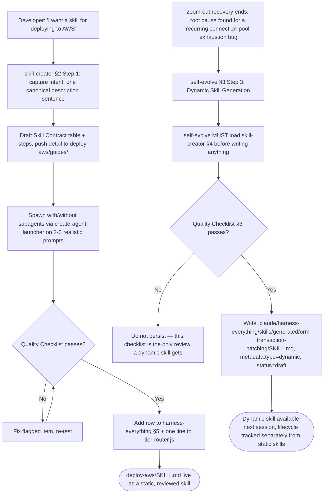

# Workflow: Skill Creator

> Authors, audits, and evolves SKILL.md files against a single quality bar — the Skill Contract format plus predictability/pruning/progressive-disclosure principles from external skill-writing research — and is the required gate for skills `self-evolve` generates dynamically.

---

## 1. Skill Behavior Workflow

This section visualizes how the `skill-creator` skill executes internally, detailing the sequence of operations, state transitions, and evaluation steps.

---

## 2. Triggering and Routing Path

This diagram illustrates how `skill-creator` is triggered through user requests or developer actions, and how it integrates or chains together with other companion skills in the Harness OS ecosystem to form unified workflows.

---

## 3. Real-World Use Case Flowchart

Here we model concrete real-world scenarios and use cases of the `skill-creator` skill, illustrating standard success paths, error handling, or recovery loops — one for a human-directed static skill, one for `self-evolve`'s dynamic path.

---

## 4. Verification Check

To ensure that the `skill-creator` skill is operating in strict compliance with Harness OS design laws, verify the following:

- [ ] **Physical Boundary Verification**: The skill boundaries are respected and do not leak context.
- [ ] **State Checkpoint Verification**: The active state is established, validated, and recorded at the beginning and end of each execution branch.
- [ ] **Cognitive Alignment**: The skill conforms to the **Think > Try > Summarize > Record** cognitive loop.
