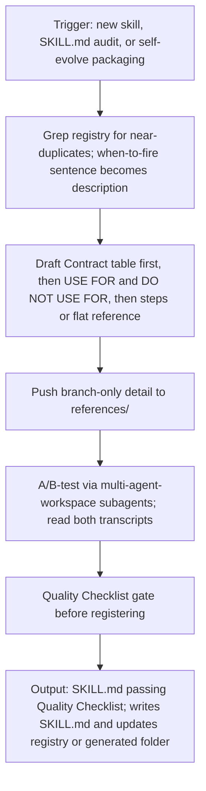
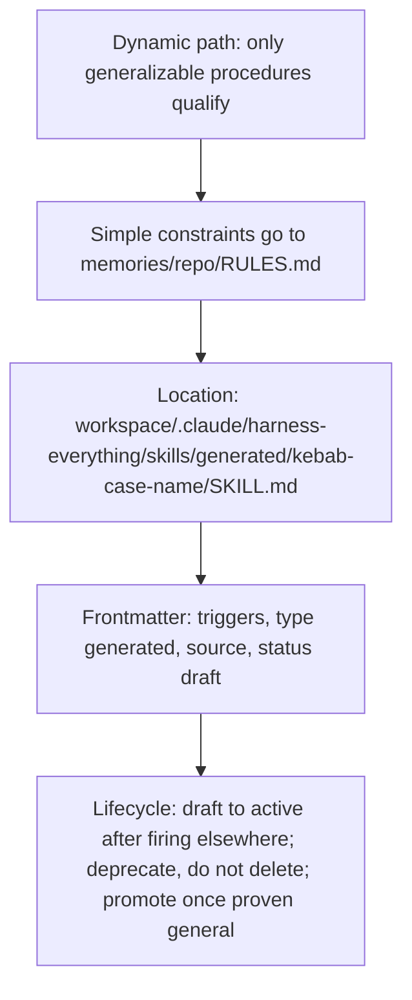
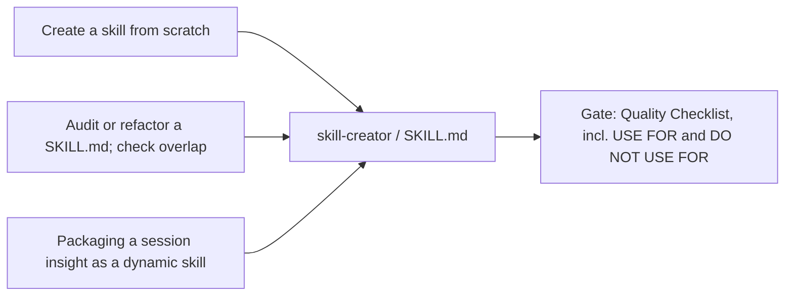
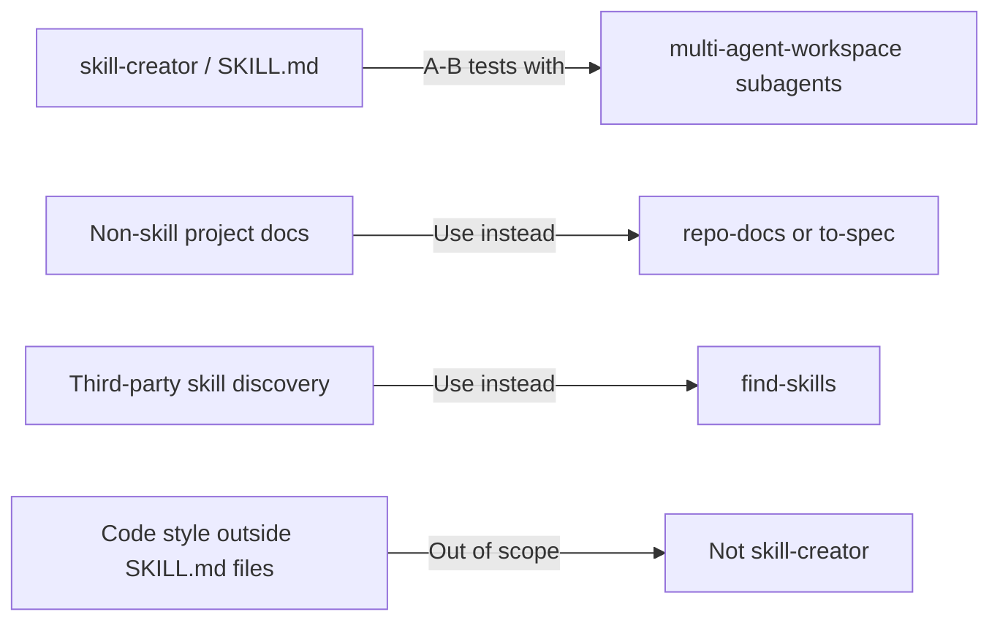

# Workflow: Skill Creator

> Authors, audits, and refactors SKILL.md files against the Skill Contract quality bar — for new skills, SKILL.md refactors, overlap checks, and packaging insights as dynamic skills.

Source of truth: `skill-creator/SKILL.md`.

---

## 1. Skill Behavior Workflow

```mermaid
graph TD
  NewReq["Trigger: new skill, SKILL.md audit, or self-evolve packaging"] --> DupGrep["Grep registry for near-duplicates; when-to-fire sentence becomes description"]
  DupGrep --> DraftContract["Draft Contract table first, then USE FOR and DO NOT USE FOR, then steps or flat reference"]
  DraftContract --> PushRef["Push branch-only detail to references/"]
  PushRef --> ABTest["A/B-test via multi-agent-workspace subagents; read both transcripts"]
  ABTest --> QualityGate["Quality Checklist gate before registering"]
  QualityGate --> RegisterOut["Output: SKILL.md passing Quality Checklist; writes SKILL.md and updates registry or generated folder"]
```

```mermaid
graph TD
  DynamicReq["Dynamic path: only generalizable procedures qualify"] --> SimpleRule["Simple constraints go to memories/repo/RULES.md"]
  SimpleRule --> DynLoc["Location: workspace/.claude/harness-everything/skills/generated/kebab-case-name/SKILL.md"]
  DynLoc --> DynFront["Frontmatter: triggers, type generated, source, status draft"]
  DynFront --> DynLife["Lifecycle: draft to active after firing elsewhere; deprecate, do not delete; promote once proven general"]
```

## 2. Triggering and Routing Path

```mermaid
graph LR
  CreateReq["Create a skill from scratch"] --> CreatorSkill["skill-creator / SKILL.md"]
  AuditReq["Audit or refactor a SKILL.md; check overlap"] --> CreatorSkill
  PackageReq["Packaging a session insight as a dynamic skill"] --> CreatorSkill
  CreatorSkill --> ChecklistOut["Gate: Quality Checklist, incl. USE FOR and DO NOT USE FOR"]
```

```mermaid
graph LR
  CreatorSkill2["skill-creator / SKILL.md"] -->|A-B tests with| MultiAgent["multi-agent-workspace subagents"]
  NonSkillDocs["Non-skill project docs"] -->|Use instead| RepoDocs["repo-docs or to-spec"]
  ThirdParty["Third-party skill discovery"] -->|Use instead| FindSkills["find-skills"]
  StyleOnly["Code style outside SKILL.md files"] -->|Out of scope| NotCreator["Not skill-creator"]
```

## 3. Real-World Use Case

A team wants a new `deploy-preview` skill. The author greps the registry for near-duplicates, writes the when-to-fire sentence as the description, drafts the Contract table first with its enforcement gate, then `USE FOR` and `DO NOT USE FOR`, then the steps, pushing long detail to `references/`. They A/B-test via `multi-agent-workspace` subagents, read both transcripts, run the Quality Checklist (`skill-creator/references/quality-checklist.md`), and only then register. A separate small tip discovered mid-session does not qualify as a dynamic skill and goes to `<workspace>/memories/repo/RULES.md`.

## 4. Verification Check

- [ ] Registry grep for near-duplicates completed; description written as the when-to-fire sentence
- [ ] Contract table drafted first to force the enforcement gate
- [ ] `USE FOR` and `DO NOT USE FOR` present before steps or flat reference
- [ ] Branch-only detail pushed to `references/` (e.g. `skill-creator/references/quality-checklist.md`)
- [ ] A/B-tested via `multi-agent-workspace` subagents and both transcripts read
- [ ] Quality Checklist passed before registering, including `USE FOR` / `DO NOT USE FOR` consistency
- [ ] Output is a SKILL.md passing the Quality Checklist; `<skill>/SKILL.md` written and registry or generated folder updated
- [ ] Dynamic path gated by Quality Checklist first; location, frontmatter triggers, generated type, and draft status correct
- [ ] Dynamic lifecycle respected: draft to active after firing elsewhere; deprecate, do not delete; promote once proven general
- [ ] Only generalizable procedures kept as skills; simple constraints sent to `<workspace>/memories/repo/RULES.md`
- [ ] Not misused for non-skill docs, third-party discovery, or code style outside SKILL.md files
