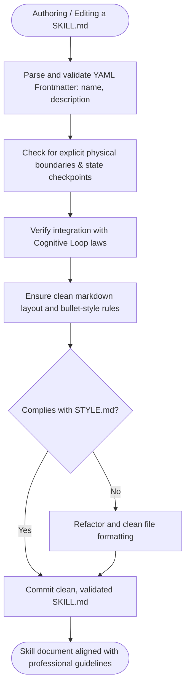
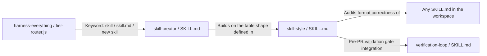
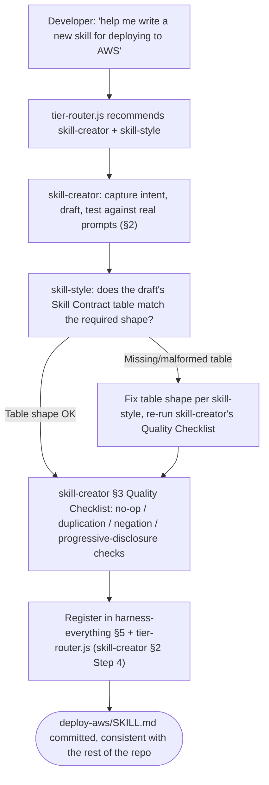

# Workflow: Skill Style

> Guidelines and style rules for authoring, refactoring, and maintaining SKILL.md files to enforce clean frontmatter and logical boundaries.

---

## 1. Skill Behavior Workflow

This section visualizes how the `skill-style` skill executes internally, detailing the sequence of operations, state transitions, and evaluation steps.

---

## 2. Triggering and Routing Path

This diagram illustrates how `skill-style` is reached — as of the `skill-creator` split, it is no longer the first stop. `tier-router.js`'s `/\bskill\b|skill\.md|new skill|write a skill/` match now recommends `skill-creator` first (the full authoring/audit/testing workflow) and `skill-style` second (the terse Skill Contract table shape it builds on) — see `harness-everything/scripts/tier-router.js`.

---

## 3. Real-World Use Case Flowchart

§1 already walks the linear audit steps for a single file. This section instead shows the case that motivated splitting `skill-creator` out of this skill in the first place: a developer who needs the *fuller* workflow, not just the table shape.

---

## 4. Verification Check

To ensure that the `skill-style` skill is operating in strict compliance with Harness OS design laws, verify the following:

- [ ] **Physical Boundary Verification**: The skill boundaries are respected and do not leak context.
- [ ] **State Checkpoint Verification**: The active state is established, validated, and recorded at the beginning and end of each execution branch.
- [ ] **Cognitive Alignment**: The skill conforms to the **Think > Try > Summarize > Record** cognitive loop.
