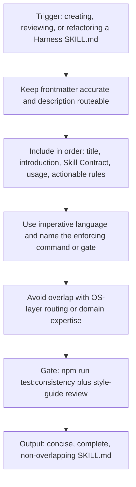
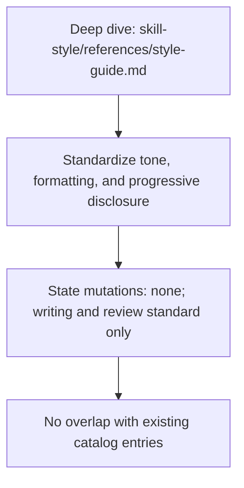
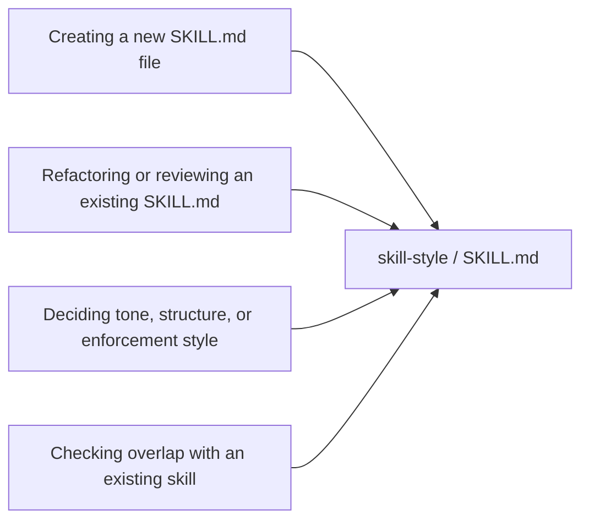
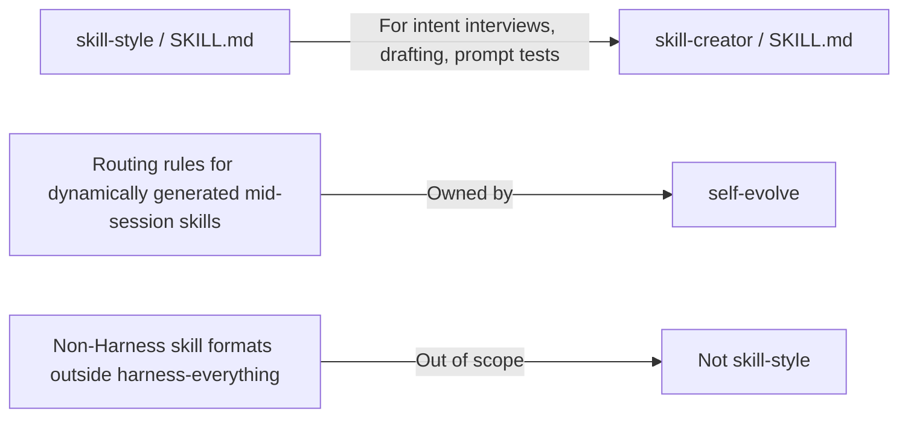

# Workflow: Skill Style

> Applies the Harness writing standard to SKILL.md files — covering new skills, structure reviews, naming and frontmatter conventions, tone, formatting, and progressive disclosure across the catalog.

Source of truth: `skill-style/SKILL.md`.

---

## 1. Skill Behavior Workflow

```mermaid
graph TD
  TriggerEdit["Trigger: creating, reviewing, or refactoring a Harness SKILL.md"] --> FrontAccurate["Keep frontmatter accurate and description routeable"]
  FrontAccurate --> OrderCheck["Include in order: title, introduction, Skill Contract, usage, actionable rules"]
  OrderCheck --> ImperativeGate["Use imperative language and name the enforcing command or gate"]
  ImperativeGate --> OverlapCheck["Avoid overlap with OS-layer routing or domain expertise"]
  OverlapCheck --> ConsistencyGate["Gate: npm run test:consistency plus style-guide review"]
  ConsistencyGate --> ConciseOut["Output: concise, complete, non-overlapping SKILL.md"]
```

```mermaid
graph TD
  StyleGuide["Deep dive: skill-style/references/style-guide.md"] --> ToneFormat["Standardize tone, formatting, and progressive disclosure"]
  ToneFormat --> NoMutate["State mutations: none; writing and review standard only"]
  NoMutate --> OverlapAvoid["No overlap with existing catalog entries"]
```

## 2. Triggering and Routing Path

```mermaid
graph LR
  NewSkillReq["Creating a new SKILL.md file"] --> StyleSkill["skill-style / SKILL.md"]
  RefactorReq["Refactoring or reviewing an existing SKILL.md"] --> StyleSkill
  ToneReq["Deciding tone, structure, or enforcement style"] --> StyleSkill
  OverlapReq["Checking overlap with an existing skill"] --> StyleSkill
```

```mermaid
graph LR
  StyleSkill2["skill-style / SKILL.md"] -->|For intent interviews, drafting, prompt tests| CreatorSkill["skill-creator / SKILL.md"]
  DynRoute["Routing rules for dynamically generated mid-session skills"] -->|Owned by| SelfEvolve["self-evolve"]
  NonHarness["Non-Harness skill formats outside harness-everything"] -->|Out of scope| NotStyle["Not skill-style"]
```

## 3. Real-World Use Case

An author drafts a new `backup-restore` SKILL.md and runs a style pass. They tighten the frontmatter description for routing, reorder the file to title, introduction, Skill Contract, usage, and actionable rules, rewrite vague advice in imperative language naming `npm run test:consistency` as the gate, remove duplicated routing already owned elsewhere, and check `skill-style/references/style-guide.md`. Intent interviewing and prompt testing are handed to `skill-creator/SKILL.md` per the Core Rules.

## 4. Verification Check

- [ ] Frontmatter accurate and description routeable
- [ ] File includes in order: title, introduction, Skill Contract, usage, and actionable rules
- [ ] Imperative language used with the enforcing command or gate named (`npm run test:consistency` plus style-guide review)
- [ ] No overlap with OS-layer routing or domain expertise; catalog overlap checked
- [ ] Tone, formatting, and progressive disclosure standardized per `skill-style/references/style-guide.md`
- [ ] State mutations are none — treated as a writing and review standard only
- [ ] Intent interviews, drafting, and prompt tests routed to `skill-creator/SKILL.md`, not handled here
- [ ] Routing rules for dynamically generated mid-session skills left to `self-evolve`
- [ ] Not applied to non-Harness skill formats outside `harness-everything`
