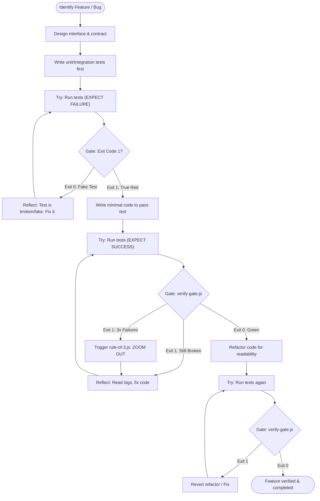

# Workflow: Test-Driven Development (TDD)

> Enforces the classic Red-Green-Refactor development cycle. Crucially, this is NOT a linear process. It is a loop driven by terminal exit codes.

---

## 1. Skill Behavior Workflow

This section visualizes the script-gated reality of TDD. The AI cannot progress to the next phase until the terminal script explicitly confirms the state.

