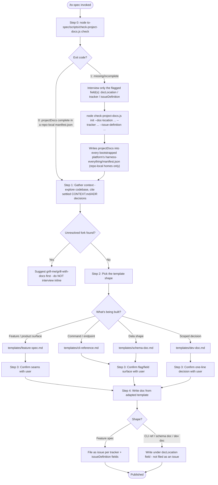
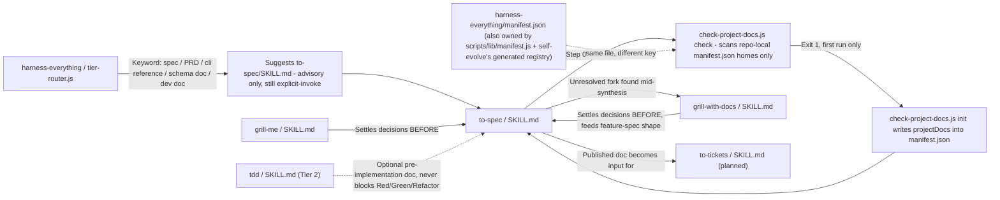
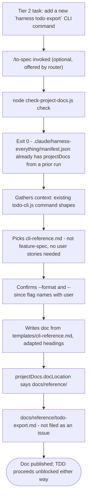

# Workflow: To Spec

> Synthesizes an already-discussed conversation into whichever written artifact actually fits — feature spec, CLI/API reference, schema doc, or dev doc — and publishes it per this repo's own `projectDocs` entry inside `harness-everything/manifest.json`. Advisory in both Tier 2 and Tier 3 toward other skills; its own Step 0 framework check is a mechanized script gate, not advisory.

---

## 1. Skill Behavior Workflow

This section visualizes how the `to-spec` skill executes internally, detailing the sequence of operations, state transitions, and evaluation steps.

---

## 2. Triggering and Routing Path

This diagram illustrates how `to-spec` is reached through user requests and how it chains with companion skills in the Harness OS ecosystem.

---

## 3. Real-World Use Case Flowchart

---

## 4. Verification Check

To ensure `to-spec` is operating in strict compliance with Harness OS design laws, verify the following:

- [ ] **Mechanized Gate, Not Prose**: Step 0 ran `check-project-docs.js check` and honored its exit code — it did not skip straight to inferring the framework from prose memory of past runs.
- [ ] **Repo-Local, Not Global**: `projectDocs` was read from / written to a workspace-relative platform home only (`.claude/`, `.cursor/`, `.github/`, `.codex/`, `.continue/` under this repo) — never `~/.agents` or the global `~/.claude` manifest, which would leak this repo's tracker into unrelated projects.
- [ ] **Pointer, Not Payload**: Every `projectDocs` field is a short pointer (≤ 200 chars, enforced by `init`) — elaborate content (a full issue template, a per-context doc map) lives in its own file, referenced by path, not inlined into `manifest.json`.
- [ ] **No Re-Interview Violation**: Beyond the one-time Step 0 setup, the skill did not ask the user questions that a prior `grill-me`/`grill-with-docs` pass, or the conversation itself, already answered.
- [ ] **Adaptive Shape Selection**: The template picked (feature-spec / cli-reference / schema-doc / dev-doc) actually matches the artifact being documented — not defaulted to the heaviest shape out of habit.
- [ ] **Shape-Correct Destination**: A feature-spec was filed as an issue; a CLI-reference/schema-doc/dev-doc was written under `docLocation` instead, unless the user explicitly confirmed it should also be an issue.
- [ ] **Non-Blocking Toward Other Skills**: The Step 3 confirmation happened before publishing, and to-spec's own execution never delayed or gated `tdd`/`verification-loop` in a Tier 2 flow.
