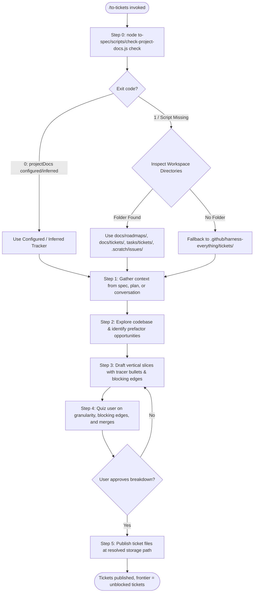
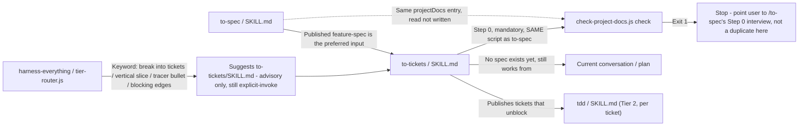
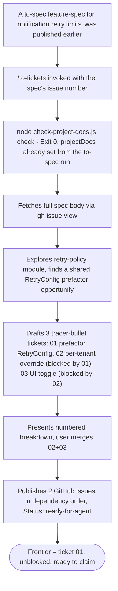

# Workflow: To Tickets

> Breaks a `to-spec` feature spec, a plan, or the current conversation into tracer-bullet tickets with declared blocking edges, published through the same `projectDocs` entry `to-spec` already established. Reuses `to-spec`'s own project-docs gate — never a second setup interview.

---

## 1. Skill Behavior Workflow

This section visualizes how the `to-tickets` skill executes internally, detailing the sequence of operations, state transitions, and evaluation steps.

---

## 2. Triggering and Routing Path

This diagram illustrates how `to-tickets` is reached through user requests and how it chains with companion skills in the Harness OS ecosystem.

---

## 3. Real-World Use Case Flowchart

---

## 4. Verification Check

To ensure `to-tickets` is operating in strict compliance with Harness OS design laws, verify the following:

- [ ] **Shared Gate, No Duplicate Interview**: Step 0 called `to-spec`'s own `check-project-docs.js check` — it did not run a second, parallel setup interview for tracker/doc-location/issue-definition.
- [ ] **Vertical, Not Horizontal**: Every non-wide-refactor ticket cuts a complete path through all layers it touches — no ticket is "just the schema" or "just the UI" for the same feature.
- [ ] **Blocking Edges Are Real**: Each ticket's "Blocked by" lists only tickets that genuinely gate it, not every ticket that merely precedes it in reading order.
- [ ] **Wide-Refactor Exception Applied Correctly**: A mechanical, huge-blast-radius change was sequenced as expand → migrate batches → contract, not forced into a single tracer-bullet ticket that can't land green.
- [ ] **User Approval Before Publish**: The numbered breakdown was shown and approved (or iterated on) before Step 5 published anything.
- [ ] **No Forced Decomposition**: A `cli-reference`/`schema-doc`/`dev-doc` shaped `to-spec` doc that was already a single unit of work was not artificially split into multiple tickets.
