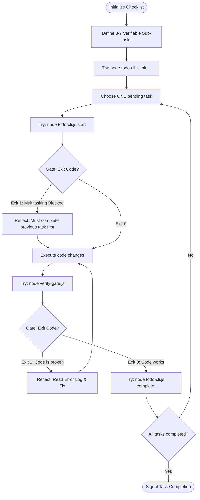

# Workflow: Todo-Driven Workflow

> The fundamental execution loop. Driven entirely by terminal state machines (`todo-cli.js`).

---

## 1. Skill Behavior Workflow

This section visualizes the rigid state constraints. Transitioning state is blocked unless verification gates pass.

