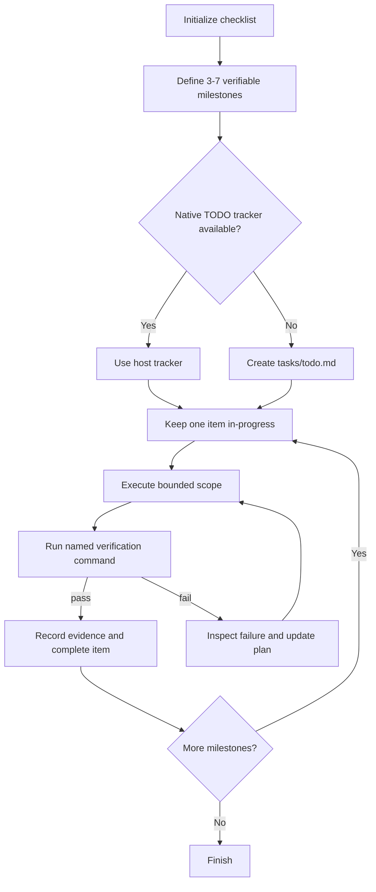
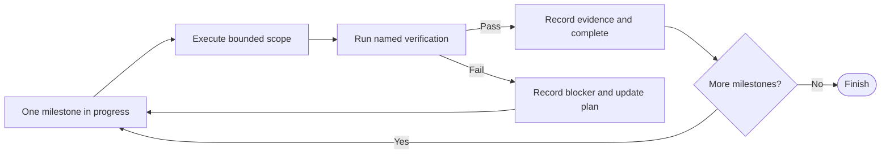
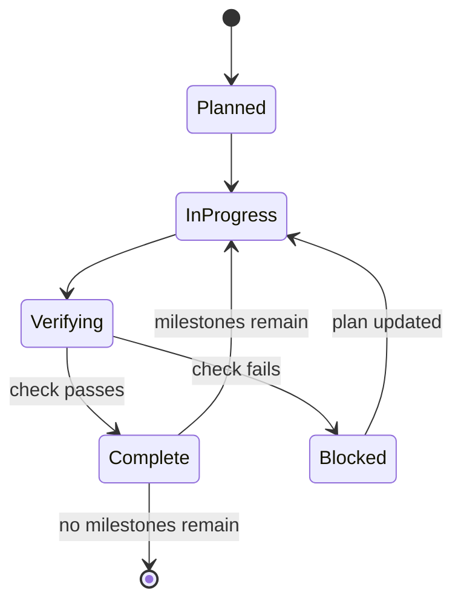

# Workflow: Todo-Driven Workflow

> The fundamental execution loop for Tier 2/3 work. Prefer the host's native
> TODO tracker; use a Markdown checklist when no native tracker is available.

```mermaid
graph TD
  Start[Initialize checklist] --> Plan[Define 3-7 verifiable milestones]
  Plan --> Native{Native TODO tracker available?}
  Native -->|Yes| Host[Use host tracker]
  Native -->|No| Markdown[Create tasks/todo.md]
  Host --> One[Keep one item in-progress]
  Markdown --> One
  One --> Execute[Execute bounded scope]
  Execute --> Verify[Run named verification command]
  Verify -->|pass| Complete[Record evidence and complete item]
  Verify -->|fail| Reflect[Inspect failure and update plan]
  Reflect --> Execute
  Complete --> More{More milestones?}
  More -->|Yes| One
  More -->|No| Done[Finish]
```

## Operating rules

1. Define 3-7 milestones before editing.
2. Give each milestone an output, pass condition, and verification command.
3. Keep exactly one milestone `in-progress`.
4. Mark a milestone complete only after its check passes.
5. Use `using-git-worktrees` when parallel agents would otherwise share a write scope.
6. Leave a blocker visible in the checklist and escalate instead of inventing progress.

The repository has no TODO CLI state machine. This keeps progress portable,
host-native, and transparent across sessions.

## Blocker loop

One milestone owns the active work. A failed check updates that milestone and
returns to execution; it does not silently advance the rest of the list.

```mermaid
flowchart LR
  Active[One milestone in progress] --> Execute[Execute bounded scope]
  Execute --> Verify[Run named verification]
  Verify -->|Pass| Record[Record evidence and complete]
  Verify -->|Fail| Blocker[Record blocker and update plan]
  Blocker --> Active
  Record --> More{More milestones?}
  More -->|Yes| Active
  More -->|No| Done([Finish])
```

## Ownership state

The checklist makes ownership visible from planning through completion.

```mermaid
stateDiagram-v2
  [*] --> Planned
  Planned --> InProgress
  InProgress --> Verifying
  Verifying --> Complete: check passes
  Verifying --> Blocked: check fails
  Blocked --> InProgress: plan updated
  Complete --> InProgress: milestones remain
  Complete --> [*]: no milestones remain
```
