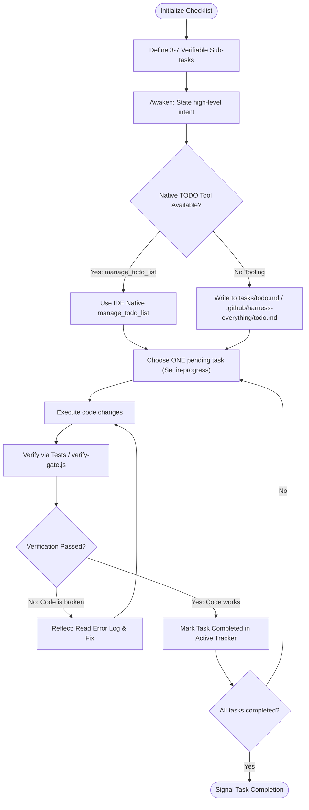

# Workflow: Todo-Driven Workflow

> The fundamental execution loop. Prioritizes native IDE tools (`manage_todo_list`), with fallback to workspace markdown files (`tasks/todo.md`).

---

## 1. Skill Behavior Workflow

This section visualizes the rigid state constraints. Transitioning state is blocked unless verification gates pass.

```mermaid
graph TD
  Start([Initialize Checklist]) --> Plan["Define 3-7 Verifiable Sub-tasks"]
  Plan --> StateIntent["Awaken: State high-level intent"]
  StateIntent --> CheckTool{Native TODO Tool Available?}
  
  CheckTool -->|Yes: manage_todo_list| NativeTracker["Use IDE Native manage_todo_list"]
  CheckTool -->|No Tooling| FileTracker["Write to tasks/todo.md / .github/harness-everything/todo.md"]
  
  NativeTracker --> ChooseTask["Choose ONE pending task (Set in-progress)"]
  FileTracker --> ChooseTask
  
  ChooseTask --> Execute["Execute code changes"]
  
  Execute --> GatherEvidence["Verify via Tests / verify-gate.js"]
  GatherEvidence --> VerifySuccess{Verification Passed?}
  
  VerifySuccess -->|No: Code is broken| ReflectCode["Reflect: Read Error Log & Fix"]
  ReflectCode --> Execute
  
  VerifySuccess -->|Yes: Code works| MarkCompleted["Mark Task Completed in Active Tracker"]
  
  MarkCompleted --> CheckRemaining{All tasks completed?}
  CheckRemaining -->|No| ChooseTask
  CheckRemaining -->|Yes| Finish([Signal Task Completion])
```
