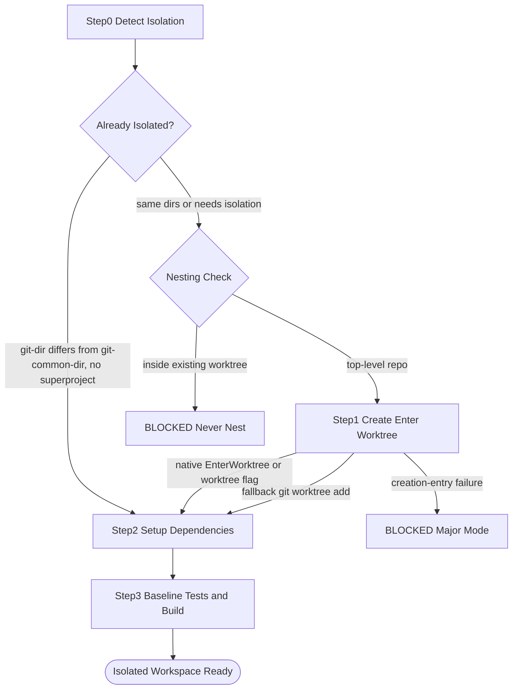
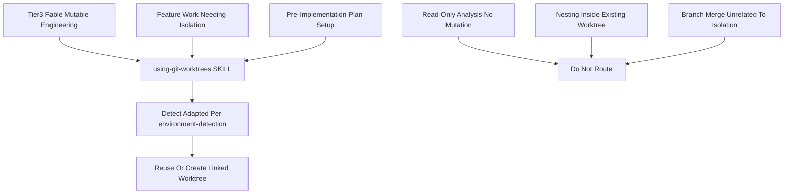
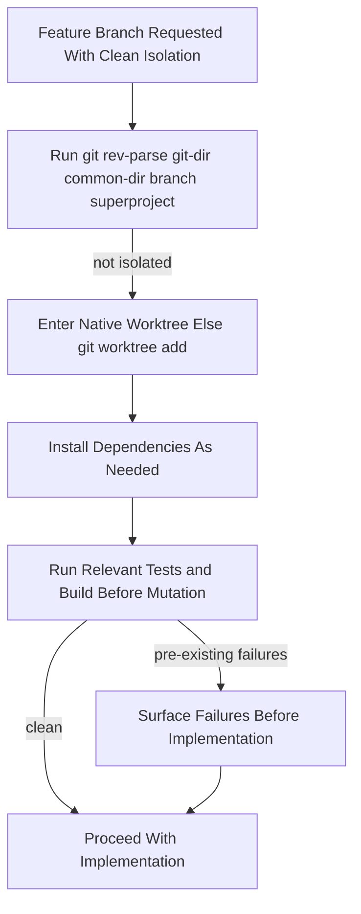

# Workflow: Using Git Worktrees

> Start isolated when feature work needs it: prefer native worktree entry before implementation plans, with raw git worktree as fallback.

Source of truth: `using-git-worktrees/SKILL.md`.

Contract summary from SKILL.md — USE FOR: Tier 3 / Fable-class mutable engineering, feature work needing isolation, pre-implementation-plan setup. DO NOT USE FOR: nesting inside an existing worktree, read-only analysis with no mutation, branch/merge workflows unrelated to workspace isolation.

## 1. Skill Behavior Workflow

## 2. Triggering and Routing Path

## 3. Real-World Use Case

Ordinary-mode note: only ordinary isolation-needing work may honor an explicit user preference to stay in place after a decline or unsupported environment. Major mode never falls back to the primary tree.

Deep dive: `using-git-worktrees/references/workflow-details.md`.

## 4. Verification Check

- [ ] Tier 3 / Fable-class source or artifact mutation occurs only in a verified isolated worktree; otherwise state is `BLOCKED`
- [ ] No worktree is nested inside an already isolated worktree
- [ ] Isolation detection used `git rev-parse --git-dir`, `git rev-parse --git-common-dir`, `git branch --show-current`, and `git rev-parse --show-superproject-working-tree`; a submodule counted as a normal repo
- [ ] Entry preferred native `EnterWorktree`, `/worktree`, or `--worktree` before `git worktree add "$path" -b "$BRANCH_NAME"`; major mode chose an already-ignored or external/sibling path
- [ ] Creation or entry failure yields `BLOCKED` in major mode; in-place continuation happened only in ordinary mode after explicit decline or unsupported environment
- [ ] Dependencies were installed as needed, then relevant tests/build ran in the isolated tree with pre-existing failures surfaced before mutation
